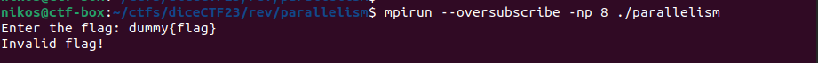
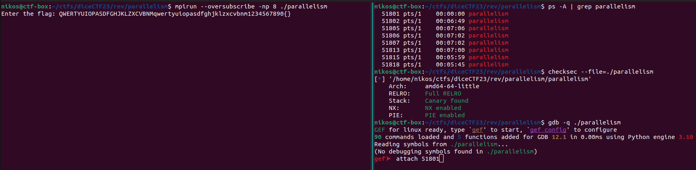
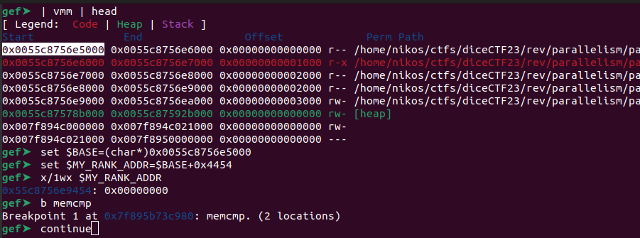
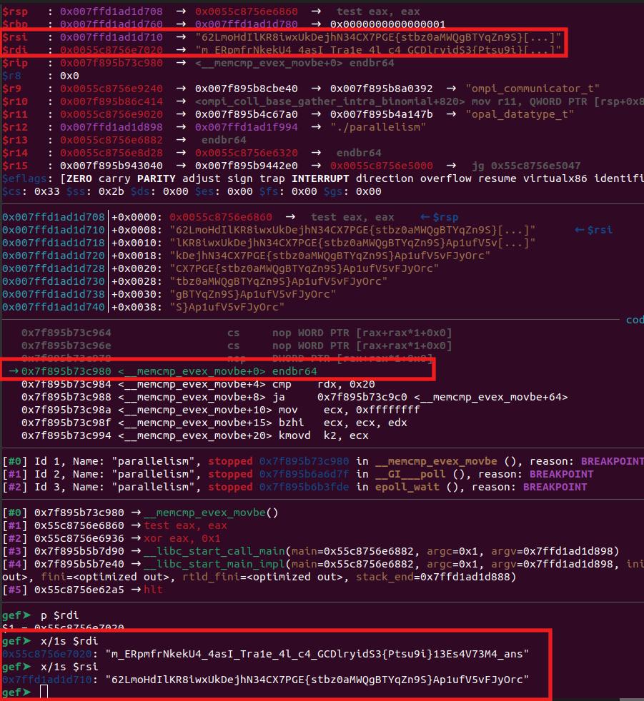

# Parallelism

Categories: Rev

Description:
> High performance computing is cool and all, but high performance flag checking is where it's at.
> 
>author: infuzion
>
>[parallelism](src/parallelism)
>
> Run with `mpirun --oversubscribe -np 8 ./parallelism`

**Tags:** rev, MPI, multi-threaded, self-contained

## Takeaways

* None - simple reversing.

## Reversing

The challenge relies on [Open MPI](https://www.open-mpi.org/), which is a Message Passing Interface (MPI) implementation. We install the necessary libraries and then run the binary:



As we see, the challenge is self-contained; i.e. the flag is somewhere inside the binary and the correct input will yield us the flag. So, let's reverse the binary:

```c
int N_PROC;
int MY_RANK;
char buf[16];
int main(int argc,char **argv) {
  
  setbuf(stdout, NULL);
  MPI_Init(&argc,&argv);
  MPI_Comm_size(ompi_mpi_comm_world,&N_PROC);
  MPI_Comm_rank(ompi_mpi_comm_world,&MY_RANK);
  if (N_PROC == 8) {
    if(
        read_input_and_scatter() == 1 &&
        compute() == 1 &&
        gather_n_compare() == 1
    ) {
      if (MY_RANK == 0) {
        puts("Correct!");
      }
    } else {
      puts("Invalid flag!");
    }
  } else {
    puts("Must be run with 8 processes");
  }
  MPI_Finalize();
  return 0;
}
```

The logic of the main function is neatly segregated. Let's analyze the 3 stages: input, process, output

```c
int read_input_and_scatter(void) {
  int shuffler [32];
  char input_buf [66];

  memset(input_buf, 0, sizeof(input_buf));
  if (MY_RANK == 0) {
    printf("Enter the flag: ");
    fgets(input_buf,0x42,stdin);
    size_t input_len = strcspn(input_buf,"\n");
    input_buf[input_len] = '\0';
    input_len = strlen(input_buf);
    if (input_len != 0x40) {
      return 0;
    }
    shuffler[0] = 0x1a;
    shuffler[1] = 0x20;
    shuffler[2] = 0xe;
    shuffler[3] = 0xb;
    shuffler[4] = 3;
    shuffler[5] = 1;
    shuffler[6] = 0x20;
    shuffler[7] = 0x18;
    shuffler[8] = 0xd;
    shuffler[9] = 0x11;
    shuffler[10] = 3;
    shuffler[11] = 0x11;
    shuffler[12] = 2;
    shuffler[13] = 0xd;
    shuffler[14] = 0x13;
    shuffler[15] = 6;
    shuffler[16] = 0xc;
    shuffler[17] = 0x16;
    shuffler[18] = 3;
    shuffler[19] = 0x1e;
    shuffler[20] = 10;
    shuffler[21] = 6;
    shuffler[22] = 8;
    shuffler[23] = 0x1a;
    shuffler[24] = 6;
    shuffler[25] = 0x16;
    shuffler[26] = 0xd;
    shuffler[27] = 1;
    shuffler[28] = 0x13;
    shuffler[29] = 1;
    shuffler[30] = 1;
    shuffler[31] = 0x1d;
    //max(shuffler) == 0x20
    //min(shuffler) == 1

    /* shuffle buffer by swapping elements arround */
    /* in this case, the first half of the buffer is swapped with the second half */
    for (int i = 0; i < 0x20; i = i + 1) {
      char c = input_buf[i];
      input_buf[i] = input_buf[shuffler[i] + 0x1f];
      input_buf[shuffler[i] + 0x1f] = c;
    }
  }

  // the root process (0) scatters sets of 8 chars to each process in the group (including self)
  MPI_Scatter(
    input_buf, 8, ompi_mpi_char, //sendbuf, sendcount, datatype
    BUF, 8, ompi_mpi_char,  //recvbuf, recvcount, datatype
    0, ompi_mpi_comm_world //root, communicator
  );
  return 1;
}

int compute(void) {
  MPI_Request send_request, receive_request;

  for (int i = 0; i < 10000; i = i + 1) {
    uint uVar1 = (uint)(i >> 0x1f) >> 0x1d;
    int buf_idx = (i + uVar1 & 7) - uVar1;

    int dest_rank = (N_PROC + (MY_RANK - i) % N_PROC) % N_PROC;
    MPI_Isend(
        BUF + buf_idx, 1, ompi_mpi_char,   //buf, count, datatype
        dest_rank, dest_rank, //dest, tag
        ompi_mpi_comm_world, //communicator
        send_request //request (out parameter)
    );

    int source_rank = (N_PROC + (MY_RANK + i) % N_PROC) % N_PROC;
    char c;
    MPI_Irecv(
        &c, 1, ompi_mpi_char,    //buf, count, datatype
        source_rank, MY_RANK,               //source, tag
        ompi_mpi_comm_world,            //communicator
        receive_request                 //request (out parameter)
    );

    MPI_Wait(send_request, NULL);
    MPI_Wait(receive_request, NULL);
    BUF[buf_idx] = c;
    MPI_Barrier(ompi_mpi_comm_world);
  }

  return 1;
}

int gather_n_compare(void) {
  int res;
  char recvbuf [0x40];
  memset(recvbuf, 0, sizeof(recvbuf));
  
  //The inverse of the MPI_Scatter done before.
  //It gathers 8 chars from each process from the BUF buffer
  //and places them sequentially in the recvbuf of the root (0) process
  MPI_Gather(
    BUF, 8, ompi_mpi_char, //sendbuf, sendcount, datatype
    recvbuf, 8, ompi_mpi_char, //recvbuf, recvcount, recvtype
    0, ompi_mpi_comm_world   //root, communicator
  );

  if (MY_RANK == 0) { 
    res = (memcmp("m_ERpmfrNkekU4_4asI_Tra1e_4l_c4_GCDlryidS3{Ptsu9i}13Es4V73M4_ans",recvbuf,0x40) == 0) ? 1 : 0;
  } else {
    res = 1;
  }
  return res;
}
```

So here are our observations:

* 8 threads are indeed required for correct functionality
* From the exit condition `(input_len != 0x40)`, we know that the flag is exactly `0x40` characters long.
* The flag characters are shuffled around
* The output shuffled buffer (shuffled flag) is compared against the constant string `"m_ERpmfrNkekU4_4asI_Tra1e_4l_c4_GCDlryidS3{Ptsu9i}13Es4V73M4_ans"`
* The values of the input are not modified, they are only shuffled.
* There are no dependencies between the characters of the flag, e.g. there is nothing like `output[i] = input[i] + input[i-1]`.
* The shuffling does not depend on the input. All inputs are shuffled in the same way.
* The shuffling is deterministic, i.e. if we supply the same input, we will always get the same output.

This is interesting! We do not have to lift the code nor understand what shuffling *exactly* happens. All we have to do is:

1. Provide a unique input of `0x40` bytes long. Each character will only appear once in our input.
2. Insert a breakpoint at `memcmp` and dump `recvbuf`, which will be our shuffled unique input.
3. Create a static mapping based on the above input-output pair.
4. Apply the reverse mapping to the hardcoded shuffled flag `"m_ERpmfrNkekU4_4asI_Tra1e_4l_c4_GCDlryidS3{Ptsu9i}13Es4V73M4_ans"`

In this way, we will automatically get the flag without actually having to write a reverse of the `compute` function.

## Solution

Our unique input will be all lowercase + all uppercase + all numbers + two symbols in order to achieve `0x40` bytes of unique input: `QWERTYUIOPASDFGHJKLZXCVBNMqwertyuiopasdfghjklzxcvbnm1234567890{}`.



Before we proceed and press enter and submit our input, we need to find the pid of the process that has rank 0. Because only that process will execute the `memcmp` and we need to set a breakpoint there. To do so, we attach to each listed process one-by-one and dump the global variable `int MY_RANK`, which resides at offset `0x4454`, until we find the process that has rank 0. Most likely, the process with the lowest pid is the one with rank 0.



Once we hit the `memcmp`, we examine `rdi` and `rsi`:



* `rdi` is the hardcoded shuffled flag.
* `rsi` contains our **unique** and **shuffled** input: `62LmoHdIlKR8iwxUkDejhN34CX7PGE{stbz0aMWQgBTYqZn9S}Ap1ufV5vFJyOrc`

Perfect! Now let's write a python script to create the static mapping and then reverse the flag:

```python
inp = 'QWERTYUIOPASDFGHJKLZXCVBNMqwertyuiopasdfghjklzxcvbnm1234567890{}'
assert(len(inp) == 64)
assert(all([inp.count(c) == 1 for c in inp]))

shuffled = '62LmoHdIlKR8iwxUkDejhN34CX7PGE{stbz0aMWQgBTYqZn9S}Ap1ufV5vFJyOrc' # obtained from gdb
print(inp)
print(shuffled)

# Create the reverse mapping:
#  Shuffled character at index i corresponds to original index reverse_mapping[i]
reverse_mapping = [None for _ in range(len(inp))]

for i, c in enumerate(shuffled):
    reverse_mapping[i] = inp.find(c)
print(reverse_mapping)

# Reconstruct flag
shuffled_flag = 'm_ERpmfrNkekU4_4asI_Tra1e_4l_c4_GCDlryidS3{Ptsu9i}13Es4V73M4_ans' # found inside binary
flag = [None for _ in range(len(shuffled_flag))]
for i, c in enumerate(shuffled_flag):
    flag[reverse_mapping[i]] = c
print(''.join(flag))
```

And we get the flag!

`dice{P4ral1isM_m4kEs_eV3ryt4InG_sUp3r_f4ST_aND_s3CuRE_a17m4k9l4}`
