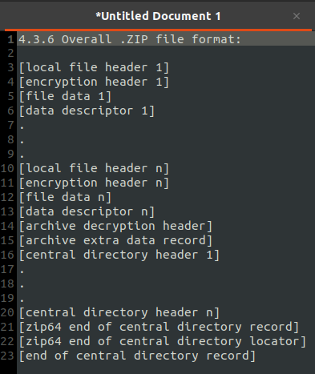
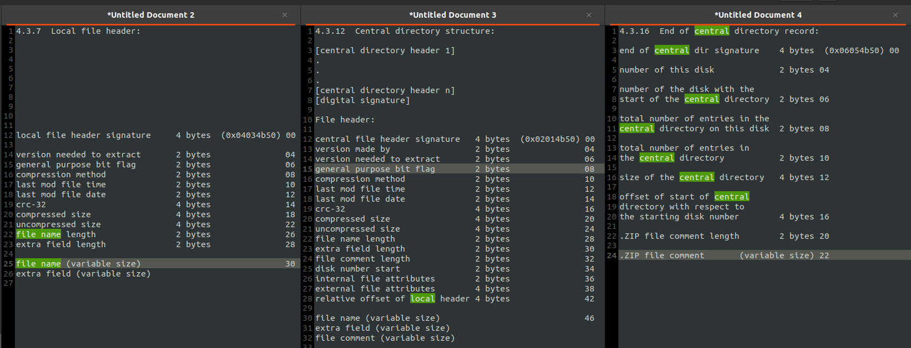

# APPNOTE.TXT

Categories: Misc

Description:
> Every single archive manager unpacks this to a different file...
>
> [challenge.zip](resources/2551253642bde3066e55c9cc8e9b0b4aa77feadc00c81032da778e6f7c89907135dfc2611fd8617204720dbfadb31429ae11f6ecd202887f4ce99f2f53a3c5e8.zip)<br/>

**Tags:** misc, zip parsing

## Takeaways

* [APPNOTE.TXT - .ZIP File Format Specification](https://pkware.cachefly.net/webdocs/casestudies/APPNOTE.TXT)
  * Always start parsing a ZIP from the "end of central directory record" (EoCD), as according to the specification, every ZIP file has exactly one such record and is mandatory.
  * The EoCD is located somewhere in the last 65557 bytes of the ZIP and can be found by its magic number (`0x06054b50` - 4 bytes little endian).
* [Ten thousand security pitfalls: The ZIP file format](https://gynvael.coldwind.pl/download.php?f=TenThousandSecurityPitfalls_theZIPfileFormat.pdf&usg=AOvVaw2ZDI_F5KsUrSZipJbCv-rQ)


## Solution

As a first step, let's run `binwalk` on the ZIP file:

```bash
nikos@ctf-box:~/ctfs/googleCTF22/misc/appnote$ binwalk dump.zip

DECIMAL       HEXADECIMAL     DESCRIPTION
--------------------------------------------------------------------------------
0             0x0             Zip archive data, v0.0 compressed size: 41, uncompressed size: 41, name: hello.txt
135           0x87            Zip archive data, v0.0 compressed size: 33, uncompressed size: 33, name: hi.txt
256           0x100           Zip archive data, v0.0 compressed size: 1, uncompressed size: 1, name: flag00
345           0x159           Zip archive data, v0.0 compressed size: 1, uncompressed size: 1, name: flag00
434           0x1B2           Zip archive data, v0.0 compressed size: 1, uncompressed size: 1, name: flag00
523           0x20B           Zip archive data, v0.0 compressed size: 1, uncompressed size: 1, name: flag00
612           0x264           Zip archive data, v0.0 compressed size: 1, uncompressed size: 1, name: flag00
701           0x2BD           Zip archive data, v0.0 compressed size: 1, uncompressed size: 1, name: flag00
790           0x316           Zip archive data, v0.0 compressed size: 1, uncompressed size: 1, name: flag00
879           0x36F           Zip archive data, v0.0 compressed size: 1, uncompressed size: 1, name: flag00
968           0x3C8           Zip archive data, v0.0 compressed size: 1, uncompressed size: 1, name: flag00
1057          0x421           Zip archive data, v0.0 compressed size: 1, uncompressed size: 1, name: flag00
1146          0x47A           Zip archive data, v0.0 compressed size: 1, uncompressed size: 1, name: flag00
1235          0x4D3           Zip archive data, v0.0 compressed size: 1, uncompressed size: 1, name: flag00
1324          0x52C           Zip archive data, v0.0 compressed size: 1, uncompressed size: 1, name: flag00
1413          0x585           Zip archive data, v0.0 compressed size: 1, uncompressed size: 1, name: flag00
1502          0x5DE           Zip archive data, v0.0 compressed size: 1, uncompressed size: 1, name: flag00
1591          0x637           Zip archive data, v0.0 compressed size: 1, uncompressed size: 1, name: flag00
1680          0x690           Zip archive data, v0.0 compressed size: 1, uncompressed size: 1, name: flag00
1769          0x6E9           Zip archive data, v0.0 compressed size: 1, uncompressed size: 1, name: flag00
1858          0x742           Zip archive data, v0.0 compressed size: 1, uncompressed size: 1, name: flag00
1947          0x79B           Zip archive data, v0.0 compressed size: 1, uncompressed size: 1, name: flag00
2036          0x7F4           Zip archive data, v0.0 compressed size: 1, uncompressed size: 1, name: flag00
2125          0x84D           Zip archive data, v0.0 compressed size: 1, uncompressed size: 1, name: flag00
2214          0x8A6           Zip archive data, v0.0 compressed size: 1, uncompressed size: 1, name: flag00
2303          0x8FF           Zip archive data, v0.0 compressed size: 1, uncompressed size: 1, name: flag00
2392          0x958           Zip archive data, v0.0 compressed size: 1, uncompressed size: 1, name: flag00
2481          0x9B1           Zip archive data, v0.0 compressed size: 1, uncompressed size: 1, name: flag00
2570          0xA0A           Zip archive data, v0.0 compressed size: 1, uncompressed size: 1, name: flag00
2659          0xA63           Zip archive data, v0.0 compressed size: 1, uncompressed size: 1, name: flag00
2748          0xABC           Zip archive data, v0.0 compressed size: 1, uncompressed size: 1, name: flag00
2837          0xB15           Zip archive data, v0.0 compressed size: 1, uncompressed size: 1, name: flag00
2926          0xB6E           Zip archive data, v0.0 compressed size: 1, uncompressed size: 1, name: flag00
3015          0xBC7           Zip archive data, v0.0 compressed size: 1, uncompressed size: 1, name: flag00
3104          0xC20           Zip archive data, v0.0 compressed size: 1, uncompressed size: 1, name: flag00
3193          0xC79           Zip archive data, v0.0 compressed size: 1, uncompressed size: 1, name: flag00
3282          0xCD2           Zip archive data, v0.0 compressed size: 1, uncompressed size: 1, name: flag00
3371          0xD2B           Zip archive data, v0.0 compressed size: 1, uncompressed size: 1, name: flag00
3460          0xD84           Zip archive data, v0.0 compressed size: 1, uncompressed size: 1, name: flag01
3549          0xDDD           Zip archive data, v0.0 compressed size: 1, uncompressed size: 1, name: flag01
3638          0xE36           Zip archive data, v0.0 compressed size: 1, uncompressed size: 1, name: flag01
3727          0xE8F           Zip archive data, v0.0 compressed size: 1, uncompressed size: 1, name: flag01
3816          0xEE8           Zip archive data, v0.0 compressed size: 1, uncompressed size: 1, name: flag01
3905          0xF41           Zip archive data, v0.0 compressed size: 1, uncompressed size: 1, name: flag01
3994          0xF9A           Zip archive data, v0.0 compressed size: 1, uncompressed size: 1, name: flag01
4083          0xFF3           Zip archive data, v0.0 compressed size: 1, uncompressed size: 1, name: flag01
4172          0x104C          Zip archive data, v0.0 compressed size: 1, uncompressed size: 1, name: flag01
4261          0x10A5          Zip archive data, v0.0 compressed size: 1, uncompressed size: 1, name: flag01
4350          0x10FE          Zip archive data, v0.0 compressed size: 1, uncompressed size: 1, name: flag01
4439          0x1157          Zip archive data, v0.0 compressed size: 1, uncompressed size: 1, name: flag01
4528          0x11B0          Zip archive data, v0.0 compressed size: 1, uncompressed size: 1, name: flag01
4617          0x1209          Zip archive data, v0.0 compressed size: 1, uncompressed size: 1, name: flag01
4706          0x1262          Zip archive data, v0.0 compressed size: 1, uncompressed size: 1, name: flag01
4795          0x12BB          Zip archive data, v0.0 compressed size: 1, uncompressed size: 1, name: flag01
4884          0x1314          Zip archive data, v0.0 compressed size: 1, uncompressed size: 1, name: flag01
4973          0x136D          Zip archive data, v0.0 compressed size: 1, uncompressed size: 1, name: flag01
5062          0x13C6          Zip archive data, v0.0 compressed size: 1, uncompressed size: 1, name: flag01
5151          0x141F          Zip archive data, v0.0 compressed size: 1, uncompressed size: 1, name: flag01
5240          0x1478          Zip archive data, v0.0 compressed size: 1, uncompressed size: 1, name: flag01
5329          0x14D1          Zip archive data, v0.0 compressed size: 1, uncompressed size: 1, name: flag01
5418          0x152A          Zip archive data, v0.0 compressed size: 1, uncompressed size: 1, name: flag01
5507          0x1583          Zip archive data, v0.0 compressed size: 1, uncompressed size: 1, name: flag01
5596          0x15DC          Zip archive data, v0.0 compressed size: 1, uncompressed size: 1, name: flag01
5685          0x1635          Zip archive data, v0.0 compressed size: 1, uncompressed size: 1, name: flag01
5774          0x168E          Zip archive data, v0.0 compressed size: 1, uncompressed size: 1, name: flag01
5863          0x16E7          Zip archive data, v0.0 compressed size: 1, uncompressed size: 1, name: flag01
5952          0x1740          Zip archive data, v0.0 compressed size: 1, uncompressed size: 1, name: flag01
6041          0x1799          Zip archive data, v0.0 compressed size: 1, uncompressed size: 1, name: flag01
6130          0x17F2          Zip archive data, v0.0 compressed size: 1, uncompressed size: 1, name: flag01
6219          0x184B          Zip archive data, v0.0 compressed size: 1, uncompressed size: 1, name: flag01
6308          0x18A4          Zip archive data, v0.0 compressed size: 1, uncompressed size: 1, name: flag01
6397          0x18FD          Zip archive data, v0.0 compressed size: 1, uncompressed size: 1, name: flag01
6486          0x1956          Zip archive data, v0.0 compressed size: 1, uncompressed size: 1, name: flag01
6575          0x19AF          Zip archive data, v0.0 compressed size: 1, uncompressed size: 1, name: flag01
6664          0x1A08          Zip archive data, v0.0 compressed size: 1, uncompressed size: 1, name: flag02
6753          0x1A61          Zip archive data, v0.0 compressed size: 1, uncompressed size: 1, name: flag02
6842          0x1ABA          Zip archive data, v0.0 compressed size: 1, uncompressed size: 1, name: flag02
6931          0x1B13          Zip archive data, v0.0 compressed size: 1, uncompressed size: 1, name: flag02
7020          0x1B6C          Zip archive data, v0.0 compressed size: 1, uncompressed size: 1, name: flag02
7109          0x1BC5          Zip archive data, v0.0 compressed size: 1, uncompressed size: 1, name: flag02
7198          0x1C1E          Zip archive data, v0.0 compressed size: 1, uncompressed size: 1, name: flag02
7287          0x1C77          Zip archive data, v0.0 compressed size: 1, uncompressed size: 1, name: flag02
7376          0x1CD0          Zip archive data, v0.0 compressed size: 1, uncompressed size: 1, name: flag02
7465          0x1D29          Zip archive data, v0.0 compressed size: 1, uncompressed size: 1, name: flag02
7554          0x1D82          Zip archive data, v0.0 compressed size: 1, uncompressed size: 1, name: flag02
7643          0x1DDB          Zip archive data, v0.0 compressed size: 1, uncompressed size: 1, name: flag02
7732          0x1E34          Zip archive data, v0.0 compressed size: 1, uncompressed size: 1, name: flag02
7821          0x1E8D          Zip archive data, v0.0 compressed size: 1, uncompressed size: 1, name: flag02
7910          0x1EE6          Zip archive data, v0.0 compressed size: 1, uncompressed size: 1, name: flag02
7999          0x1F3F          Zip archive data, v0.0 compressed size: 1, uncompressed size: 1, name: flag02
8088          0x1F98          Zip archive data, v0.0 compressed size: 1, uncompressed size: 1, name: flag02
8177          0x1FF1          Zip archive data, v0.0 compressed size: 1, uncompressed size: 1, name: flag02
8266          0x204A          Zip archive data, v0.0 compressed size: 1, uncompressed size: 1, name: flag02
8355          0x20A3          Zip archive data, v0.0 compressed size: 1, uncompressed size: 1, name: flag02
8444          0x20FC          Zip archive data, v0.0 compressed size: 1, uncompressed size: 1, name: flag02
8533          0x2155          Zip archive data, v0.0 compressed size: 1, uncompressed size: 1, name: flag02
8622          0x21AE          Zip archive data, v0.0 compressed size: 1, uncompressed size: 1, name: flag02
8711          0x2207          Zip archive data, v0.0 compressed size: 1, uncompressed size: 1, name: flag02
8800          0x2260          Zip archive data, v0.0 compressed size: 1, uncompressed size: 1, name: flag02
8889          0x22B9          Zip archive data, v0.0 compressed size: 1, uncompressed size: 1, name: flag02
8978          0x2312          Zip archive data, v0.0 compressed size: 1, uncompressed size: 1, name: flag02
9067          0x236B          Zip archive data, v0.0 compressed size: 1, uncompressed size: 1, name: flag02
9156          0x23C4          Zip archive data, v0.0 compressed size: 1, uncompressed size: 1, name: flag02
9245          0x241D          Zip archive data, v0.0 compressed size: 1, uncompressed size: 1, name: flag02
9334          0x2476          Zip archive data, v0.0 compressed size: 1, uncompressed size: 1, name: flag02
9423          0x24CF          Zip archive data, v0.0 compressed size: 1, uncompressed size: 1, name: flag02
9512          0x2528          Zip archive data, v0.0 compressed size: 1, uncompressed size: 1, name: flag02
9601          0x2581          Zip archive data, v0.0 compressed size: 1, uncompressed size: 1, name: flag02
9690          0x25DA          Zip archive data, v0.0 compressed size: 1, uncompressed size: 1, name: flag02
9779          0x2633          Zip archive data, v0.0 compressed size: 1, uncompressed size: 1, name: flag02
9868          0x268C          Zip archive data, v0.0 compressed size: 1, uncompressed size: 1, name: flag03
9957          0x26E5          Zip archive data, v0.0 compressed size: 1, uncompressed size: 1, name: flag03
10046         0x273E          Zip archive data, v0.0 compressed size: 1, uncompressed size: 1, name: flag03
10135         0x2797          Zip archive data, v0.0 compressed size: 1, uncompressed size: 1, name: flag03
10224         0x27F0          Zip archive data, v0.0 compressed size: 1, uncompressed size: 1, name: flag03
10313         0x2849          Zip archive data, v0.0 compressed size: 1, uncompressed size: 1, name: flag03
10402         0x28A2          Zip archive data, v0.0 compressed size: 1, uncompressed size: 1, name: flag03
10491         0x28FB          Zip archive data, v0.0 compressed size: 1, uncompressed size: 1, name: flag03
10580         0x2954          Zip archive data, v0.0 compressed size: 1, uncompressed size: 1, name: flag03
10669         0x29AD          Zip archive data, v0.0 compressed size: 1, uncompressed size: 1, name: flag03
10758         0x2A06          Zip archive data, v0.0 compressed size: 1, uncompressed size: 1, name: flag03
10847         0x2A5F          Zip archive data, v0.0 compressed size: 1, uncompressed size: 1, name: flag03
10936         0x2AB8          Zip archive data, v0.0 compressed size: 1, uncompressed size: 1, name: flag03
11025         0x2B11          Zip archive data, v0.0 compressed size: 1, uncompressed size: 1, name: flag03
11114         0x2B6A          Zip archive data, v0.0 compressed size: 1, uncompressed size: 1, name: flag03
11203         0x2BC3          Zip archive data, v0.0 compressed size: 1, uncompressed size: 1, name: flag03
11292         0x2C1C          Zip archive data, v0.0 compressed size: 1, uncompressed size: 1, name: flag03
11381         0x2C75          Zip archive data, v0.0 compressed size: 1, uncompressed size: 1, name: flag03
11470         0x2CCE          Zip archive data, v0.0 compressed size: 1, uncompressed size: 1, name: flag03
11559         0x2D27          Zip archive data, v0.0 compressed size: 1, uncompressed size: 1, name: flag03
11648         0x2D80          Zip archive data, v0.0 compressed size: 1, uncompressed size: 1, name: flag03
11737         0x2DD9          Zip archive data, v0.0 compressed size: 1, uncompressed size: 1, name: flag03
11826         0x2E32          Zip archive data, v0.0 compressed size: 1, uncompressed size: 1, name: flag03
11915         0x2E8B          Zip archive data, v0.0 compressed size: 1, uncompressed size: 1, name: flag03
12004         0x2EE4          Zip archive data, v0.0 compressed size: 1, uncompressed size: 1, name: flag03
12093         0x2F3D          Zip archive data, v0.0 compressed size: 1, uncompressed size: 1, name: flag03
12182         0x2F96          Zip archive data, v0.0 compressed size: 1, uncompressed size: 1, name: flag03
12271         0x2FEF          Zip archive data, v0.0 compressed size: 1, uncompressed size: 1, name: flag03
12360         0x3048          Zip archive data, v0.0 compressed size: 1, uncompressed size: 1, name: flag03
12449         0x30A1          Zip archive data, v0.0 compressed size: 1, uncompressed size: 1, name: flag03
12538         0x30FA          Zip archive data, v0.0 compressed size: 1, uncompressed size: 1, name: flag03
12627         0x3153          Zip archive data, v0.0 compressed size: 1, uncompressed size: 1, name: flag03
12716         0x31AC          Zip archive data, v0.0 compressed size: 1, uncompressed size: 1, name: flag03
12805         0x3205          Zip archive data, v0.0 compressed size: 1, uncompressed size: 1, name: flag03
12894         0x325E          Zip archive data, v0.0 compressed size: 1, uncompressed size: 1, name: flag03
12983         0x32B7          Zip archive data, v0.0 compressed size: 1, uncompressed size: 1, name: flag03
13072         0x3310          Zip archive data, v0.0 compressed size: 1, uncompressed size: 1, name: flag04
13161         0x3369          Zip archive data, v0.0 compressed size: 1, uncompressed size: 1, name: flag04
13250         0x33C2          Zip archive data, v0.0 compressed size: 1, uncompressed size: 1, name: flag04
13339         0x341B          Zip archive data, v0.0 compressed size: 1, uncompressed size: 1, name: flag04
13428         0x3474          Zip archive data, v0.0 compressed size: 1, uncompressed size: 1, name: flag04
13517         0x34CD          Zip archive data, v0.0 compressed size: 1, uncompressed size: 1, name: flag04
13606         0x3526          Zip archive data, v0.0 compressed size: 1, uncompressed size: 1, name: flag04
13695         0x357F          Zip archive data, v0.0 compressed size: 1, uncompressed size: 1, name: flag04
13784         0x35D8          Zip archive data, v0.0 compressed size: 1, uncompressed size: 1, name: flag04
13873         0x3631          Zip archive data, v0.0 compressed size: 1, uncompressed size: 1, name: flag04
13962         0x368A          Zip archive data, v0.0 compressed size: 1, uncompressed size: 1, name: flag04
14051         0x36E3          Zip archive data, v0.0 compressed size: 1, uncompressed size: 1, name: flag04
14140         0x373C          Zip archive data, v0.0 compressed size: 1, uncompressed size: 1, name: flag04
14229         0x3795          Zip archive data, v0.0 compressed size: 1, uncompressed size: 1, name: flag04
14318         0x37EE          Zip archive data, v0.0 compressed size: 1, uncompressed size: 1, name: flag04
14407         0x3847          Zip archive data, v0.0 compressed size: 1, uncompressed size: 1, name: flag04
14496         0x38A0          Zip archive data, v0.0 compressed size: 1, uncompressed size: 1, name: flag04
14585         0x38F9          Zip archive data, v0.0 compressed size: 1, uncompressed size: 1, name: flag04
14674         0x3952          Zip archive data, v0.0 compressed size: 1, uncompressed size: 1, name: flag04
14763         0x39AB          Zip archive data, v0.0 compressed size: 1, uncompressed size: 1, name: flag04
14852         0x3A04          Zip archive data, v0.0 compressed size: 1, uncompressed size: 1, name: flag04
14941         0x3A5D          Zip archive data, v0.0 compressed size: 1, uncompressed size: 1, name: flag04
15030         0x3AB6          Zip archive data, v0.0 compressed size: 1, uncompressed size: 1, name: flag04
15119         0x3B0F          Zip archive data, v0.0 compressed size: 1, uncompressed size: 1, name: flag04
15208         0x3B68          Zip archive data, v0.0 compressed size: 1, uncompressed size: 1, name: flag04
15297         0x3BC1          Zip archive data, v0.0 compressed size: 1, uncompressed size: 1, name: flag04
15386         0x3C1A          Zip archive data, v0.0 compressed size: 1, uncompressed size: 1, name: flag04
15475         0x3C73          Zip archive data, v0.0 compressed size: 1, uncompressed size: 1, name: flag04
15564         0x3CCC          Zip archive data, v0.0 compressed size: 1, uncompressed size: 1, name: flag04
15653         0x3D25          Zip archive data, v0.0 compressed size: 1, uncompressed size: 1, name: flag04
15742         0x3D7E          Zip archive data, v0.0 compressed size: 1, uncompressed size: 1, name: flag04
15831         0x3DD7          Zip archive data, v0.0 compressed size: 1, uncompressed size: 1, name: flag04
15920         0x3E30          Zip archive data, v0.0 compressed size: 1, uncompressed size: 1, name: flag04
16009         0x3E89          Zip archive data, v0.0 compressed size: 1, uncompressed size: 1, name: flag04
16098         0x3EE2          Zip archive data, v0.0 compressed size: 1, uncompressed size: 1, name: flag04
16187         0x3F3B          Zip archive data, v0.0 compressed size: 1, uncompressed size: 1, name: flag04
16276         0x3F94          Zip archive data, v0.0 compressed size: 1, uncompressed size: 1, name: flag05
16365         0x3FED          Zip archive data, v0.0 compressed size: 1, uncompressed size: 1, name: flag05
16454         0x4046          Zip archive data, v0.0 compressed size: 1, uncompressed size: 1, name: flag05
16543         0x409F          Zip archive data, v0.0 compressed size: 1, uncompressed size: 1, name: flag05
16632         0x40F8          Zip archive data, v0.0 compressed size: 1, uncompressed size: 1, name: flag05
16721         0x4151          Zip archive data, v0.0 compressed size: 1, uncompressed size: 1, name: flag05
16810         0x41AA          Zip archive data, v0.0 compressed size: 1, uncompressed size: 1, name: flag05
16899         0x4203          Zip archive data, v0.0 compressed size: 1, uncompressed size: 1, name: flag05
16988         0x425C          Zip archive data, v0.0 compressed size: 1, uncompressed size: 1, name: flag05
17077         0x42B5          Zip archive data, v0.0 compressed size: 1, uncompressed size: 1, name: flag05
17166         0x430E          Zip archive data, v0.0 compressed size: 1, uncompressed size: 1, name: flag05
17255         0x4367          Zip archive data, v0.0 compressed size: 1, uncompressed size: 1, name: flag05
17344         0x43C0          Zip archive data, v0.0 compressed size: 1, uncompressed size: 1, name: flag05
17433         0x4419          Zip archive data, v0.0 compressed size: 1, uncompressed size: 1, name: flag05
17522         0x4472          Zip archive data, v0.0 compressed size: 1, uncompressed size: 1, name: flag05
17611         0x44CB          Zip archive data, v0.0 compressed size: 1, uncompressed size: 1, name: flag05
17700         0x4524          Zip archive data, v0.0 compressed size: 1, uncompressed size: 1, name: flag05
17789         0x457D          Zip archive data, v0.0 compressed size: 1, uncompressed size: 1, name: flag05
17878         0x45D6          Zip archive data, v0.0 compressed size: 1, uncompressed size: 1, name: flag05
17967         0x462F          Zip archive data, v0.0 compressed size: 1, uncompressed size: 1, name: flag05
18056         0x4688          Zip archive data, v0.0 compressed size: 1, uncompressed size: 1, name: flag05
18145         0x46E1          Zip archive data, v0.0 compressed size: 1, uncompressed size: 1, name: flag05
18234         0x473A          Zip archive data, v0.0 compressed size: 1, uncompressed size: 1, name: flag05
18323         0x4793          Zip archive data, v0.0 compressed size: 1, uncompressed size: 1, name: flag05
18412         0x47EC          Zip archive data, v0.0 compressed size: 1, uncompressed size: 1, name: flag05
18501         0x4845          Zip archive data, v0.0 compressed size: 1, uncompressed size: 1, name: flag05
18590         0x489E          Zip archive data, v0.0 compressed size: 1, uncompressed size: 1, name: flag05
18679         0x48F7          Zip archive data, v0.0 compressed size: 1, uncompressed size: 1, name: flag05
18768         0x4950          Zip archive data, v0.0 compressed size: 1, uncompressed size: 1, name: flag05
18857         0x49A9          Zip archive data, v0.0 compressed size: 1, uncompressed size: 1, name: flag05
18946         0x4A02          Zip archive data, v0.0 compressed size: 1, uncompressed size: 1, name: flag05
19035         0x4A5B          Zip archive data, v0.0 compressed size: 1, uncompressed size: 1, name: flag05
19124         0x4AB4          Zip archive data, v0.0 compressed size: 1, uncompressed size: 1, name: flag05
19213         0x4B0D          Zip archive data, v0.0 compressed size: 1, uncompressed size: 1, name: flag05
19302         0x4B66          Zip archive data, v0.0 compressed size: 1, uncompressed size: 1, name: flag05
19391         0x4BBF          Zip archive data, v0.0 compressed size: 1, uncompressed size: 1, name: flag05
19480         0x4C18          Zip archive data, v0.0 compressed size: 1, uncompressed size: 1, name: flag06
19569         0x4C71          Zip archive data, v0.0 compressed size: 1, uncompressed size: 1, name: flag06
19658         0x4CCA          Zip archive data, v0.0 compressed size: 1, uncompressed size: 1, name: flag06
19747         0x4D23          Zip archive data, v0.0 compressed size: 1, uncompressed size: 1, name: flag06
19836         0x4D7C          Zip archive data, v0.0 compressed size: 1, uncompressed size: 1, name: flag06
19925         0x4DD5          Zip archive data, v0.0 compressed size: 1, uncompressed size: 1, name: flag06
20014         0x4E2E          Zip archive data, v0.0 compressed size: 1, uncompressed size: 1, name: flag06
20103         0x4E87          Zip archive data, v0.0 compressed size: 1, uncompressed size: 1, name: flag06
20192         0x4EE0          Zip archive data, v0.0 compressed size: 1, uncompressed size: 1, name: flag06
20281         0x4F39          Zip archive data, v0.0 compressed size: 1, uncompressed size: 1, name: flag06
20370         0x4F92          Zip archive data, v0.0 compressed size: 1, uncompressed size: 1, name: flag06
20459         0x4FEB          Zip archive data, v0.0 compressed size: 1, uncompressed size: 1, name: flag06
20548         0x5044          Zip archive data, v0.0 compressed size: 1, uncompressed size: 1, name: flag06
20637         0x509D          Zip archive data, v0.0 compressed size: 1, uncompressed size: 1, name: flag06
20726         0x50F6          Zip archive data, v0.0 compressed size: 1, uncompressed size: 1, name: flag06
20815         0x514F          Zip archive data, v0.0 compressed size: 1, uncompressed size: 1, name: flag06
20904         0x51A8          Zip archive data, v0.0 compressed size: 1, uncompressed size: 1, name: flag06
20993         0x5201          Zip archive data, v0.0 compressed size: 1, uncompressed size: 1, name: flag06
21082         0x525A          Zip archive data, v0.0 compressed size: 1, uncompressed size: 1, name: flag06
21171         0x52B3          Zip archive data, v0.0 compressed size: 1, uncompressed size: 1, name: flag06
21260         0x530C          Zip archive data, v0.0 compressed size: 1, uncompressed size: 1, name: flag06
21349         0x5365          Zip archive data, v0.0 compressed size: 1, uncompressed size: 1, name: flag06
21438         0x53BE          Zip archive data, v0.0 compressed size: 1, uncompressed size: 1, name: flag06
21527         0x5417          Zip archive data, v0.0 compressed size: 1, uncompressed size: 1, name: flag06
21616         0x5470          Zip archive data, v0.0 compressed size: 1, uncompressed size: 1, name: flag06
21705         0x54C9          Zip archive data, v0.0 compressed size: 1, uncompressed size: 1, name: flag06
21794         0x5522          Zip archive data, v0.0 compressed size: 1, uncompressed size: 1, name: flag06
21883         0x557B          Zip archive data, v0.0 compressed size: 1, uncompressed size: 1, name: flag06
21972         0x55D4          Zip archive data, v0.0 compressed size: 1, uncompressed size: 1, name: flag06
22061         0x562D          Zip archive data, v0.0 compressed size: 1, uncompressed size: 1, name: flag06
22150         0x5686          Zip archive data, v0.0 compressed size: 1, uncompressed size: 1, name: flag06
22239         0x56DF          Zip archive data, v0.0 compressed size: 1, uncompressed size: 1, name: flag06
22328         0x5738          Zip archive data, v0.0 compressed size: 1, uncompressed size: 1, name: flag06
22417         0x5791          Zip archive data, v0.0 compressed size: 1, uncompressed size: 1, name: flag06
22506         0x57EA          Zip archive data, v0.0 compressed size: 1, uncompressed size: 1, name: flag06
22595         0x5843          Zip archive data, v0.0 compressed size: 1, uncompressed size: 1, name: flag06
22684         0x589C          Zip archive data, v0.0 compressed size: 1, uncompressed size: 1, name: flag07
22773         0x58F5          Zip archive data, v0.0 compressed size: 1, uncompressed size: 1, name: flag07
22862         0x594E          Zip archive data, v0.0 compressed size: 1, uncompressed size: 1, name: flag07
22951         0x59A7          Zip archive data, v0.0 compressed size: 1, uncompressed size: 1, name: flag07
23040         0x5A00          Zip archive data, v0.0 compressed size: 1, uncompressed size: 1, name: flag07
23129         0x5A59          Zip archive data, v0.0 compressed size: 1, uncompressed size: 1, name: flag07
23218         0x5AB2          Zip archive data, v0.0 compressed size: 1, uncompressed size: 1, name: flag07
23307         0x5B0B          Zip archive data, v0.0 compressed size: 1, uncompressed size: 1, name: flag07
23396         0x5B64          Zip archive data, v0.0 compressed size: 1, uncompressed size: 1, name: flag07
23485         0x5BBD          Zip archive data, v0.0 compressed size: 1, uncompressed size: 1, name: flag07
23574         0x5C16          Zip archive data, v0.0 compressed size: 1, uncompressed size: 1, name: flag07
23663         0x5C6F          Zip archive data, v0.0 compressed size: 1, uncompressed size: 1, name: flag07
23752         0x5CC8          Zip archive data, v0.0 compressed size: 1, uncompressed size: 1, name: flag07
23841         0x5D21          Zip archive data, v0.0 compressed size: 1, uncompressed size: 1, name: flag07
23930         0x5D7A          Zip archive data, v0.0 compressed size: 1, uncompressed size: 1, name: flag07
24019         0x5DD3          Zip archive data, v0.0 compressed size: 1, uncompressed size: 1, name: flag07
24108         0x5E2C          Zip archive data, v0.0 compressed size: 1, uncompressed size: 1, name: flag07
24197         0x5E85          Zip archive data, v0.0 compressed size: 1, uncompressed size: 1, name: flag07
24286         0x5EDE          Zip archive data, v0.0 compressed size: 1, uncompressed size: 1, name: flag07
24375         0x5F37          Zip archive data, v0.0 compressed size: 1, uncompressed size: 1, name: flag07
24464         0x5F90          Zip archive data, v0.0 compressed size: 1, uncompressed size: 1, name: flag07
24553         0x5FE9          Zip archive data, v0.0 compressed size: 1, uncompressed size: 1, name: flag07
24642         0x6042          Zip archive data, v0.0 compressed size: 1, uncompressed size: 1, name: flag07
24731         0x609B          Zip archive data, v0.0 compressed size: 1, uncompressed size: 1, name: flag07
24820         0x60F4          Zip archive data, v0.0 compressed size: 1, uncompressed size: 1, name: flag07
24909         0x614D          Zip archive data, v0.0 compressed size: 1, uncompressed size: 1, name: flag07
24998         0x61A6          Zip archive data, v0.0 compressed size: 1, uncompressed size: 1, name: flag07
25087         0x61FF          Zip archive data, v0.0 compressed size: 1, uncompressed size: 1, name: flag07
25176         0x6258          Zip archive data, v0.0 compressed size: 1, uncompressed size: 1, name: flag07
25265         0x62B1          Zip archive data, v0.0 compressed size: 1, uncompressed size: 1, name: flag07
25354         0x630A          Zip archive data, v0.0 compressed size: 1, uncompressed size: 1, name: flag07
25443         0x6363          Zip archive data, v0.0 compressed size: 1, uncompressed size: 1, name: flag07
25532         0x63BC          Zip archive data, v0.0 compressed size: 1, uncompressed size: 1, name: flag07
25621         0x6415          Zip archive data, v0.0 compressed size: 1, uncompressed size: 1, name: flag07
25710         0x646E          Zip archive data, v0.0 compressed size: 1, uncompressed size: 1, name: flag07
25799         0x64C7          Zip archive data, v0.0 compressed size: 1, uncompressed size: 1, name: flag07
25888         0x6520          Zip archive data, v0.0 compressed size: 1, uncompressed size: 1, name: flag08
25977         0x6579          Zip archive data, v0.0 compressed size: 1, uncompressed size: 1, name: flag08
26066         0x65D2          Zip archive data, v0.0 compressed size: 1, uncompressed size: 1, name: flag08
26155         0x662B          Zip archive data, v0.0 compressed size: 1, uncompressed size: 1, name: flag08
26244         0x6684          Zip archive data, v0.0 compressed size: 1, uncompressed size: 1, name: flag08
26333         0x66DD          Zip archive data, v0.0 compressed size: 1, uncompressed size: 1, name: flag08
26422         0x6736          Zip archive data, v0.0 compressed size: 1, uncompressed size: 1, name: flag08
26511         0x678F          Zip archive data, v0.0 compressed size: 1, uncompressed size: 1, name: flag08
26600         0x67E8          Zip archive data, v0.0 compressed size: 1, uncompressed size: 1, name: flag08
26689         0x6841          Zip archive data, v0.0 compressed size: 1, uncompressed size: 1, name: flag08
26778         0x689A          Zip archive data, v0.0 compressed size: 1, uncompressed size: 1, name: flag08
26867         0x68F3          Zip archive data, v0.0 compressed size: 1, uncompressed size: 1, name: flag08
26956         0x694C          Zip archive data, v0.0 compressed size: 1, uncompressed size: 1, name: flag08
27045         0x69A5          Zip archive data, v0.0 compressed size: 1, uncompressed size: 1, name: flag08
27134         0x69FE          Zip archive data, v0.0 compressed size: 1, uncompressed size: 1, name: flag08
27223         0x6A57          Zip archive data, v0.0 compressed size: 1, uncompressed size: 1, name: flag08
27312         0x6AB0          Zip archive data, v0.0 compressed size: 1, uncompressed size: 1, name: flag08
27401         0x6B09          Zip archive data, v0.0 compressed size: 1, uncompressed size: 1, name: flag08
27490         0x6B62          Zip archive data, v0.0 compressed size: 1, uncompressed size: 1, name: flag08
27579         0x6BBB          Zip archive data, v0.0 compressed size: 1, uncompressed size: 1, name: flag08
27668         0x6C14          Zip archive data, v0.0 compressed size: 1, uncompressed size: 1, name: flag08
27757         0x6C6D          Zip archive data, v0.0 compressed size: 1, uncompressed size: 1, name: flag08
27846         0x6CC6          Zip archive data, v0.0 compressed size: 1, uncompressed size: 1, name: flag08
27935         0x6D1F          Zip archive data, v0.0 compressed size: 1, uncompressed size: 1, name: flag08
28024         0x6D78          Zip archive data, v0.0 compressed size: 1, uncompressed size: 1, name: flag08
28113         0x6DD1          Zip archive data, v0.0 compressed size: 1, uncompressed size: 1, name: flag08
28202         0x6E2A          Zip archive data, v0.0 compressed size: 1, uncompressed size: 1, name: flag08
28291         0x6E83          Zip archive data, v0.0 compressed size: 1, uncompressed size: 1, name: flag08
28380         0x6EDC          Zip archive data, v0.0 compressed size: 1, uncompressed size: 1, name: flag08
28469         0x6F35          Zip archive data, v0.0 compressed size: 1, uncompressed size: 1, name: flag08
28558         0x6F8E          Zip archive data, v0.0 compressed size: 1, uncompressed size: 1, name: flag08
28647         0x6FE7          Zip archive data, v0.0 compressed size: 1, uncompressed size: 1, name: flag08
28736         0x7040          Zip archive data, v0.0 compressed size: 1, uncompressed size: 1, name: flag08
28825         0x7099          Zip archive data, v0.0 compressed size: 1, uncompressed size: 1, name: flag08
28914         0x70F2          Zip archive data, v0.0 compressed size: 1, uncompressed size: 1, name: flag08
29003         0x714B          Zip archive data, v0.0 compressed size: 1, uncompressed size: 1, name: flag08
29092         0x71A4          Zip archive data, v0.0 compressed size: 1, uncompressed size: 1, name: flag09
29181         0x71FD          Zip archive data, v0.0 compressed size: 1, uncompressed size: 1, name: flag09
29270         0x7256          Zip archive data, v0.0 compressed size: 1, uncompressed size: 1, name: flag09
29359         0x72AF          Zip archive data, v0.0 compressed size: 1, uncompressed size: 1, name: flag09
29448         0x7308          Zip archive data, v0.0 compressed size: 1, uncompressed size: 1, name: flag09
29537         0x7361          Zip archive data, v0.0 compressed size: 1, uncompressed size: 1, name: flag09
29626         0x73BA          Zip archive data, v0.0 compressed size: 1, uncompressed size: 1, name: flag09
29715         0x7413          Zip archive data, v0.0 compressed size: 1, uncompressed size: 1, name: flag09
29804         0x746C          Zip archive data, v0.0 compressed size: 1, uncompressed size: 1, name: flag09
29893         0x74C5          Zip archive data, v0.0 compressed size: 1, uncompressed size: 1, name: flag09
29982         0x751E          Zip archive data, v0.0 compressed size: 1, uncompressed size: 1, name: flag09
30071         0x7577          Zip archive data, v0.0 compressed size: 1, uncompressed size: 1, name: flag09
30160         0x75D0          Zip archive data, v0.0 compressed size: 1, uncompressed size: 1, name: flag09
30249         0x7629          Zip archive data, v0.0 compressed size: 1, uncompressed size: 1, name: flag09
30338         0x7682          Zip archive data, v0.0 compressed size: 1, uncompressed size: 1, name: flag09
30427         0x76DB          Zip archive data, v0.0 compressed size: 1, uncompressed size: 1, name: flag09
30516         0x7734          Zip archive data, v0.0 compressed size: 1, uncompressed size: 1, name: flag09
30605         0x778D          Zip archive data, v0.0 compressed size: 1, uncompressed size: 1, name: flag09
30694         0x77E6          Zip archive data, v0.0 compressed size: 1, uncompressed size: 1, name: flag09
30783         0x783F          Zip archive data, v0.0 compressed size: 1, uncompressed size: 1, name: flag09
30872         0x7898          Zip archive data, v0.0 compressed size: 1, uncompressed size: 1, name: flag09
30961         0x78F1          Zip archive data, v0.0 compressed size: 1, uncompressed size: 1, name: flag09
31050         0x794A          Zip archive data, v0.0 compressed size: 1, uncompressed size: 1, name: flag09
31139         0x79A3          Zip archive data, v0.0 compressed size: 1, uncompressed size: 1, name: flag09
31228         0x79FC          Zip archive data, v0.0 compressed size: 1, uncompressed size: 1, name: flag09
31317         0x7A55          Zip archive data, v0.0 compressed size: 1, uncompressed size: 1, name: flag09
31406         0x7AAE          Zip archive data, v0.0 compressed size: 1, uncompressed size: 1, name: flag09
31495         0x7B07          Zip archive data, v0.0 compressed size: 1, uncompressed size: 1, name: flag09
31584         0x7B60          Zip archive data, v0.0 compressed size: 1, uncompressed size: 1, name: flag09
31673         0x7BB9          Zip archive data, v0.0 compressed size: 1, uncompressed size: 1, name: flag09
31762         0x7C12          Zip archive data, v0.0 compressed size: 1, uncompressed size: 1, name: flag09
31851         0x7C6B          Zip archive data, v0.0 compressed size: 1, uncompressed size: 1, name: flag09
31940         0x7CC4          Zip archive data, v0.0 compressed size: 1, uncompressed size: 1, name: flag09
32029         0x7D1D          Zip archive data, v0.0 compressed size: 1, uncompressed size: 1, name: flag09
32118         0x7D76          Zip archive data, v0.0 compressed size: 1, uncompressed size: 1, name: flag09
32207         0x7DCF          Zip archive data, v0.0 compressed size: 1, uncompressed size: 1, name: flag09
32296         0x7E28          Zip archive data, v0.0 compressed size: 1, uncompressed size: 1, name: flag10
32385         0x7E81          Zip archive data, v0.0 compressed size: 1, uncompressed size: 1, name: flag10
32474         0x7EDA          Zip archive data, v0.0 compressed size: 1, uncompressed size: 1, name: flag10
32563         0x7F33          Zip archive data, v0.0 compressed size: 1, uncompressed size: 1, name: flag10
32652         0x7F8C          Zip archive data, v0.0 compressed size: 1, uncompressed size: 1, name: flag10
32741         0x7FE5          Zip archive data, v0.0 compressed size: 1, uncompressed size: 1, name: flag10
32830         0x803E          Zip archive data, v0.0 compressed size: 1, uncompressed size: 1, name: flag10
32919         0x8097          Zip archive data, v0.0 compressed size: 1, uncompressed size: 1, name: flag10
33008         0x80F0          Zip archive data, v0.0 compressed size: 1, uncompressed size: 1, name: flag10
33097         0x8149          Zip archive data, v0.0 compressed size: 1, uncompressed size: 1, name: flag10
33186         0x81A2          Zip archive data, v0.0 compressed size: 1, uncompressed size: 1, name: flag10
33275         0x81FB          Zip archive data, v0.0 compressed size: 1, uncompressed size: 1, name: flag10
33364         0x8254          Zip archive data, v0.0 compressed size: 1, uncompressed size: 1, name: flag10
33453         0x82AD          Zip archive data, v0.0 compressed size: 1, uncompressed size: 1, name: flag10
33542         0x8306          Zip archive data, v0.0 compressed size: 1, uncompressed size: 1, name: flag10
33631         0x835F          Zip archive data, v0.0 compressed size: 1, uncompressed size: 1, name: flag10
33720         0x83B8          Zip archive data, v0.0 compressed size: 1, uncompressed size: 1, name: flag10
33809         0x8411          Zip archive data, v0.0 compressed size: 1, uncompressed size: 1, name: flag10
33898         0x846A          Zip archive data, v0.0 compressed size: 1, uncompressed size: 1, name: flag10
33987         0x84C3          Zip archive data, v0.0 compressed size: 1, uncompressed size: 1, name: flag10
34076         0x851C          Zip archive data, v0.0 compressed size: 1, uncompressed size: 1, name: flag10
34165         0x8575          Zip archive data, v0.0 compressed size: 1, uncompressed size: 1, name: flag10
34254         0x85CE          Zip archive data, v0.0 compressed size: 1, uncompressed size: 1, name: flag10
34343         0x8627          Zip archive data, v0.0 compressed size: 1, uncompressed size: 1, name: flag10
34432         0x8680          Zip archive data, v0.0 compressed size: 1, uncompressed size: 1, name: flag10
34521         0x86D9          Zip archive data, v0.0 compressed size: 1, uncompressed size: 1, name: flag10
34610         0x8732          Zip archive data, v0.0 compressed size: 1, uncompressed size: 1, name: flag10
34699         0x878B          Zip archive data, v0.0 compressed size: 1, uncompressed size: 1, name: flag10
34788         0x87E4          Zip archive data, v0.0 compressed size: 1, uncompressed size: 1, name: flag10
34877         0x883D          Zip archive data, v0.0 compressed size: 1, uncompressed size: 1, name: flag10
34966         0x8896          Zip archive data, v0.0 compressed size: 1, uncompressed size: 1, name: flag10
35055         0x88EF          Zip archive data, v0.0 compressed size: 1, uncompressed size: 1, name: flag10
35144         0x8948          Zip archive data, v0.0 compressed size: 1, uncompressed size: 1, name: flag10
35233         0x89A1          Zip archive data, v0.0 compressed size: 1, uncompressed size: 1, name: flag10
35322         0x89FA          Zip archive data, v0.0 compressed size: 1, uncompressed size: 1, name: flag10
35411         0x8A53          Zip archive data, v0.0 compressed size: 1, uncompressed size: 1, name: flag10
35500         0x8AAC          Zip archive data, v0.0 compressed size: 1, uncompressed size: 1, name: flag11
35589         0x8B05          Zip archive data, v0.0 compressed size: 1, uncompressed size: 1, name: flag11
35678         0x8B5E          Zip archive data, v0.0 compressed size: 1, uncompressed size: 1, name: flag11
35767         0x8BB7          Zip archive data, v0.0 compressed size: 1, uncompressed size: 1, name: flag11
35856         0x8C10          Zip archive data, v0.0 compressed size: 1, uncompressed size: 1, name: flag11
35945         0x8C69          Zip archive data, v0.0 compressed size: 1, uncompressed size: 1, name: flag11
36034         0x8CC2          Zip archive data, v0.0 compressed size: 1, uncompressed size: 1, name: flag11
36123         0x8D1B          Zip archive data, v0.0 compressed size: 1, uncompressed size: 1, name: flag11
36212         0x8D74          Zip archive data, v0.0 compressed size: 1, uncompressed size: 1, name: flag11
36301         0x8DCD          Zip archive data, v0.0 compressed size: 1, uncompressed size: 1, name: flag11
36390         0x8E26          Zip archive data, v0.0 compressed size: 1, uncompressed size: 1, name: flag11
36479         0x8E7F          Zip archive data, v0.0 compressed size: 1, uncompressed size: 1, name: flag11
36568         0x8ED8          Zip archive data, v0.0 compressed size: 1, uncompressed size: 1, name: flag11
36657         0x8F31          Zip archive data, v0.0 compressed size: 1, uncompressed size: 1, name: flag11
36746         0x8F8A          Zip archive data, v0.0 compressed size: 1, uncompressed size: 1, name: flag11
36835         0x8FE3          Zip archive data, v0.0 compressed size: 1, uncompressed size: 1, name: flag11
36924         0x903C          Zip archive data, v0.0 compressed size: 1, uncompressed size: 1, name: flag11
37013         0x9095          Zip archive data, v0.0 compressed size: 1, uncompressed size: 1, name: flag11
37102         0x90EE          Zip archive data, v0.0 compressed size: 1, uncompressed size: 1, name: flag11
37191         0x9147          Zip archive data, v0.0 compressed size: 1, uncompressed size: 1, name: flag11
37280         0x91A0          Zip archive data, v0.0 compressed size: 1, uncompressed size: 1, name: flag11
37369         0x91F9          Zip archive data, v0.0 compressed size: 1, uncompressed size: 1, name: flag11
37458         0x9252          Zip archive data, v0.0 compressed size: 1, uncompressed size: 1, name: flag11
37547         0x92AB          Zip archive data, v0.0 compressed size: 1, uncompressed size: 1, name: flag11
37636         0x9304          Zip archive data, v0.0 compressed size: 1, uncompressed size: 1, name: flag11
37725         0x935D          Zip archive data, v0.0 compressed size: 1, uncompressed size: 1, name: flag11
37814         0x93B6          Zip archive data, v0.0 compressed size: 1, uncompressed size: 1, name: flag11
37903         0x940F          Zip archive data, v0.0 compressed size: 1, uncompressed size: 1, name: flag11
37992         0x9468          Zip archive data, v0.0 compressed size: 1, uncompressed size: 1, name: flag11
38081         0x94C1          Zip archive data, v0.0 compressed size: 1, uncompressed size: 1, name: flag11
38170         0x951A          Zip archive data, v0.0 compressed size: 1, uncompressed size: 1, name: flag11
38259         0x9573          Zip archive data, v0.0 compressed size: 1, uncompressed size: 1, name: flag11
38348         0x95CC          Zip archive data, v0.0 compressed size: 1, uncompressed size: 1, name: flag11
38437         0x9625          Zip archive data, v0.0 compressed size: 1, uncompressed size: 1, name: flag11
38526         0x967E          Zip archive data, v0.0 compressed size: 1, uncompressed size: 1, name: flag11
38615         0x96D7          Zip archive data, v0.0 compressed size: 1, uncompressed size: 1, name: flag11
38704         0x9730          Zip archive data, v0.0 compressed size: 1, uncompressed size: 1, name: flag12
38793         0x9789          Zip archive data, v0.0 compressed size: 1, uncompressed size: 1, name: flag12
38882         0x97E2          Zip archive data, v0.0 compressed size: 1, uncompressed size: 1, name: flag12
38971         0x983B          Zip archive data, v0.0 compressed size: 1, uncompressed size: 1, name: flag12
39060         0x9894          Zip archive data, v0.0 compressed size: 1, uncompressed size: 1, name: flag12
39149         0x98ED          Zip archive data, v0.0 compressed size: 1, uncompressed size: 1, name: flag12
39238         0x9946          Zip archive data, v0.0 compressed size: 1, uncompressed size: 1, name: flag12
39327         0x999F          Zip archive data, v0.0 compressed size: 1, uncompressed size: 1, name: flag12
39416         0x99F8          Zip archive data, v0.0 compressed size: 1, uncompressed size: 1, name: flag12
39505         0x9A51          Zip archive data, v0.0 compressed size: 1, uncompressed size: 1, name: flag12
39594         0x9AAA          Zip archive data, v0.0 compressed size: 1, uncompressed size: 1, name: flag12
39683         0x9B03          Zip archive data, v0.0 compressed size: 1, uncompressed size: 1, name: flag12
39772         0x9B5C          Zip archive data, v0.0 compressed size: 1, uncompressed size: 1, name: flag12
39861         0x9BB5          Zip archive data, v0.0 compressed size: 1, uncompressed size: 1, name: flag12
39950         0x9C0E          Zip archive data, v0.0 compressed size: 1, uncompressed size: 1, name: flag12
40039         0x9C67          Zip archive data, v0.0 compressed size: 1, uncompressed size: 1, name: flag12
40128         0x9CC0          Zip archive data, v0.0 compressed size: 1, uncompressed size: 1, name: flag12
40217         0x9D19          Zip archive data, v0.0 compressed size: 1, uncompressed size: 1, name: flag12
40306         0x9D72          Zip archive data, v0.0 compressed size: 1, uncompressed size: 1, name: flag12
40395         0x9DCB          Zip archive data, v0.0 compressed size: 1, uncompressed size: 1, name: flag12
40484         0x9E24          Zip archive data, v0.0 compressed size: 1, uncompressed size: 1, name: flag12
40573         0x9E7D          Zip archive data, v0.0 compressed size: 1, uncompressed size: 1, name: flag12
40662         0x9ED6          Zip archive data, v0.0 compressed size: 1, uncompressed size: 1, name: flag12
40751         0x9F2F          Zip archive data, v0.0 compressed size: 1, uncompressed size: 1, name: flag12
40840         0x9F88          Zip archive data, v0.0 compressed size: 1, uncompressed size: 1, name: flag12
40929         0x9FE1          Zip archive data, v0.0 compressed size: 1, uncompressed size: 1, name: flag12
41018         0xA03A          Zip archive data, v0.0 compressed size: 1, uncompressed size: 1, name: flag12
41107         0xA093          Zip archive data, v0.0 compressed size: 1, uncompressed size: 1, name: flag12
41196         0xA0EC          Zip archive data, v0.0 compressed size: 1, uncompressed size: 1, name: flag12
41285         0xA145          Zip archive data, v0.0 compressed size: 1, uncompressed size: 1, name: flag12
41374         0xA19E          Zip archive data, v0.0 compressed size: 1, uncompressed size: 1, name: flag12
41463         0xA1F7          Zip archive data, v0.0 compressed size: 1, uncompressed size: 1, name: flag12
41552         0xA250          Zip archive data, v0.0 compressed size: 1, uncompressed size: 1, name: flag12
41641         0xA2A9          Zip archive data, v0.0 compressed size: 1, uncompressed size: 1, name: flag12
41730         0xA302          Zip archive data, v0.0 compressed size: 1, uncompressed size: 1, name: flag12
41819         0xA35B          Zip archive data, v0.0 compressed size: 1, uncompressed size: 1, name: flag12
41908         0xA3B4          Zip archive data, v0.0 compressed size: 1, uncompressed size: 1, name: flag13
41997         0xA40D          Zip archive data, v0.0 compressed size: 1, uncompressed size: 1, name: flag13
42086         0xA466          Zip archive data, v0.0 compressed size: 1, uncompressed size: 1, name: flag13
42175         0xA4BF          Zip archive data, v0.0 compressed size: 1, uncompressed size: 1, name: flag13
42264         0xA518          Zip archive data, v0.0 compressed size: 1, uncompressed size: 1, name: flag13
42353         0xA571          Zip archive data, v0.0 compressed size: 1, uncompressed size: 1, name: flag13
42442         0xA5CA          Zip archive data, v0.0 compressed size: 1, uncompressed size: 1, name: flag13
42531         0xA623          Zip archive data, v0.0 compressed size: 1, uncompressed size: 1, name: flag13
42620         0xA67C          Zip archive data, v0.0 compressed size: 1, uncompressed size: 1, name: flag13
42709         0xA6D5          Zip archive data, v0.0 compressed size: 1, uncompressed size: 1, name: flag13
42798         0xA72E          Zip archive data, v0.0 compressed size: 1, uncompressed size: 1, name: flag13
42887         0xA787          Zip archive data, v0.0 compressed size: 1, uncompressed size: 1, name: flag13
42976         0xA7E0          Zip archive data, v0.0 compressed size: 1, uncompressed size: 1, name: flag13
43065         0xA839          Zip archive data, v0.0 compressed size: 1, uncompressed size: 1, name: flag13
43154         0xA892          Zip archive data, v0.0 compressed size: 1, uncompressed size: 1, name: flag13
43243         0xA8EB          Zip archive data, v0.0 compressed size: 1, uncompressed size: 1, name: flag13
43332         0xA944          Zip archive data, v0.0 compressed size: 1, uncompressed size: 1, name: flag13
43421         0xA99D          Zip archive data, v0.0 compressed size: 1, uncompressed size: 1, name: flag13
43510         0xA9F6          Zip archive data, v0.0 compressed size: 1, uncompressed size: 1, name: flag13
43599         0xAA4F          Zip archive data, v0.0 compressed size: 1, uncompressed size: 1, name: flag13
43688         0xAAA8          Zip archive data, v0.0 compressed size: 1, uncompressed size: 1, name: flag13
43777         0xAB01          Zip archive data, v0.0 compressed size: 1, uncompressed size: 1, name: flag13
43866         0xAB5A          Zip archive data, v0.0 compressed size: 1, uncompressed size: 1, name: flag13
43955         0xABB3          Zip archive data, v0.0 compressed size: 1, uncompressed size: 1, name: flag13
44044         0xAC0C          Zip archive data, v0.0 compressed size: 1, uncompressed size: 1, name: flag13
44133         0xAC65          Zip archive data, v0.0 compressed size: 1, uncompressed size: 1, name: flag13
44222         0xACBE          Zip archive data, v0.0 compressed size: 1, uncompressed size: 1, name: flag13
44311         0xAD17          Zip archive data, v0.0 compressed size: 1, uncompressed size: 1, name: flag13
44400         0xAD70          Zip archive data, v0.0 compressed size: 1, uncompressed size: 1, name: flag13
44489         0xADC9          Zip archive data, v0.0 compressed size: 1, uncompressed size: 1, name: flag13
44578         0xAE22          Zip archive data, v0.0 compressed size: 1, uncompressed size: 1, name: flag13
44667         0xAE7B          Zip archive data, v0.0 compressed size: 1, uncompressed size: 1, name: flag13
44756         0xAED4          Zip archive data, v0.0 compressed size: 1, uncompressed size: 1, name: flag13
44845         0xAF2D          Zip archive data, v0.0 compressed size: 1, uncompressed size: 1, name: flag13
44934         0xAF86          Zip archive data, v0.0 compressed size: 1, uncompressed size: 1, name: flag13
45023         0xAFDF          Zip archive data, v0.0 compressed size: 1, uncompressed size: 1, name: flag13
45112         0xB038          Zip archive data, v0.0 compressed size: 1, uncompressed size: 1, name: flag14
45201         0xB091          Zip archive data, v0.0 compressed size: 1, uncompressed size: 1, name: flag14
45290         0xB0EA          Zip archive data, v0.0 compressed size: 1, uncompressed size: 1, name: flag14
45379         0xB143          Zip archive data, v0.0 compressed size: 1, uncompressed size: 1, name: flag14
45468         0xB19C          Zip archive data, v0.0 compressed size: 1, uncompressed size: 1, name: flag14
45557         0xB1F5          Zip archive data, v0.0 compressed size: 1, uncompressed size: 1, name: flag14
45646         0xB24E          Zip archive data, v0.0 compressed size: 1, uncompressed size: 1, name: flag14
45735         0xB2A7          Zip archive data, v0.0 compressed size: 1, uncompressed size: 1, name: flag14
45824         0xB300          Zip archive data, v0.0 compressed size: 1, uncompressed size: 1, name: flag14
45913         0xB359          Zip archive data, v0.0 compressed size: 1, uncompressed size: 1, name: flag14
46002         0xB3B2          Zip archive data, v0.0 compressed size: 1, uncompressed size: 1, name: flag14
46091         0xB40B          Zip archive data, v0.0 compressed size: 1, uncompressed size: 1, name: flag14
46180         0xB464          Zip archive data, v0.0 compressed size: 1, uncompressed size: 1, name: flag14
46269         0xB4BD          Zip archive data, v0.0 compressed size: 1, uncompressed size: 1, name: flag14
46358         0xB516          Zip archive data, v0.0 compressed size: 1, uncompressed size: 1, name: flag14
46447         0xB56F          Zip archive data, v0.0 compressed size: 1, uncompressed size: 1, name: flag14
46536         0xB5C8          Zip archive data, v0.0 compressed size: 1, uncompressed size: 1, name: flag14
46625         0xB621          Zip archive data, v0.0 compressed size: 1, uncompressed size: 1, name: flag14
46714         0xB67A          Zip archive data, v0.0 compressed size: 1, uncompressed size: 1, name: flag14
46803         0xB6D3          Zip archive data, v0.0 compressed size: 1, uncompressed size: 1, name: flag14
46892         0xB72C          Zip archive data, v0.0 compressed size: 1, uncompressed size: 1, name: flag14
46981         0xB785          Zip archive data, v0.0 compressed size: 1, uncompressed size: 1, name: flag14
47070         0xB7DE          Zip archive data, v0.0 compressed size: 1, uncompressed size: 1, name: flag14
47159         0xB837          Zip archive data, v0.0 compressed size: 1, uncompressed size: 1, name: flag14
47248         0xB890          Zip archive data, v0.0 compressed size: 1, uncompressed size: 1, name: flag14
47337         0xB8E9          Zip archive data, v0.0 compressed size: 1, uncompressed size: 1, name: flag14
47426         0xB942          Zip archive data, v0.0 compressed size: 1, uncompressed size: 1, name: flag14
47515         0xB99B          Zip archive data, v0.0 compressed size: 1, uncompressed size: 1, name: flag14
47604         0xB9F4          Zip archive data, v0.0 compressed size: 1, uncompressed size: 1, name: flag14
47693         0xBA4D          Zip archive data, v0.0 compressed size: 1, uncompressed size: 1, name: flag14
47782         0xBAA6          Zip archive data, v0.0 compressed size: 1, uncompressed size: 1, name: flag14
47871         0xBAFF          Zip archive data, v0.0 compressed size: 1, uncompressed size: 1, name: flag14
47960         0xBB58          Zip archive data, v0.0 compressed size: 1, uncompressed size: 1, name: flag14
48049         0xBBB1          Zip archive data, v0.0 compressed size: 1, uncompressed size: 1, name: flag14
48138         0xBC0A          Zip archive data, v0.0 compressed size: 1, uncompressed size: 1, name: flag14
48227         0xBC63          Zip archive data, v0.0 compressed size: 1, uncompressed size: 1, name: flag14
48316         0xBCBC          Zip archive data, v0.0 compressed size: 1, uncompressed size: 1, name: flag15
48405         0xBD15          Zip archive data, v0.0 compressed size: 1, uncompressed size: 1, name: flag15
48494         0xBD6E          Zip archive data, v0.0 compressed size: 1, uncompressed size: 1, name: flag15
48583         0xBDC7          Zip archive data, v0.0 compressed size: 1, uncompressed size: 1, name: flag15
48672         0xBE20          Zip archive data, v0.0 compressed size: 1, uncompressed size: 1, name: flag15
48761         0xBE79          Zip archive data, v0.0 compressed size: 1, uncompressed size: 1, name: flag15
48850         0xBED2          Zip archive data, v0.0 compressed size: 1, uncompressed size: 1, name: flag15
48939         0xBF2B          Zip archive data, v0.0 compressed size: 1, uncompressed size: 1, name: flag15
49028         0xBF84          Zip archive data, v0.0 compressed size: 1, uncompressed size: 1, name: flag15
49117         0xBFDD          Zip archive data, v0.0 compressed size: 1, uncompressed size: 1, name: flag15
49206         0xC036          Zip archive data, v0.0 compressed size: 1, uncompressed size: 1, name: flag15
49295         0xC08F          Zip archive data, v0.0 compressed size: 1, uncompressed size: 1, name: flag15
49384         0xC0E8          Zip archive data, v0.0 compressed size: 1, uncompressed size: 1, name: flag15
49473         0xC141          Zip archive data, v0.0 compressed size: 1, uncompressed size: 1, name: flag15
49562         0xC19A          Zip archive data, v0.0 compressed size: 1, uncompressed size: 1, name: flag15
49651         0xC1F3          Zip archive data, v0.0 compressed size: 1, uncompressed size: 1, name: flag15
49740         0xC24C          Zip archive data, v0.0 compressed size: 1, uncompressed size: 1, name: flag15
49829         0xC2A5          Zip archive data, v0.0 compressed size: 1, uncompressed size: 1, name: flag15
49918         0xC2FE          Zip archive data, v0.0 compressed size: 1, uncompressed size: 1, name: flag15
50007         0xC357          Zip archive data, v0.0 compressed size: 1, uncompressed size: 1, name: flag15
50096         0xC3B0          Zip archive data, v0.0 compressed size: 1, uncompressed size: 1, name: flag15
50185         0xC409          Zip archive data, v0.0 compressed size: 1, uncompressed size: 1, name: flag15
50274         0xC462          Zip archive data, v0.0 compressed size: 1, uncompressed size: 1, name: flag15
50363         0xC4BB          Zip archive data, v0.0 compressed size: 1, uncompressed size: 1, name: flag15
50452         0xC514          Zip archive data, v0.0 compressed size: 1, uncompressed size: 1, name: flag15
50541         0xC56D          Zip archive data, v0.0 compressed size: 1, uncompressed size: 1, name: flag15
50630         0xC5C6          Zip archive data, v0.0 compressed size: 1, uncompressed size: 1, name: flag15
50719         0xC61F          Zip archive data, v0.0 compressed size: 1, uncompressed size: 1, name: flag15
50808         0xC678          Zip archive data, v0.0 compressed size: 1, uncompressed size: 1, name: flag15
50897         0xC6D1          Zip archive data, v0.0 compressed size: 1, uncompressed size: 1, name: flag15
50986         0xC72A          Zip archive data, v0.0 compressed size: 1, uncompressed size: 1, name: flag15
51075         0xC783          Zip archive data, v0.0 compressed size: 1, uncompressed size: 1, name: flag15
51164         0xC7DC          Zip archive data, v0.0 compressed size: 1, uncompressed size: 1, name: flag15
51253         0xC835          Zip archive data, v0.0 compressed size: 1, uncompressed size: 1, name: flag15
51342         0xC88E          Zip archive data, v0.0 compressed size: 1, uncompressed size: 1, name: flag15
51431         0xC8E7          Zip archive data, v0.0 compressed size: 1, uncompressed size: 1, name: flag15
51520         0xC940          Zip archive data, v0.0 compressed size: 1, uncompressed size: 1, name: flag16
51609         0xC999          Zip archive data, v0.0 compressed size: 1, uncompressed size: 1, name: flag16
51698         0xC9F2          Zip archive data, v0.0 compressed size: 1, uncompressed size: 1, name: flag16
51787         0xCA4B          Zip archive data, v0.0 compressed size: 1, uncompressed size: 1, name: flag16
51876         0xCAA4          Zip archive data, v0.0 compressed size: 1, uncompressed size: 1, name: flag16
51965         0xCAFD          Zip archive data, v0.0 compressed size: 1, uncompressed size: 1, name: flag16
52054         0xCB56          Zip archive data, v0.0 compressed size: 1, uncompressed size: 1, name: flag16
52143         0xCBAF          Zip archive data, v0.0 compressed size: 1, uncompressed size: 1, name: flag16
52232         0xCC08          Zip archive data, v0.0 compressed size: 1, uncompressed size: 1, name: flag16
52321         0xCC61          Zip archive data, v0.0 compressed size: 1, uncompressed size: 1, name: flag16
52410         0xCCBA          Zip archive data, v0.0 compressed size: 1, uncompressed size: 1, name: flag16
52499         0xCD13          Zip archive data, v0.0 compressed size: 1, uncompressed size: 1, name: flag16
52588         0xCD6C          Zip archive data, v0.0 compressed size: 1, uncompressed size: 1, name: flag16
52677         0xCDC5          Zip archive data, v0.0 compressed size: 1, uncompressed size: 1, name: flag16
52766         0xCE1E          Zip archive data, v0.0 compressed size: 1, uncompressed size: 1, name: flag16
52855         0xCE77          Zip archive data, v0.0 compressed size: 1, uncompressed size: 1, name: flag16
52944         0xCED0          Zip archive data, v0.0 compressed size: 1, uncompressed size: 1, name: flag16
53033         0xCF29          Zip archive data, v0.0 compressed size: 1, uncompressed size: 1, name: flag16
53122         0xCF82          Zip archive data, v0.0 compressed size: 1, uncompressed size: 1, name: flag16
53211         0xCFDB          Zip archive data, v0.0 compressed size: 1, uncompressed size: 1, name: flag16
53300         0xD034          Zip archive data, v0.0 compressed size: 1, uncompressed size: 1, name: flag16
53389         0xD08D          Zip archive data, v0.0 compressed size: 1, uncompressed size: 1, name: flag16
53478         0xD0E6          Zip archive data, v0.0 compressed size: 1, uncompressed size: 1, name: flag16
53567         0xD13F          Zip archive data, v0.0 compressed size: 1, uncompressed size: 1, name: flag16
53656         0xD198          Zip archive data, v0.0 compressed size: 1, uncompressed size: 1, name: flag16
53745         0xD1F1          Zip archive data, v0.0 compressed size: 1, uncompressed size: 1, name: flag16
53834         0xD24A          Zip archive data, v0.0 compressed size: 1, uncompressed size: 1, name: flag16
53923         0xD2A3          Zip archive data, v0.0 compressed size: 1, uncompressed size: 1, name: flag16
54012         0xD2FC          Zip archive data, v0.0 compressed size: 1, uncompressed size: 1, name: flag16
54101         0xD355          Zip archive data, v0.0 compressed size: 1, uncompressed size: 1, name: flag16
54190         0xD3AE          Zip archive data, v0.0 compressed size: 1, uncompressed size: 1, name: flag16
54279         0xD407          Zip archive data, v0.0 compressed size: 1, uncompressed size: 1, name: flag16
54368         0xD460          Zip archive data, v0.0 compressed size: 1, uncompressed size: 1, name: flag16
54457         0xD4B9          Zip archive data, v0.0 compressed size: 1, uncompressed size: 1, name: flag16
54546         0xD512          Zip archive data, v0.0 compressed size: 1, uncompressed size: 1, name: flag16
54635         0xD56B          Zip archive data, v0.0 compressed size: 1, uncompressed size: 1, name: flag16
54724         0xD5C4          Zip archive data, v0.0 compressed size: 1, uncompressed size: 1, name: flag17
54813         0xD61D          Zip archive data, v0.0 compressed size: 1, uncompressed size: 1, name: flag17
54902         0xD676          Zip archive data, v0.0 compressed size: 1, uncompressed size: 1, name: flag17
54991         0xD6CF          Zip archive data, v0.0 compressed size: 1, uncompressed size: 1, name: flag17
55080         0xD728          Zip archive data, v0.0 compressed size: 1, uncompressed size: 1, name: flag17
55169         0xD781          Zip archive data, v0.0 compressed size: 1, uncompressed size: 1, name: flag17
55258         0xD7DA          Zip archive data, v0.0 compressed size: 1, uncompressed size: 1, name: flag17
55347         0xD833          Zip archive data, v0.0 compressed size: 1, uncompressed size: 1, name: flag17
55436         0xD88C          Zip archive data, v0.0 compressed size: 1, uncompressed size: 1, name: flag17
55525         0xD8E5          Zip archive data, v0.0 compressed size: 1, uncompressed size: 1, name: flag17
55614         0xD93E          Zip archive data, v0.0 compressed size: 1, uncompressed size: 1, name: flag17
55703         0xD997          Zip archive data, v0.0 compressed size: 1, uncompressed size: 1, name: flag17
55792         0xD9F0          Zip archive data, v0.0 compressed size: 1, uncompressed size: 1, name: flag17
55881         0xDA49          Zip archive data, v0.0 compressed size: 1, uncompressed size: 1, name: flag17
55970         0xDAA2          Zip archive data, v0.0 compressed size: 1, uncompressed size: 1, name: flag17
56059         0xDAFB          Zip archive data, v0.0 compressed size: 1, uncompressed size: 1, name: flag17
56148         0xDB54          Zip archive data, v0.0 compressed size: 1, uncompressed size: 1, name: flag17
56237         0xDBAD          Zip archive data, v0.0 compressed size: 1, uncompressed size: 1, name: flag17
56326         0xDC06          Zip archive data, v0.0 compressed size: 1, uncompressed size: 1, name: flag17
56415         0xDC5F          Zip archive data, v0.0 compressed size: 1, uncompressed size: 1, name: flag17
56504         0xDCB8          Zip archive data, v0.0 compressed size: 1, uncompressed size: 1, name: flag17
56593         0xDD11          Zip archive data, v0.0 compressed size: 1, uncompressed size: 1, name: flag17
56682         0xDD6A          Zip archive data, v0.0 compressed size: 1, uncompressed size: 1, name: flag17
56771         0xDDC3          Zip archive data, v0.0 compressed size: 1, uncompressed size: 1, name: flag17
56860         0xDE1C          Zip archive data, v0.0 compressed size: 1, uncompressed size: 1, name: flag17
56949         0xDE75          Zip archive data, v0.0 compressed size: 1, uncompressed size: 1, name: flag17
57038         0xDECE          Zip archive data, v0.0 compressed size: 1, uncompressed size: 1, name: flag17
57127         0xDF27          Zip archive data, v0.0 compressed size: 1, uncompressed size: 1, name: flag17
57216         0xDF80          Zip archive data, v0.0 compressed size: 1, uncompressed size: 1, name: flag17
57305         0xDFD9          Zip archive data, v0.0 compressed size: 1, uncompressed size: 1, name: flag17
57394         0xE032          Zip archive data, v0.0 compressed size: 1, uncompressed size: 1, name: flag17
57483         0xE08B          Zip archive data, v0.0 compressed size: 1, uncompressed size: 1, name: flag17
57572         0xE0E4          Zip archive data, v0.0 compressed size: 1, uncompressed size: 1, name: flag17
57661         0xE13D          Zip archive data, v0.0 compressed size: 1, uncompressed size: 1, name: flag17
57750         0xE196          Zip archive data, v0.0 compressed size: 1, uncompressed size: 1, name: flag17
57839         0xE1EF          Zip archive data, v0.0 compressed size: 1, uncompressed size: 1, name: flag17
57928         0xE248          Zip archive data, v0.0 compressed size: 1, uncompressed size: 1, name: flag18
58017         0xE2A1          Zip archive data, v0.0 compressed size: 1, uncompressed size: 1, name: flag18
58106         0xE2FA          Zip archive data, v0.0 compressed size: 1, uncompressed size: 1, name: flag18
58195         0xE353          Zip archive data, v0.0 compressed size: 1, uncompressed size: 1, name: flag18
58284         0xE3AC          Zip archive data, v0.0 compressed size: 1, uncompressed size: 1, name: flag18
58373         0xE405          Zip archive data, v0.0 compressed size: 1, uncompressed size: 1, name: flag18
58462         0xE45E          Zip archive data, v0.0 compressed size: 1, uncompressed size: 1, name: flag18
58551         0xE4B7          Zip archive data, v0.0 compressed size: 1, uncompressed size: 1, name: flag18
58640         0xE510          Zip archive data, v0.0 compressed size: 1, uncompressed size: 1, name: flag18
58729         0xE569          Zip archive data, v0.0 compressed size: 1, uncompressed size: 1, name: flag18
58818         0xE5C2          Zip archive data, v0.0 compressed size: 1, uncompressed size: 1, name: flag18
58907         0xE61B          Zip archive data, v0.0 compressed size: 1, uncompressed size: 1, name: flag18
58996         0xE674          Zip archive data, v0.0 compressed size: 1, uncompressed size: 1, name: flag18
59085         0xE6CD          Zip archive data, v0.0 compressed size: 1, uncompressed size: 1, name: flag18
59174         0xE726          Zip archive data, v0.0 compressed size: 1, uncompressed size: 1, name: flag18
59263         0xE77F          Zip archive data, v0.0 compressed size: 1, uncompressed size: 1, name: flag18
59352         0xE7D8          Zip archive data, v0.0 compressed size: 1, uncompressed size: 1, name: flag18
59441         0xE831          Zip archive data, v0.0 compressed size: 1, uncompressed size: 1, name: flag18
59530         0xE88A          Zip archive data, v0.0 compressed size: 1, uncompressed size: 1, name: flag18
59619         0xE8E3          Zip archive data, v0.0 compressed size: 1, uncompressed size: 1, name: flag18
59708         0xE93C          Zip archive data, v0.0 compressed size: 1, uncompressed size: 1, name: flag18
59797         0xE995          Zip archive data, v0.0 compressed size: 1, uncompressed size: 1, name: flag18
59886         0xE9EE          Zip archive data, v0.0 compressed size: 1, uncompressed size: 1, name: flag18
59975         0xEA47          Zip archive data, v0.0 compressed size: 1, uncompressed size: 1, name: flag18
60064         0xEAA0          Zip archive data, v0.0 compressed size: 1, uncompressed size: 1, name: flag18
60153         0xEAF9          Zip archive data, v0.0 compressed size: 1, uncompressed size: 1, name: flag18
60242         0xEB52          Zip archive data, v0.0 compressed size: 1, uncompressed size: 1, name: flag18
60331         0xEBAB          Zip archive data, v0.0 compressed size: 1, uncompressed size: 1, name: flag18
60420         0xEC04          Zip archive data, v0.0 compressed size: 1, uncompressed size: 1, name: flag18
60509         0xEC5D          Zip archive data, v0.0 compressed size: 1, uncompressed size: 1, name: flag18
60598         0xECB6          Zip archive data, v0.0 compressed size: 1, uncompressed size: 1, name: flag18
60687         0xED0F          Zip archive data, v0.0 compressed size: 1, uncompressed size: 1, name: flag18
60776         0xED68          Zip archive data, v0.0 compressed size: 1, uncompressed size: 1, name: flag18
60865         0xEDC1          Zip archive data, v0.0 compressed size: 1, uncompressed size: 1, name: flag18
60954         0xEE1A          Zip archive data, v0.0 compressed size: 1, uncompressed size: 1, name: flag18
61043         0xEE73          Zip archive data, v0.0 compressed size: 1, uncompressed size: 1, name: flag18
61572         0xF084          End of Zip archive, footer length: 22
```

Here are our observations:

* The contents of the ZIP containing `hello.txt` are: "There's more to it than meets the eye...\n"
* The contents of the ZIP containing `hi.txt` are:  "Find a needle in the haystack...\n"
* The flag is 18 characters. Each group of `flagXX` ZIPs define a character in the flag.
* Each of the `flagXX` ZIPs contains a single character. For example:
  ```log
    nikos@ctf-box:~/ctfs/googleCTF22/misc/appnote$ xxd -e -g 1 dump.zip | head -n 28
    00000000: 50 4b 03 04 00 00 00 00 00 00 00 00 00 00 56 7e  PK............V~
    00000010: 75 4b 29 00 00 00 29 00 00 00 09 00 00 00 68 65  uK)...).......he
    00000020: 6c 6c 6f 2e 74 78 74 54 68 65 72 65 27 73 20 6d  llo.txtThere's m
    00000030: 6f 72 65 20 74 6f 20 69 74 20 74 68 61 6e 20 6d  ore to it than m
    00000040: 65 65 74 73 20 74 68 65 20 65 79 65 2e 2e 2e 0a  eets the eye....
    00000050: 50 4b 01 02 00 00 00 00 00 00 00 00 00 00 00 00  PK..............
    00000060: 56 7e 75 4b 29 00 00 00 29 00 00 00 09 00 00 00  V~uK)...).......
    00000070: fd ef 00 00 00 00 00 00 00 00 00 00 00 00 68 65  ..............he
    00000080: 6c 6c 6f 2e 74 78 74 50 4b 03 04 00 00 00 00 00  llo.txtPK.......
    00000090: 00 00 00 00 00 9a 15 62 e9 21 00 00 00 21 00 00  .......b.!...!..
    000000a0: 00 06 00 00 00 68 69 2e 74 78 74 46 69 6e 64 20  .....hi.txtFind
    000000b0: 61 20 6e 65 65 64 6c 65 20 69 6e 20 74 68 65 20  a needle in the
    000000c0: 68 61 79 73 74 61 63 6b 2e 2e 2e 0a 50 4b 01 02  haystack....PK..
    000000d0: 00 00 00 00 00 00 00 00 00 00 00 00 9a 15 62 e9  ..............b.
    000000e0: 21 00 00 00 21 00 00 00 06 00 00 00 84 ef 00 00  !...!...........
    000000f0: 00 00 00 00 00 00 87 00 00 00 68 69 2e 74 78 74  ..........hi.txt
    00000100: 50 4b 03 04 00 00 00 00 00 00 00 00 00 00 43 be  PK............C.
    00000110: b7 e8 01 00 00 00 01 00 00 00 06 00 00 00 66 6c  ..............fl
    00000120: 61 67 30 30 61 50 4b 01 02 00 00 00 00 00 00 00  ag00aPK......... <-- 1st flag00 ZIP has character a
    00000130: 00 00 00 00 00 43 be b7 e8 01 00 00 00 01 00 00  .....C..........
    00000140: 00 06 00 00 00 2b ef 00 00 00 00 00 00 00 00 00  .....+..........
    00000150: 01 00 00 66 6c 61 67 30 30 50 4b 03 04 00 00 00  ...flag00PK.....
    00000160: 00 00 00 00 00 00 00 f9 ef be 71 01 00 00 00 01  ..........q.....
    00000170: 00 00 00 06 00 00 00 66 6c 61 67 30 30 62 50 4b  .......flag00bPK <-- 2nd flag00 ZIP has character b
    00000180: 01 02 00 00 00 00 00 00 00 00 00 00 00 00 f9 ef  ................
    00000190: be 71 01 00 00 00 01 00 00 00 06 00 00 00 d2 ee  .q..............
    000001a0: 00 00 00 00 00 00 00 00 59 01 00 00 66 6c 61 67  ........Y...flag
    000001b0: 30 30 50 4b 03 04 00 00 00 00 00 00 00 00 00 00  00PK............
    etc.
  ```
* If we dump the ZIPs of a specific group (e.g. all ZIPs `flag00`), the alphabet of the flag (valid flag characters) is the following: `abcdefghijklmnopqrstuvwxyz{CTF0137}_`
* We know that the format of the flag is `CTF{...}`

At this point, I parsed the output of `binwalk` into python to get the offsets of the various ZIPs and tried various stuff. I tried finding a diff, or a hint, between a correct ZIP and a wrong ZIP (e.g. for `flag00`, we know that the correct ZIP is the one that contains the `C` character due to the format of the flag). However, this yielded no results.

After a lot of googling and reading the ZIP specification, I stumbled upon this talk: [Ten thousand security pitfalls: The ZIP file format](https://gynvael.coldwind.pl/download.php?f=TenThousandSecurityPitfalls_theZIPfileFormat.pdf&usg=AOvVaw2ZDI_F5KsUrSZipJbCv-rQ). It says why ZIPs should be parsed from the end instead. And this is because every ZIP must contain exactly one "end of central directory record" (EoCD), as according to the specification. And the EoCD is located in the last 65557 bytes of the ZIP.

Our ZIP is 61594 bytes (less than 65557). So, let's scan the whole ZIP file for the magic number `0x06054b50` (4 bytes - little endian) to find the EoCD record:

```python
import struct

with open('dump.zip', 'rb') as f:
    dumpzip=f.read()
assert(len(dumpzip) < 65557)

for i in range(len(dumpzip)-4):
    magic_num = struct.unpack("<I", dumpzip[i:i+4])[0]
    if(magic_num == 0x06054b50): # End of central directory record
        print(f"Found end of End of central directory record at offset {i}")
```

and let's run the script:

```log
nikos@ctf-box:~/ctfs/googleCTF22/misc/appnote$ python solution.py
Found end of End of central directory record at offset 61132
Found end of End of central directory record at offset 61154
Found end of End of central directory record at offset 61176
Found end of End of central directory record at offset 61198
Found end of End of central directory record at offset 61220
Found end of End of central directory record at offset 61242
Found end of End of central directory record at offset 61264
Found end of End of central directory record at offset 61286
Found end of End of central directory record at offset 61308
Found end of End of central directory record at offset 61330
Found end of End of central directory record at offset 61352
Found end of End of central directory record at offset 61374
Found end of End of central directory record at offset 61396
Found end of End of central directory record at offset 61418
Found end of End of central directory record at offset 61440
Found end of End of central directory record at offset 61462
Found end of End of central directory record at offset 61484
Found end of End of central directory record at offset 61506
Found end of End of central directory record at offset 61528
Found end of End of central directory record at offset 61550
Found end of End of central directory record at offset 61572
```

Okay, this looks promising. We have 21 results. We will use the [ZIP specification](https://pkware.cachefly.net/webdocs/casestudies/APPNOTE.TXT) and the [talk](https://gynvael.coldwind.pl/download.php?f=TenThousandSecurityPitfalls_theZIPfileFormat.pdf&usg=AOvVaw2ZDI_F5KsUrSZipJbCv-rQ) as helpers, to build a ZIP parser that parses the ZIP from the EoCD record. Most fields in the ZIP are zero, so this makes it already easier (e.g. we don't have to deal with "disks").

Here is an overview of the forma of a ZIP file:



And here is an overview of the sections that we are interested in, with columns for size and offset for their fields in the header (ignore the highlighed green):



So, let's write our parser:

```python
import struct
from pwnlib.util.fiddling import hexdump

with open('dump.zip', 'rb') as f:
    dumpzip=f.read()
assert(len(dumpzip) < 65557) # otherwise we would have to scan only the last part

def parse_zip(eof_cd_offset):
    '''eof_cd_offset - Offset in dumpzip where the end of central directory record (EoCD) starts'''

    eof_cd_record_h=dumpzip[eof_cd_offset:eof_cd_offset+22]   # without the variable sized comment

    print("Dumping EOF CD Record")
    print(hexdump(eof_cd_record_h))

    entries_in_central_directory = struct.unpack("<H", eof_cd_record_h[10:12])[0]
    size_of_central_directory    = struct.unpack("<I", eof_cd_record_h[12:16])[0]
    offset_of_start_of_central   = struct.unpack("<I", eof_cd_record_h[16:20])[0]

    print(f" [*] Central directory [{offset_of_start_of_central}, {offset_of_start_of_central+size_of_central_directory})")
    print(f" [*] Num of entries: {entries_in_central_directory}")


    print("Dumping CD record")
    cd_record_h = dumpzip[offset_of_start_of_central:offset_of_start_of_central+46]
    assert(struct.unpack("<I", cd_record_h[0:4])[0] == 0x02014b50)
    print(hexdump(cd_record_h))

    relative_offset_of_local_header = struct.unpack("<I", cd_record_h[42:46])[0]

    print("Dumping Local File Header")
    lf_header_h = dumpzip[relative_offset_of_local_header:relative_offset_of_local_header+30]
    print(hexdump(lf_header_h))
    assert(struct.unpack("<I", lf_header_h[0:4])[0] == 0x04034b50)
    compressed_size  = struct.unpack("<I", lf_header_h[18:22])[0]
    file_name_length = struct.unpack("<H", lf_header_h[26:28])[0]

    data = dumpzip[relative_offset_of_local_header+30+file_name_length:relative_offset_of_local_header+30+file_name_length+compressed_size]
    print(data)
    return data

for i in range(len(dumpzip)-4):
    magic_num = struct.unpack("<I", dumpzip[i:i+4])[0]
    if(magic_num == 0x06054b50): # End of central directory record
        print("-------------------- PARSING --------------------")
        print(f"Found end of End of central directory record at offset {i}")
        print("-------------------- ------ --------------------\n")
```

It's a really quick and dirty parser, but it will do its job. We have made some assumptions (like disks are 0, central directory has only 1 entry, etc.) as we only want it to work for the challenge. So, let's run it:

```log
Found end of End of central directory record at offset 61132
Dumping EOF CD Record
00000000  50 4b 05 06  00 00 00 00  01 00 01 00  00 ee 00 00  │PK··│····│····│····│
00000010  cc 00 00 00  b8 01                                  │····│··│
00000016
 [*] Central directory [204, 61132)
 [*] Num of entries: 1
Dumping CD record
00000000  50 4b 01 02  00 00 00 00  00 00 00 00  00 00 00 00  │PK··│····│····│····│
00000010  9a 15 62 e9  21 00 00 00  21 00 00 00  06 00 00 00  │··b·│!···│!···│····│
00000020  84 ef 00 00  00 00 00 00  00 00 87 00  00 00        │····│····│····│··│
0000002e
Dumping Local File Header
00000000  50 4b 03 04  00 00 00 00  00 00 00 00  00 00 9a 15  │PK··│····│····│····│
00000010  62 e9 21 00  00 00 21 00  00 00 06 00  00 00        │b·!·│··!·│····│··│
0000001e
b'Find a needle in the haystack...\n'
-------------------- ------ --------------------

-------------------- PARSING --------------------
Found end of End of central directory record at offset 61154
Dumping EOF CD Record
00000000  50 4b 05 06  00 00 00 00  01 00 01 00  5a e4 00 00  │PK··│····│····│Z···│
00000010  88 0a 00 00  a2 01                                  │····│··│
00000016
 [*] Central directory [2696, 61154)
 [*] Num of entries: 1
Dumping CD record
00000000  50 4b 01 02  00 00 00 00  00 00 00 00  00 00 00 00  │PK··│····│····│····│
00000010  a7 ff d7 3d  01 00 00 00  01 00 00 00  06 00 00 00  │···=│····│····│····│
00000020  c8 e5 00 00  00 00 00 00  00 00 63 0a  00 00        │····│····│··c·│··│
0000002e
Dumping Local File Header
00000000  50 4b 03 04  00 00 00 00  00 00 00 00  00 00 a7 ff  │PK··│····│····│····│
00000010  d7 3d 01 00  00 00 01 00  00 00 06 00  00 00        │·=··│····│····│··│
0000001e
b'C'
-------------------- ------ --------------------

-------------------- PARSING --------------------
Found end of End of central directory record at offset 61176
Dumping EOF CD Record
00000000  50 4b 05 06  00 00 00 00  01 00 01 00  93 d7 00 00  │PK··│····│····│····│
00000010  65 17 00 00  8c 01                                  │e···│··│
00000016
 [*] Central directory [5989, 61176)
 [*] Num of entries: 1
Dumping CD record
00000000  50 4b 01 02  00 00 00 00  00 00 00 00  00 00 00 00  │PK··│····│····│····│
00000010  60 7a 04 be  01 00 00 00  01 00 00 00  06 00 00 00  │`z··│····│····│····│
00000020  eb d8 00 00  00 00 00 00  00 00 40 17  00 00        │····│····│··@·│··│
0000002e
Dumping Local File Header
00000000  50 4b 03 04  00 00 00 00  00 00 00 00  00 00 60 7a  │PK··│····│····│··`z│
00000010  04 be 01 00  00 00 01 00  00 00 06 00  00 00        │····│····│····│··│
0000001e
b'T'
-------------------- ------ --------------------

-------------------- PARSING --------------------
Found end of End of central directory record at offset 61198
Dumping EOF CD Record
00000000  50 4b 05 06  00 00 00 00  01 00 01 00  cc ca 00 00  │PK··│····│····│····│
00000010  42 24 00 00  76 01                                  │B$··│v·│
00000016
 [*] Central directory [9282, 61198)
 [*] Num of entries: 1
Dumping CD record
00000000  50 4b 01 02  00 00 00 00  00 00 00 00  00 00 00 00  │PK··│····│····│····│
00000010  28 0b bd 4d  01 00 00 00  01 00 00 00  06 00 00 00  │(··M│····│····│····│
00000020  0e cc 00 00  00 00 00 00  00 00 1d 24  00 00        │····│····│···$│··│
0000002e
Dumping Local File Header
00000000  50 4b 03 04  00 00 00 00  00 00 00 00  00 00 28 0b  │PK··│····│····│··(·│
00000010  bd 4d 01 00  00 00 01 00  00 00 06 00  00 00        │·M··│····│····│··│
0000001e
b'F'
-------------------- ------ --------------------

<...>
```

As we can see, by parsing from each of the found EoCD records, we can get the flag! We already see in the output the initial `CTF` characters - one per EoCD record. So, let's augment the script a little bit to dump the flag:

```python
flag = b''
for i in range(len(dumpzip)-4):
    magic_num = struct.unpack("<I", dumpzip[i:i+4])[0]
    if(magic_num == 0x06054b50): # End of central directory record
        print("-------------------- PARSING --------------------")
        print(f"Found end of End of central directory record at offset {i}")
        ch = parse_zip(i)
        flag += ch
        print("-------------------- ------ --------------------\n")
print(flag.decode('ascii'))
```

and the flag is

`CTF{p0s7m0d3rn_z1p}`
