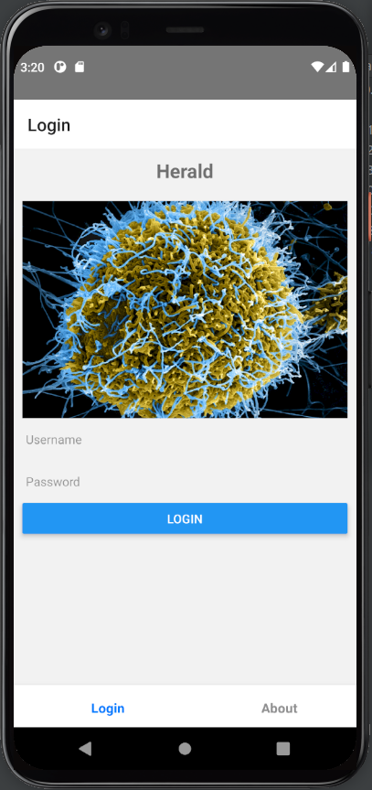
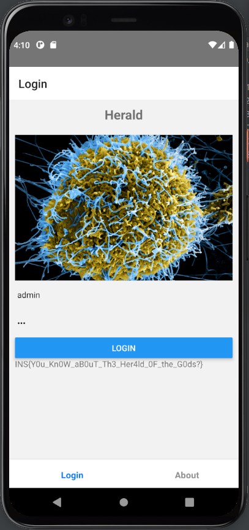

# Herald

Categories: Mobile, Reversing

Description:
> Our lab administrator has just passed out from a strange virus. Please help us find the password to his messaging app so we can identify what he was working on and save his life.
>
> The file [Herald.apk](Herald-e3081153dbcbc3f2bcd6aa0453e8ec6f7055deaf5762aee0a794e28e58b8bb12.apk) is given.


## Takeaways

* How to open an `.apk` in Android Studio: Go to `File` -> `Profile or Debug APK` and select your apk.
* Using [jadx](https://github.com/skylot/jadx) to decompile android APKs back to Java code (lossy conversion)
* [hbctool](https://github.com/bongtrop/hbctool) to modify Hermes Bytecode.
* How to re-assemble a decompressed apk using the `apktool`
* How to re-sign a re-assembled apk using [Uber Apk Signer](https://github.com/patrickfav/uber-apk-signer)

## Solution

First thing that we do with the apk file, is of course run it.



So it clearly requires a username/password and we are unable to proceed further in the application unless we find the credentials.

Next step is to viw the source code using jadx

```java
public class MainApplication extends Application implements ReactApplication {
    private final ReactNativeHost mReactNativeHost = new ReactNativeHost(this) { // from class: com.herald.MainApplication.1
        @Override // com.facebook.react.ReactNativeHost
        protected String getJSMainModuleName() {
            return "index";
        }

        @Override // com.facebook.react.ReactNativeHost
        public boolean getUseDeveloperSupport() {
            return false;
        }

        @Override // com.facebook.react.ReactNativeHost
        protected List<ReactPackage> getPackages() {
            return new PackageList(this).getPackages();
        }
    };

    private static void initializeFlipper(Context context, ReactInstanceManager reactInstanceManager) {
    }

    @Override // com.facebook.react.ReactApplication
    public ReactNativeHost getReactNativeHost() {
        return this.mReactNativeHost;
    }

    @Override // android.app.Application
    public void onCreate() {
        super.onCreate();
        SoLoader.init((Context) this, false);
        initializeFlipper(this, getReactNativeHost().getReactInstanceManager());
    }
}

public class MainActivity extends ReactActivity {
    @Override // com.facebook.react.ReactActivity
    protected String getMainComponentName() {
        return "Herald";
    }
}
```

As we can see from the code above, this is a [React Native](https://reactnative.dev/)(RN) application. There is no other interesting Java source code and the actual functionality of the application is in javascript, located in `resource/assets/index.android.bundle` because that is where RN places the javascript code. Even the strings used in the RN application are located in this file (and not in the regular `res/valus/strings.xml`).

We use the `apktool` to decompress the apk and retrieve the above file.

```bash
nikos@inspiron:~$ apktool d -r -s -o Herald-apktooled-pure Herald.apk
nikos@inspiron:~$ file Herald-apktooled-pure/assets/index.android.bundle
index.android.bundle: Hermes JavaScript bytecode, version 84
```

So we see that this is not simply RN, but the javascript is pre-compiled into bytecode using the [Hermes Engine](https://hermesengine.dev/). The file is not directly readable as it is in binary format.

Another thing to notice is that in the `AndroidManifest.xml`, the application requires the `android.permission.INTERNET` permission. Trying to login while having a wireshark on the side did not produce any traffic so this probably has to do with the fact that it is a RN application which inherently is used to make web apps for mobile.

Next step is to somehow convert the `index.android.bundle` from bytecode to some human readable format. [hbctool](https://github.com/bongtrop/hbctool) is unable to do this for us as the used Hermes version is very new.

We resort to using the [hermes-cli tools](https://github.com/facebook/hermes/releases/download/v0.10.0/hermes-cli-linux-v0.10.0.tar.gz) in order to disassemble it. Hermes version 84 requires hermes tools [release 0.8](https://github.com/facebook/hermes/blob/release-v0.8/include/hermes/BCGen/HBC/BytecodeVersion.h#L23) or [release 0.10](https://github.com/facebook/hermes/blob/release-v0.10/include/hermes/BCGen/HBC/BytecodeVersion.h#L23) so we roll with version 0.10.

```bash
./hermes-cli-linux-v0.10.0/hbcdump  -c="disassemble;quit" -human -out=human-mode ./index.android.bundle

./hermes-cli-linux-v0.10.0/hbcdump  -c="disassemble;quit" -list-opcodes -objdump-disassemble -out=objdump-mode ./index.android.bundle
```

The dumps are around 200K lines long so we search for used strings in the application like "password", "Login", etc.. Using both dumps side by side, we extract the following interesting piece of code:

```js
# Function<tryAuth>4087(3 params, 13 registers, 0 symbols):
00000000000b9020 <_4087>:
000b9020:	76 02                       LoadThisNS        r2
000b9022:	32 00 02 01 79              GetByIdShort      r0, r2, 1, "state"
000b9027:	33 00 00 02 2e 10           GetById           r0, r0, 2, "username"
000b902d:	6d 01 21 03                 LoadConstString   r1, "admin"
000b9031:	b7 26 00 01                 JStrictNotEqual   L1, r0, r1
000b9035:	32 00 02 01 79              GetByIdShort      r0, r2, 1, "state"
000b903a:	33 03 00 03 18 10           GetById           r3, r0, 3, "password"
000b9040:	33 04 02 04 9d 0d           GetById           r4, r2, 4, "decodedText"
000b9046:	05 00 1c 00 1c 00 b6 24     NewArrayWithBuffer r0, 28, 28, 9398
000b904e:	4f 00 04 02 00              Call2             r0, r4, r2, r0
000b9053:	b5 69 03 00                 JStrictEqual      L2, r3, r0

L1:
000b9057:	32 00 02 01 79              GetByIdShort      r0, r2, 1, "state"
000b905c:	33 00 00 02 2e 10           GetById           r0, r0, 2, "username"
000b9062:	b5 2d 00 01                 JStrictEqual      L3, r0, r1
000b9066:	27 00 01                    GetEnvironment    r0, 1
000b9069:	2c 00 00 06                 LoadFromEnvironment r0, r0, 6
000b906d:	33 03 00 05 6c 11           GetById           r3, r0, 5, "Alert"
000b9073:	33 00 03 06 cb 13           GetById           r0, r3, 6, "alert"
000b9079:	6d 01 ec 06                 LoadConstString   r1, "Wrong Username/Pa"...
000b907d:	4f 00 00 03 01              Call2             r0, r0, r3, r1
000b9082:	33 00 02 07 40 0f           GetById           r0, r2, 7, "setPrint"
000b9088:	4f 00 00 02 01              Call2             r0, r0, r2, r1
000b908d:	87 42                       Jmp               L4

L3:
000b908f:	27 00 01                    GetEnvironment    r0, 1
000b9092:	2c 00 00 06                 LoadFromEnvironment r0, r0, 6
000b9096:	33 03 00 05 6c 11           GetById           r3, r0, 5, "Alert"
000b909c:	33 01 03 06 cb 13           GetById           r1, r3, 6, "alert"
000b90a2:	6d 00 20 03                 LoadConstString   r0, "You are not the a"...
000b90a6:	4f 00 01 03 00              Call2             r0, r1, r3, r0
000b90ab:	33 01 02 07 40 0f           GetById           r1, r2, 7, "setPrint"
000b90b1:	6d 00 20 05                 LoadConstString   r0, "Attack attempt de"...
000b90b5:	4f 00 01 02 00              Call2             r0, r1, r2, r0
000b90ba:	87 15                       Jmp               L4

L2:
000b90bc:	33 01 02 08 ff 0e           GetById           r1, r2, 8, "decodedFlag"
000b90c2:	05 00 2b 00 2b 00 28 25     NewArrayWithBuffer r0, 43, 43, 9512
000b90ca:	4f 00 01 02 00              Call2             r0, r1, r2, r0

L4:
000b90cf:	27 00 01                    GetEnvironment    r0, 1
000b90d2:	2c 00 00 06                 LoadFromEnvironment r0, r0, 6
000b90d6:	33 01 00 09 eb 0e           GetById           r1, r0, 9, "Keyboard"
000b90dc:	33 00 01 0a ee 0e           GetById           r0, r1, 10, "dismiss"
000b90e2:	4d 00 00 01                 Call1             r0, r0, r1
000b90e6:	70 00                       LoadConstUndefined r0
000b90e8:	58 00                       Ret               r0
```

From this code and the behavior of the application, we induce that the username is `admin`. The password seems to be formed using a buffer and invoking `decodedText()` which in turn invokes `fromCharCode()`. Once we get the password also correct, is seems that `decodedFlag` will be used which might give us the flag.

But do we really have to guess the password?

Well, it turns out no. We can circumvent that. We use a hex editor to patch the binary and invert the comparison at address `0x000b9053`. The instruction `b5 69 03 00` is broken down to

* `b5` - the opcode `JStrictEqual`
* `69` - relative offset to jump to
* `03` - register `r3`
* `00` - register `r0`.

So we change the byte at offset `0x000b9053` from `b5` to `b7`, which corresponds to a `JStrictNotEqual`. We replace the original `index.android.bundle` with the patched one and repackage the apk.

```bash
apktool b Herald-apktooled-pure -o Herald-patched.apk
java -jar uber-apk-signer-1.2.1.jar --apks Herald-patched.apk
```

The final command generates the file `Herald-patched-aligned-debugSigned.apk` and we run it in the android studio. We use `admin` as login and any value as password:



And when we successfully login, we are indeed presented with the flag!

`INS{Y0u_Kn0W_aB0uT_Th3_Her4ld_0F_the_G0ds?}`

## Solution 2

There is an alternative solution to patching the binary. For the password, the disassembled code contains the following sequence:

```js
000b9040:	33 04 02 04 9d 0d           GetById           r4, r2, 4, "decodedText"
000b9046:	05 00 1c 00 1c 00 b6 24     NewArrayWithBuffer r0, 28, 28, 9398
000b904e:	4f 00 04 02 00              Call2             r0, r4, r2, r0
000b9053:	b5 69 03 00                 JStrictEqual      L2, r3, r0
```

The `NewArrayWithBuffer` instruction means that it will [create a new Array](https://github.com/facebook/hermes/blob/main/lib/VM/Interpreter.cpp#L3004) from [static content](https://github.com/facebook/hermes/blob/c2cd9e385a922f486a55e6bd70db2032f78379ed/include/hermes/VM/Interpreter.h#L151). It will go to the `Array Buffer` global and construct an array with `numElements=28`, `numLiterals=28` from `bufferIndex=9398`. The disassembly contains this `Array Buffer` but string length have to be also taken into consideration when counting the offset.

Using python, we can convert it in order to get the password:

```python
for b in [78, 48, 98, 48, 100, 121, 95, 67, 52, 110, 95, 102, 49, 110, 100, 95, 77, 121, 95, 80, 52, 115, 115, 119, 48, 114, 100, 33]:
    print(chr(b), end='')
```

And the password is `N0b0dy_C4n_f1nd_My_P4ssw0rd!`

Also, adjacently to the password in the `Array Buffer`, the next 43 bytes are the flag: `INS{Y0u_Kn0W_aB0uT_Th3_Her4ld_0F_the_G0ds?}`


