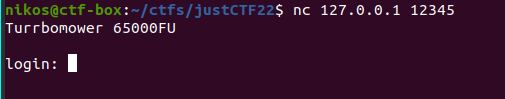
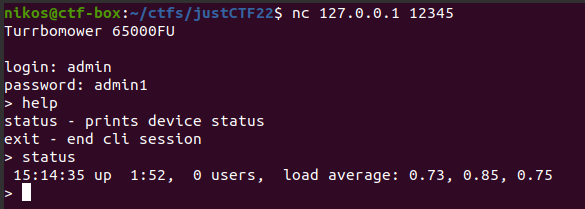

# arm

Categories: Pwn

Description:
> This IoT solution will revolutionize the market!
>
> `% nc arm.nc.jctf.pro 5002` <br/>
> PS: there is a few minutes timeout for every connection.
>
> https://s3.cdn.justctf.team/b4fb8301-34e3-49d6-9054-88b3a7866593/cli (Binary)<br/>
> https://s3.cdn.justctf.team/71ce34e6-1eec-4aea-8afb-c51ebac15d58/Dockerfile

**Tags:** ARM, ARMv8, aarch64, string format vulnerability, %n, arbitrary write %n, Docker, shellcode

## Takeaways

* Pwning ARM binaries on x86 host
* Custom pwntools template for ARM binaries
* Creating ARM shellcode (See [solution.py](solution.py))

## Setup

Since this is an ARM challenge (aarch64), and we are on an x86-64 machine, we need some additional setup to get started. We will use Docker to host the binary instead of just using `qemu-aarch64[-static]` on our host machine. The Docker solution has major advantages:

1. You run the binary safely inside a docker container
2. You do not have to provide the libraries yourself with `-L`
3. You can use whichever glibc version you want (by changing the dockerfile's base image)

We will also use a custom pwntools template to pwn the binary. pwntools will run on the host and communicate with the dockerized binary. `gdb-multiarch` will also be running on the host with correctly configured environment and libraries.

### Tooling reminder

*Feel free to skip this section.*

* `qemu-aarch64-static` - For emulating statically linked binaries.
* `qemu-aarch64` - For emulating dynamically linked binaries. You must supply however the aarch64 dynamic libraries with `-L /usr/aarch64-linux-gnu` (and also have them installed in your system)

### Installing dependencies

We will use [multiarch/qemu-user-static](https://github.com/multiarch/qemu-user-static) to enable the execution of aarch64 (or any other supported architecture) by QEMU, [binfmt_misc](https://docs.kernel.org/admin-guide/binfmt-misc.html), and Docker.

First, install the necessary dependencies (docker is assumed to be already installed):

```bash
sudo apt-get install -y qemu binfmt-support qemu-user-static gdb-multiarch
```

Next, run the `multiarch/qemu-user-static` container to register the `binfmt` entries in your system.

```bash
docker run --rm --privileged multiarch/qemu-user-static --reset -p yes
```

You can verify that `binfmt` entries were registered on the system by running:

```bash
update-binfmts --display
```

and observing the following output:

```log
...
qemu-aarch64 (enabled):
     package = qemu-user-static
        type = magic
      offset = 0
       magic = \x7f\x45\x4c\x46\x02\x01\x01\x00\x00\x00\x00\x00\x00\x00\x00\x00\x02\x00\xb7\x00
        mask = \xff\xff\xff\xff\xff\xff\xff\x00\xff\xff\xff\xff\xff\xff\xff\xff\xfe\xff\xff\xff
 interpreter = /usr/bin/qemu-aarch64-static
    detector =
...
```

### Setup 1 - cli_minimal_aarch64

In this setup, we run the binary in an "arm64v8/ubuntu" based docker image. This setup can be used for binaries that depend on many shared libraries or depend more on ARM related stuff. To get started with the exploitation using this setup:

```bash
cd cli_minimal_aarch64
docker run --rm --privileged multiarch/qemu-user-static --reset -p yes
docker build -t cli_minimal_aarch64 .

python solution.py [DEBUG] [NOASLR] [GDB] [REMOTE]
```

See [solution.py](solution.py) for more details.

### Setup 2 - cli_minimal_native

In this setup, we run the binary in a docker image based on the same platform as the host (e.g. x86-64). This setup can be used with dynamically linked binaries that only depend on ld.so or static binaries. To get started with the exploitation using this setup:

```bash
docker build -t cli_minimal_native .

python solution.py [DEBUG] [NOASLR] [GDB] [REMOTE]
```

This setup runs faster than the `cli_minimal_aarch64` alternative. See [solution.py](solution.py) for more details.

## Solution

When we run the binary, we are presented with a login prompt:



So, we reverse engineer it to find the credentials. We assume base address `0x100000`.

```c
int main(void) {
  setvbuf(stdin,(char *)0x0,2,0);
  setvbuf(stdout,(char *)0x0,2,0);

  if (auth() == 0)
    puts("Sorry.");
  else
    cli();
  return 0;
}

const char *user = "admin";
const char *pass = "admin1";
int auth(void) {
  int iVar2;
  char password [16];
  char username [16];
  
  puts("Turrbomower 65000FU\n");
  printf("login: ");
  read_bytes(username,0xf);

  printf("password: ");
  read_bytes(password,0xf);
  
  iVar2 = strncmp(username, user, strlen(user));
  if (iVar2 == 0) {
    iVar2 = strncmp(password, pass, strlen(pass));
    if (iVar2 == 0) {
      return 1; //auth success
    }
  }
  return 0; //auth failed
}
```

So, nothing fancy going on here. The credentials are simply `admin:admin1`



Next, let's decompile the `cli()` function:

```c
void cli(void) {
  int res;
  size_t cmd_len;
  char cmd [256];
  char vuln_buf [100];
  int advanced_mode;
  
  advanced_mode = 0;
  while( true ) {
    printf("> ");
    read_bytes(cmd,0x100);

    if (strncmp(cmd, "exit", 4) == 0)
        return;
    
    if ((strncmp(cmd, "echo", 4) == 0) && (advanced_mode == 1)) {
      cmd_len = strlen(cmd);
      strncpy(vuln_buf, cmd+5, cmd_len);    //buffer overflow
      printf(vuln_buf); //string format vulnerability
    } else {
      if (strncmp(cmd, "status", 6) == 0) {
        system("uptime");
      } else if (strncmp(cmd, "mode", 4) == 0) {
          if (strncmp(cmd + 5, "advanced", 8) == 0) {
            advanced_mode = 1;
            puts("advanced mode enabled\n");
          } else {
            puts("unknown mode");
          }
      } else {
        //print available, non-hidden, commands
        if (advanced_mode == 0) {
          puts("status - prints device status\nexit - end cli session");
        } else {
          puts(
              "status - prints device status\necho <string> - prints <string>\nexit - end cli sessio n"
              );
    } } }

    memset(cmd, 0, 0x100);
  } //end of while(1)
}

void read_bytes(char *buffer,int count) {
  char *cptr;
  
  char *cptr = buffer;
  for (int i=0; i!=count; ++i) {
    read(0, cptr, 1); //read 1 byte from stdin and store it into bffer

    char c = *cptr;
    if (c == '\n' || c == '\0' || c==0x1b || c==0xa8 || c==0x13)
        break;
    ++cptr;
  }
}
```

As we can see, the IoT devices has some hidden functionality. The above code has two bugs:

1. `printf(vuln_buf);` is a string format vulnerability
2. `strncpy(vuln_buf, cmd+5, cmd_len);` is a buffer overflow as `vuln_buf` is able to hold only 100 bytes and `cmd` can go up to `256` bytes.

There are a few more things to notice:

1. The binary has RWX segments:
    ```bash
    root@2563b6ed5e6e:/$ checksec --file /pwn/cli
    [*] '/pwn/cli'
        Arch:     aarch64-64-little
        RELRO:    Full RELRO
        Stack:    No canary found
        NX:       NX disabled
        PIE:      PIE enabled
        RWX:      Has RWX segments

    root@2563b6ed5e6e:/$ readelf --program-headers /pwn/cli --wide
    Program Headers:
        Type           Offset   VirtAddr           PhysAddr           FileSiz  MemSiz   Flg Align
        GNU_STACK      0x000000 0x0000000000000000 0x0000000000000000 0x000000 0x000000 RWE 0x10
    ```
    So the stack is RWX and can facilitate shellcode.
2. The binary has `system()` available at address `0x113040`

So the plan is to break ASLR by leaking stack and binary's base address using the string format vulnerability. Then we can write our shellcode in the stack. The string format vulnerability also gives us an arbitrary write primitive which we can use. Then, we can use the buffer overflow to overwrite a stored LR register on the stack and jump to our payload.

See [solution.py](solution.py) for the full exploit.

And the flag is `justCTF{pwn_the_lawn!1}`
