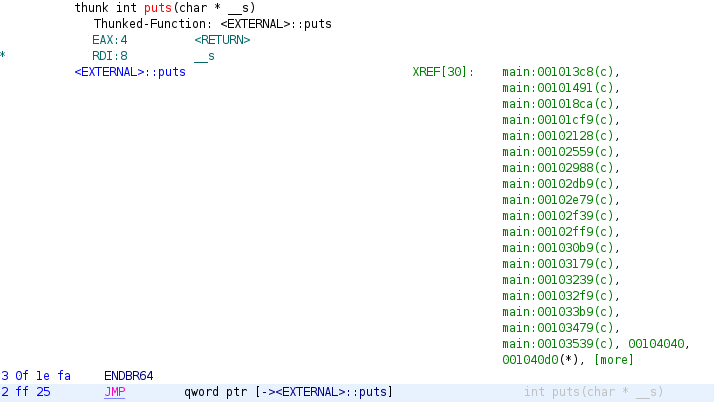
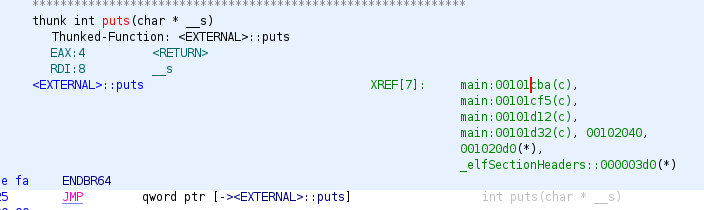

# Open Source Software (OSS)

Categories: Rev

Description:
>??
> 
>author: midnight sun organizers 2023
>
>[oss.c](src/oss.c)

**Tags:** rev, angr, mixed (symbolic and concrete) input, multiple solutions, avoiding

## Takeaways

* angr-related takeaways
  * symbolic input mixed with concrete input
  * state exploration and avoiding
  * solving for multiple solutions
  * angr sigint handler
  * angr logging
* The binary *will probably* differ from the source when you enable optimizations
* `int o=010;` in C means that `o` is an octal number and corresponds to decimal `8`. Anything in C that starts with `0` is in octal...

## Solution

In this challenge we are given a C source file and we have to figure out the flag. How hard can it be? Here is the C file:

```c
#include <stdio.h>
#include <string.h>

#ifndef FLAG
#error "FLAG is not defined."
#endif

#define Z3K(R2K) (((R2K)/*&||*/<<4)|((R2K)/*&=|=*/>>4))
#define X1M(A9W,B8X) (((A9W)/*|=*/^(B8X))&/*~*/0xff)
#define Y2G(A9W,B8X) ((A9W)/*>>*/&0x55)|(((B8X)&/*<<*/0xaa)>>1)
#define W4U(A9W,B8X) ((((A9W)/*%*/*(B8X))%/*&=|=*/1257)&0xff)
#define V5H(T3S) (((T3S)/*>>*/<<1)|((T3S)/*|*/>>7))
#define S6E(T3S) (((T3S)/*^*/<<3)^((T3S)/*&*/>>5))
#define D7F(A9W,B8X) (((A9W)/*<*/<<4)^/*~*/(B8X))
#define A1C(P6F,Q5G,R4H,S3I) Z3K(W4U(V5H(Z3K(Y2G(V5H(X1M(/*&||*/P6F,Q5G)),V5H(X1M(R4H,S3I))))),Q5G)) /* Function W */
#define B2D(P6F,Q5G) V5H(Z3K(X1M(P6F,Q5G)))
#define C3E(P6F,Q5G) D7F(Q5G,Z3K(X1M(P6F,Q5G)))
#define D4F(P6F,Q5G) ((P6F)/*&|*/^(Q5G))
#define E1I(K2L,M1N) (W4U(V5H(Z3K(K2L)),q1s)/*|*/==(M1N)?(++q1s):(q1s=q1s))
#define F2J(K2L,M1N) (V5H(Z3K(K2L))==(M1N)?(++r8w):(r8w=r8w))
#define G3K(K2L,M1N) (S6E(K2L)==(M1N)?(++s9r):(s9r=s9r))
typedef unsigned int T6R;
T6R q1s=1,r8w=1,s9r=1;
int main(void){
    const char x0f[]=FLAG;T6R N = strlen(x0f);/* TODO: REMOVE
    T6R h8m[]={A1C(x0f[19],x0f[15],x0f[11],x0f[4]),A1C(x0f[3],
    x0f[20],x0f[10],x0f[14]),A1C(x0f[0],x0f[6],x0f[1],x0f[8]),
    A1C(x0f[17],x0f[13],x0f[9],x0f[23]),};T6R g7k[]={D4F(C3E(x0f[4],
    x0f[23]),C3E(x0f[11],x0f[18])),D4F(C3E(x0f[17],x0f[10]),C3E(x0f[12],
    x0f[7])),D4F(C3E(x0f[15],x0f[6]),C3E(x0f[20],x0f[1])),D4F(C3E(x0f[22],
    x0f[14]),C3E(x0f[5],x0f[3])),D4F(C3E(x0f[9],x0f[0]),C3E(x0f[13],
    x0f[16])),D4F(C3E(x0f[8],x0f[19]),C3E(x0f[5],x0f[21])),};*/
    T6R p5f[12]={0x10,0,010,20,0xe,014,0x12,02,0x16,012,6,4};T6R g7k[6]={0};
    T6R h8m[6]={0};T6R j9n[12]={0};for(T6R a2z=0;a2z<N;a2z+=4){
    if(a2z<12){j9n[p5f[a2z+3]/2]=B2D(x0f[p5f[a2z+3]],x0f[p5f[a2z+3]+1]);
    g7k[a2z/4]=D4F(C3E(x0f[a2z*2],x0f[a2z*2+2]),C3E(x0f[a2z*2+4],x0f[a2z*2+6]));
    if(a2z<4)h8m[a2z/4]=A1C(x0f[a2z],x0f[a2z+4],x0f[a2z+8],x0f[a2z+12]);
    g7k[(a2z/4)+3]= D4F(C3E(x0f[a2z*2+1],x0f[a2z*2+3]),C3E(x0f[a2z*2+5],x0f[a2z*2+7]));
    j9n[p5f[a2z+1]/2]=B2D(x0f[p5f[a2z+1]],x0f[p5f[a2z+1]+1]);
    j9n[p5f[a2z+2]/2]=B2D(x0f[p5f[a2z+2]],x0f[p5f[a2z+2]+1]);
    if(a2z==4)h8m[1]=A1C(x0f[16],x0f[20],x0f[1],x0f[5]);
    j9n[p5f[a2z]/2]=B2D(x0f[p5f[a2z]],x0f[p5f[a2z]+1]);}else{
    if(a2z<16){h8m[a2z/6]=A1C(x0f[a2z-3],x0f[a2z+1],x0f[a2z+5],x0f[a2z*2-3]);
    h8m[3]=A1C(x0f[2],x0f[6],x0f[10],x0f[14]);} 
    G3K(g7k[0],0x202);G3K(g7k[1],0x1aa2);G3K(g7k[2],0x5a5);}}
    h8m[4]=A1C(x0f[s9r*2-q1s-r8w],x0f[s9r*2+q1s+r8w],x0f[q1s*3],x0f[r8w*7]);
    h8m[5]=A1C(x0f[s9r+q1s],x0f[s9r+5],x0f[s9r*2-r8w],x0f[s9r*2+3]);
    E1I(h8m[0],0x5B);E1I(h8m[1],13);E1I(h8m[2],0x5D);
    E1I(h8m[3],0244);E1I(h8m[4],52);E1I(h8m[5],0xDC);
    F2J(j9n[0],0x1010);F2J(j9n[1],024050);F2J(j9n[2],034070);
    F2J(j9n[3],28784);F2J(j9n[4],0x12d2d);F2J(j9n[5],0x10d0d);
    F2J(j9n[6],042104);F2J(j9n[7],012024);F2J(j9n[8],0xc4c4);
    F2J(j9n[9],0156334);F2J(j9n[10],0x16161);F2J(j9n[11],0270561);
    F2J(B2D(x0f[20],x0f[23]),4112);F2J(B2D(x0f[14],x0f[0]),90465);
    G3K(g7k[3],03417);G3K(g7k[4],0x3787);G3K(g7k[5],030421);
    T6R s1d = 0;for (T6R a2z=0;a2z<N;a2z++)s1d=(s1d*251)^x0f[a2z];
    printf((q1s==7)&&(r8w==15)&&(s9r==13)&&(s1d==0x4E6F76D0)?":)\n":":(\n");
    return 0;
}
```

Ouuuufff... This looks really complex. How shall we approach it? Reversing is all about the thought process, so I'll try to elaborate more on the thought process than the actual solution.

The first step here is to format the code so that it looks (kinda) sane again:

```c
#include <stdio.h>
#include <string.h>

#ifndef FLAG
#error "FLAG is not defined."
#endif

#define Z3K(R2K) (((R2K) /*&||*/ << 4) | ((R2K) /*&=|=*/ >> 4))
#define X1M(A9W, B8X) (((A9W) /*|=*/ ^ (B8X)) & /*~*/ 0xff)
#define Y2G(A9W, B8X) ((A9W) /*>>*/ & 0x55) | (((B8X) & /*<<*/ 0xaa) >> 1)
#define W4U(A9W, B8X) ((((A9W) /*%*/ * (B8X)) % /*&=|=*/1257) & 0xff)
#define V5H(T3S) (((T3S) /*>>*/ << 1) | ((T3S) /*|*/ >> 7))
#define S6E(T3S) (((T3S) /*^*/ << 3) ^ ((T3S) /*&*/ >> 5))
#define D7F(A9W, B8X) (((A9W) /*<*/ << 4) ^ /*~*/ (B8X))
#define A1C(P6F, Q5G, R4H, S3I) Z3K(W4U(V5H(Z3K(Y2G(V5H(X1M(/*&||*/ P6F, Q5G)), V5H(X1M(R4H, S3I))))), Q5G)) /* Function W */
#define B2D(P6F, Q5G) V5H(Z3K(X1M(P6F, Q5G)))
#define C3E(P6F, Q5G) D7F(Q5G, Z3K(X1M(P6F, Q5G)))
#define D4F(P6F, Q5G) ((P6F) /*&|*/ ^ (Q5G))
#define E1I(K2L, M1N) (W4U(V5H(Z3K(K2L)), q1s) /*|*/ == (M1N) ? (++q1s) : (q1s = q1s))
#define F2J(K2L, M1N) (V5H(Z3K(K2L)) == (M1N) ? (++r8w) : (r8w = r8w))
#define G3K(K2L, M1N) (S6E(K2L) == (M1N) ? (++s9r) : (s9r = s9r))


typedef unsigned int uint;
uint q1s = 1, r8w = 1, s9r = 1;

int main(void) {
  const char x0f[] = FLAG;
  uint N = strlen(x0f);

  /* TODO: REMOVE
  uint h8m[] = {
    A1C(x0f[19], x0f[15], x0f[11], x0f[4] ),
    A1C(x0f[3] , x0f[20], x0f[10], x0f[14]),
    A1C(x0f[0] , x0f[6] , x0f[1] , x0f[8] ),
    A1C(x0f[17], x0f[13], x0f[9] , x0f[23]),
  };
  uint g7k[] = {
    D4F(C3E(x0f[4] , x0f[23]), C3E(x0f[11], x0f[18]) ),
    D4F(C3E(x0f[17], x0f[10]), C3E(x0f[12], x0f[7])  ),
    D4F(C3E(x0f[15], x0f[6]) , C3E(x0f[20], x0f[1])  ),
    D4F(C3E(x0f[22], x0f[14]), C3E(x0f[5] , x0f[3])  ),
    D4F(C3E(x0f[9] , x0f[0]) , C3E(x0f[13], x0f[16]) ),
    D4F(C3E(x0f[8] , x0f[19]), C3E(x0f[5] , x0f[21]) ),
  };
  */

  uint p5f[12] = {0x10, 0, 010, 20, 0xe, 014, 0x12, 02, 0x16, 012, 6, 4};
  uint g7k[6]  = {0};
  uint h8m[6]  = {0};
  uint j9n[12] = {0};
  for (uint a2z = 0; a2z < N; a2z += 4) {
    if (a2z < 12) {
      j9n[p5f[a2z + 3] / 2] = B2D(x0f[p5f[a2z + 3]], x0f[p5f[a2z + 3] + 1]);
      g7k[a2z / 4] = D4F(C3E(x0f[a2z * 2], x0f[a2z * 2 + 2]), C3E(x0f[a2z * 2 + 4], x0f[a2z * 2 + 6]));
      if (a2z < 4)
        h8m[a2z / 4] = A1C(x0f[a2z], x0f[a2z + 4], x0f[a2z + 8], x0f[a2z + 12]);
      g7k[(a2z / 4) + 3] = D4F(C3E(x0f[a2z * 2 + 1], x0f[a2z * 2 + 3]), C3E(x0f[a2z * 2 + 5], x0f[a2z * 2 + 7]));
      j9n[p5f[a2z + 1] / 2] = B2D(x0f[p5f[a2z + 1]], x0f[p5f[a2z + 1] + 1]);
      j9n[p5f[a2z + 2] / 2] = B2D(x0f[p5f[a2z + 2]], x0f[p5f[a2z + 2] + 1]);
      if (a2z == 4)
        h8m[1] = A1C(x0f[16], x0f[20], x0f[1], x0f[5]);
      j9n[p5f[a2z] / 2] = B2D(x0f[p5f[a2z]], x0f[p5f[a2z] + 1]);
    } else {
      if (a2z < 16) {
        h8m[a2z / 6] = A1C(x0f[a2z - 3], x0f[a2z + 1], x0f[a2z + 5], x0f[a2z * 2 - 3]);
        h8m[3] = A1C(x0f[2], x0f[6], x0f[10], x0f[14]);
      }
      G3K(g7k[0], 0x202);
      G3K(g7k[1], 0x1aa2);
      G3K(g7k[2], 0x5a5);
    }
  }

  h8m[4] = A1C(x0f[s9r * 2 - q1s - r8w], x0f[s9r * 2 + q1s + r8w], x0f[q1s * 3], x0f[r8w * 7]);
  h8m[5] = A1C(x0f[s9r + q1s], x0f[s9r + 5], x0f[s9r * 2 - r8w], x0f[s9r * 2 + 3]);
  E1I(h8m[0], 0x5B);
  E1I(h8m[1], 13);
  E1I(h8m[2], 0x5D);
  E1I(h8m[3], 0244);
  E1I(h8m[4], 52);
  E1I(h8m[5], 0xDC);
  F2J(j9n[0], 0x1010);
  F2J(j9n[1], 024050);
  F2J(j9n[2], 034070);
  F2J(j9n[3], 28784);
  F2J(j9n[4], 0x12d2d);
  F2J(j9n[5], 0x10d0d);
  F2J(j9n[6], 042104);
  F2J(j9n[7], 012024);
  F2J(j9n[8], 0xc4c4);
  F2J(j9n[9], 0156334);
  F2J(j9n[10], 0x16161);
  F2J(j9n[11], 0270561);
  F2J(B2D(x0f[20], x0f[23]), 4112);
  F2J(B2D(x0f[14], x0f[0]), 90465);
  G3K(g7k[3], 03417);
  G3K(g7k[4], 0x3787);
  G3K(g7k[5], 030421);

  uint s1d = 0;
  for (uint a2z = 0; a2z < N; a2z++)
    s1d = (s1d * 251) ^ x0f[a2z];

  if((q1s == 7) && (r8w == 15) && (s9r == 13) && (s1d == 0x4E6F76D0))
    printf(":)\n");
  else
    printf(":(\n");

  return 0;
}
```

Okay, at least now the control flow is clear. But what does it actually do? The `flag` seems to be the input, and if it is the correct one, then all the calculations are made correctly, the `if((q1s == 7) && (r8w == 15) && (s9r == 13) && (s1d == 0x4E6F76D0))` evaluates to true and a happy smile is being printed. So, somehow we have to find all the *constraints* that *satisfy* the input in order for `:)` to be printed.

RING! RING! BELL! BELL! **Constraint solving** should hint us towards symbolic execution. We should try to compile the program, read the flag from `stdin` (symbolic input) and try to explore the states until we reach `:)`.

Okay, we have at least a clear objective in mind. At this point I tried this idea of symbolic execution but my poor 8GB VM went kaput because it run out of memory error during the symbolic execution. This was a longshot. Here is our symbolic execution script using angr:

```python
import angr
import claripy
import logging
logging.getLogger('angr.sim_manager').setLevel(logging.DEBUG)

p = angr.Project('oss.angr.O0', auto_load_libs=False)

PREFIX=b'midnight{'
FLAG_LEN=24 # assumption
symbolic_input = claripy.BVS('input', (FLAG_LEN-len(PREFIX)-1)*8)
initial_state = p.factory.entry_state(
    stdin=claripy.Concat(PREFIX, symbolic_input, b'}')
)
for chop in symbolic_input.chop(8):
    initial_state.solver.add(
        claripy.And(chop >= 0x21, chop < 0x7f) # only printable chars
    )

simgr = p.factory.simulation_manager(initial_state)
simgr.explore(
    find=lambda s: b":)" in s.posix.dumps(1)
)

print(simgr)
import IPython; IPython.embed();
print(simgr.found[0].posix.dumps(0))
```

So, let's help the symbolic engine by trying to understand *a little bit* the source code and tell it to avoid certain paths.

Let's start by trying to simplify the macros and grouping them:

```c
#define Z3K(val)       (((val) << 4) | ((val) >> 4))
#define V5H(val)       (((val) << 1) | ((val) >> 7))
#define S6E(val)       (((val) << 3) ^ ((val) >> 5))

#define XOR(a, b)      ((a) ^ (b))
#define XOR_BYTE(a, b) (((a) ^ (b)) & 0xff) /* XOR to values and keep only the least significant byte */
#define Y2G(a, b)      ((a) & 0x55) | (((b) & 0xaa) >> 1)
#define W4U(a, b)      ((((a) * (b)) % 1257) & 0xff)
#define D7F(a, b)      (((a) << 4) ^ (b))

#define A1C(a, b, c, d) Z3K(W4U(V5H(Z3K(Y2G(V5H(XOR_BYTE(a, b)), V5H(XOR_BYTE(c, d))))), b)) /* Function W */
#define B2D(a, b) V5H(Z3K(XOR_BYTE(a, b)))
#define C3E(a, b) D7F(b, Z3K(XOR_BYTE(a, b)))

typedef unsigned int uint;
uint ra = 1, rb = 1, rc = 1; //formerly namesd q1s, r8w, and s9r respectively

#define ra_cond_inc(a, expected) (W4U(V5H(Z3K(a)), ra) == (expected) ? (++ra) : ( ra /* noop */) )
#define rb_cond_inc(a, expected) (V5H(Z3K(a))          == (expected) ? (++rb) : ( rb /* noop */) )
#define rc_cond_inc(a, expected) (S6E(a)               == (expected) ? (++rc) : ( rc /* noop */) )
```

Here are our observations:

* We do not have to understand the source code as we are aiming for symbolic execution
* We have 4 categories of macros:
  * Primitive macros that operate on a single value (`val`) and transform it
  * Primitive macros that take two inputs `a` and `b`, and produce some output based on their combinations
  * Macros that look like a condensed function call as they combine other macros
  * `rX_cond_inc` macros that seem to compare the left hand side (`a`) against a constant `expected` value. These macros advance one of the state variables `rX` if the expected value matches

Let's see how the source code now looks like:

```c
int main(void) {
  const char flag[] = FLAG;
  uint N = strlen(flag);

  /* TODO: REMOVE
  uint h8m[] = {
    A1C(flag[19], flag[15], flag[11], flag[4] ),
    A1C(flag[3] , flag[20], flag[10], flag[14]),
    A1C(flag[0] , flag[6] , flag[1] , flag[8] ),
    A1C(flag[17], flag[13], flag[9] , flag[23]),
  };
  uint g7k[] = {
    XOR(C3E(flag[4] , flag[23]), C3E(flag[11], flag[18]) ),
    XOR(C3E(flag[17], flag[10]), C3E(flag[12], flag[7])  ),
    XOR(C3E(flag[15], flag[6]) , C3E(flag[20], flag[1])  ),
    XOR(C3E(flag[22], flag[14]), C3E(flag[5] , flag[3])  ),
    XOR(C3E(flag[9] , flag[0]) , C3E(flag[13], flag[16]) ),
    XOR(C3E(flag[8] , flag[19]), C3E(flag[5] , flag[21]) ),
  };
  */

  uint p5f[12] = {0x10, 0, 010, 20, 0xe, 014, 0x12, 02, 0x16, 012, 6, 4};
  uint g7k[6]  = {0};
  uint h8m[6]  = {0};
  uint j9n[12] = {0};
  for (uint i = 0; i < N; i += 4) {
    if (i < 12) {
      j9n[p5f[i + 3] / 2] = B2D(flag[p5f[i + 3]], flag[p5f[i + 3] + 1]);
      g7k[i / 4] = XOR(C3E(flag[i * 2], flag[i * 2 + 2]), C3E(flag[i * 2 + 4], flag[i * 2 + 6]));
      if (i < 4)
        h8m[i / 4] = A1C(flag[i], flag[i + 4], flag[i + 8], flag[i + 12]);
      g7k[(i / 4) + 3] = XOR(C3E(flag[i * 2 + 1], flag[i * 2 + 3]), C3E(flag[i * 2 + 5], flag[i * 2 + 7]));
      j9n[p5f[i + 1] / 2] = B2D(flag[p5f[i + 1]], flag[p5f[i + 1] + 1]);
      j9n[p5f[i + 2] / 2] = B2D(flag[p5f[i + 2]], flag[p5f[i + 2] + 1]);
      if (i == 4)
        h8m[1] = A1C(flag[16], flag[20], flag[1], flag[5]);
      j9n[p5f[i] / 2] = B2D(flag[p5f[i]], flag[p5f[i] + 1]);
    } else {
      if (i < 16) {
        h8m[i / 6] = A1C(flag[i - 3], flag[i + 1], flag[i + 5], flag[i * 2 - 3]);
        h8m[3] = A1C(flag[2], flag[6], flag[10], flag[14]);
      }
      rc_cond_inc(g7k[0], 0x202);
      rc_cond_inc(g7k[1], 0x1aa2);
      rc_cond_inc(g7k[2], 0x5a5);
    }
  }

  h8m[4] = A1C(flag[rc * 2 - ra - rb], flag[rc * 2 + ra + rb], flag[ra * 3], flag[rb * 7]);
  h8m[5] = A1C(flag[rc + ra], flag[rc + 5], flag[rc * 2 - rb], flag[rc * 2 + 3]);
  ra_cond_inc(h8m[0], 0x5B);
  ra_cond_inc(h8m[1], 13);
  ra_cond_inc(h8m[2], 0x5D);
  ra_cond_inc(h8m[3], 0244);
  ra_cond_inc(h8m[4], 52);
  ra_cond_inc(h8m[5], 0xDC);
  rb_cond_inc(j9n[0], 0x1010);
  rb_cond_inc(j9n[1], 024050);
  rb_cond_inc(j9n[2], 034070);
  rb_cond_inc(j9n[3], 28784);
  rb_cond_inc(j9n[4], 0x12d2d);
  rb_cond_inc(j9n[5], 0x10d0d);
  rb_cond_inc(j9n[6], 042104);
  rb_cond_inc(j9n[7], 012024);
  rb_cond_inc(j9n[8], 0xc4c4);
  rb_cond_inc(j9n[9], 0156334);
  rb_cond_inc(j9n[10], 0x16161);
  rb_cond_inc(j9n[11], 0270561);
  rb_cond_inc(B2D(flag[20], flag[23]), 4112);
  rb_cond_inc(B2D(flag[14], flag[0]), 90465);
  rc_cond_inc(g7k[3], 03417);
  rc_cond_inc(g7k[4], 0x3787);
  rc_cond_inc(g7k[5], 030421);

  uint s1d = 0;
  for (uint i = 0; i < N; i++)
    s1d = (s1d * 251) ^ flag[i];

  if((ra == 7) && (rb == 15) && (rc == 13) && (s1d == 0x4E6F76D0))
    printf(":)\n");
  else
    printf(":(\n");

  return 0;
}
```

Much better! Here are some further observations:

Regarding `ra`:

* (1) `ra` is initialized to 1
* (2) `ra_cond_inc` is invoked exactly 6 times
* (3) Because of the `if` case at the end, `ra` must be 7.

From these observations, we conclude that **all** the `ra_cond_inc(a, expected)` function calls must evaluate to true. Here is how we can help our symbolic engine:

```c
#define wrong_ra()        \
  {                       \
    printf("wrong ra\n"); \
    exit(1);              \
  }
#define ra_cond_inc(a, expected) (W4U(V5H(Z3K(a)), ra) == (expected) ? (++ra) : ( wrong_ra() ) )
int main(void) {
  //...
  if((rb == 15) && (rc == 13)) //removed condition `ra == 7`
    printf(":)\n");
  //...
}
```

So, in our symbolic engine we can just tell it to ignore any states which contain the string `"wrong ra"` in its output. The situation is similar for `rb`:

* (1) `rb` is initialized to 1
* (2) `rb_cond_inc` is invoked exactly 14 times
* (3) Because of the `if` case at the end, `rb` must be 15.

From these observations, we conclude again that **all** the `rb_cond_inc(a, expected)` function calls must evaluate to true. We can follow a similar approach again:

```c
#define wrong_rb()        \
  {                       \
    printf("wrong rb\n"); \
    exit(1);              \
  }
#define rb_cond_inc(a, expected) (V5H(Z3K(a))          == (expected) ? (++rb) : ( wrong_rb() ) )
int main(void) {
  //...
  if(rc == 13) //removed condition `rb == 15`
    printf(":)\n");
  //...
}
```

Regarding `rc`, it is a little bit more tricky. `rc` is initialized to 1, and because of the `if` case at the end, `rc` must be equal to 13. However, the `rc_cond_inc()` is invoked both inside and outside a loop:

```c
int main(void) {
  uint N = strlen(flag);
  //...
  for (uint i = 0; i < N; i += 4) {
    if (i < 12) {
        //...
    } else {
      //...
      rc_cond_inc(g7k[0], 0x202);
      rc_cond_inc(g7k[1], 0x1aa2);
      rc_cond_inc(g7k[2], 0x5a5);
    }
  }
  //...
  rc_cond_inc(g7k[3], 03417);
  rc_cond_inc(g7k[4], 0x3787);
  rc_cond_inc(g7k[5], 030421);
  //...
}
```

So, at this point we have to wonder what is the value of `N`, which is the length of the flag. Now it is time to remember the commented code which we have ignored so far:

```c
int main(void) {
  const char flag[] = FLAG;
  uint N = strlen(flag);

  /* TODO: REMOVE
  uint h8m[] = {
    A1C(flag[19], flag[15], flag[11], flag[4] ),
    A1C(flag[3] , flag[20], flag[10], flag[14]),
    A1C(flag[0] , flag[6] , flag[1] , flag[8] ),
    A1C(flag[17], flag[13], flag[9] , flag[23]),
  };
  uint g7k[] = {
    XOR(C3E(flag[4] , flag[23]), C3E(flag[11], flag[18]) ),
    XOR(C3E(flag[17], flag[10]), C3E(flag[12], flag[7])  ),
    XOR(C3E(flag[15], flag[6]) , C3E(flag[20], flag[1])  ),
    XOR(C3E(flag[22], flag[14]), C3E(flag[5] , flag[3])  ),
    XOR(C3E(flag[9] , flag[0]) , C3E(flag[13], flag[16]) ),
    XOR(C3E(flag[8] , flag[19]), C3E(flag[5] , flag[21]) ),
  };
  */

  uint p5f[12] = {0x10, 0, 010, 20, 0xe, 014, 0x12, 02, 0x16, 012, 6, 4};
  uint g7k[6]  = {0};
  uint h8m[6]  = {0};
  uint j9n[12] = {0};

  //compute the arrays
  for (uint i = 0; i < N; i += 4) {
    if (i < 12) {
      j9n[p5f[i + 3] / 2] = B2D(flag[p5f[i + 3]], flag[p5f[i + 3] + 1]);
      g7k[i / 4] = XOR(C3E(flag[i * 2], flag[i * 2 + 2]), C3E(flag[i * 2 + 4], flag[i * 2 + 6]));
      if (i < 4)
        h8m[i / 4] = A1C(flag[i], flag[i + 4], flag[i + 8], flag[i + 12]);
      g7k[(i / 4) + 3] = XOR(C3E(flag[i * 2 + 1], flag[i * 2 + 3]), C3E(flag[i * 2 + 5], flag[i * 2 + 7]));
      j9n[p5f[i + 1] / 2] = B2D(flag[p5f[i + 1]], flag[p5f[i + 1] + 1]);
      j9n[p5f[i + 2] / 2] = B2D(flag[p5f[i + 2]], flag[p5f[i + 2] + 1]);
      if (i == 4)
        h8m[1] = A1C(flag[16], flag[20], flag[1], flag[5]);
      j9n[p5f[i] / 2] = B2D(flag[p5f[i]], flag[p5f[i] + 1]);
    } else {
      if (i < 16) {
        h8m[i / 6] = A1C(flag[i - 3], flag[i + 1], flag[i + 5], flag[i * 2 - 3]);
        h8m[3] = A1C(flag[2], flag[6], flag[10], flag[14]);
      }
      rc_cond_inc(g7k[0], 0x202);
      rc_cond_inc(g7k[1], 0x1aa2);
      rc_cond_inc(g7k[2], 0x5a5);
    }
  }
  h8m[4] = A1C(flag[rc * 2 - ra - rb], flag[rc * 2 + ra + rb], flag[ra * 3], flag[rb * 7]);
  h8m[5] = A1C(flag[rc + ra], flag[rc + 5], flag[rc * 2 - rb], flag[rc * 2 + 3]);
}
```

As you can see, the commented code has the some of the arrays pre-computed. However, they do not seem to match with what is being computed in the for-loop. For example:

* From the comments we have: `g7k[0] = XOR(C3E(flag[4] , flag[23]), C3E(flag[11], flag[18]) )`
* From the for loop we have `g7k[i / 4] = XOR(C3E(flag[i * 2], flag[i * 2 + 2]), C3E(flag[i * 2 + 4], flag[i * 2 + 6]));` and if we replace `i=0`, we get `g7k[0] = XOR(C3E(flag[0], flag[2]), C3E(flag[4], flag[6]));`, which is different from the pre-computed.

The arrays do not seem to have any dependency on each other but only on the flag. The commented code suggests that the flag length is `N=24`, excluding the `NULL` byte. The `i+=4` in the for-loop hints that the flag length is a multiple of 4. So, at this point, we will **assume** that the flag length is `N=24` since we cannot know for sure, and we will just roll with it. Here is how we modify `main()`:

```c
#include <stdlib.h>
#include <unistd.h>
int main(void) {
  #define FLAG_LEN 24
  char flag[FLAG_LEN+1];
  for(int i=0; i<FLAG_LEN+1; i++)
    flag[i] = 0;
  read(0, flag, FLAG_LEN);
  uint N = FLAG_LEN; //strlen(flag); 
}
```

At this point, I tried again symbolic execution but still went out of memory... One check that puzzles me and seems to be very expensive is the for loop with the check `s1d == 0x4E6F76D0` at the very end of `main`. So, let's ask chatGPT about it:


````log
Question:
What does the following C function do?

```c
unsigned int s1d = 0;
for (unsigned int i = 0; i < N; i++)
  s1d = (s1d * 251) ^ flag[i];

if(s1d == 0x4E6F76D0)
  printf(":)\n");
```

Answer:
This C function calculates a hash value for an array of `N` bytes (`flag[]`) and checks if the hash value matches a specific value (`0x4E6F76D0`).

The function initializes an unsigned integer variable `s1d` to `0` and then iterates over each byte in the `flag[]` array, multiplying the current value of `s1d` by `251` and then performing an XOR operation with the current byte (`flag[i]`). The resulting value is then stored back in `s1d`.

At the end of the loop, if the calculated hash value (`s1d`) matches the specific value `0x4E6F76D0`, the function prints ":)\n" to the console, indicating success.

It's worth noting that this type of hash function is **not cryptographically secure** and should not be used for secure applications. However, it may be suitable for simpler applications where a quick hash function is needed.

Question:
Is that hash function reversible? If yes, provide me with the C code.

Answer:
No, this hash function is not reversible. Hash functions are designed to be one-way functions, meaning that it is computationally infeasible to derive the input data from the output hash value.

While there are techniques like brute force or rainbow table attacks that can attempt to reverse a hash function, they are typically not practical for large inputs or secure hash functions.

Therefore, it is not possible to provide C code to reverse this hash function.
````

Interesting. The final loop is a hash function. No wonder it is giving our symbolic execution engine a hard time. So, for the time being, we will comment out the hash check and deal with it later, probably with brute-force.

Let's try symbolic execution once again... [computing...] We still go out of memory... 😭😭😭

Okay we need to help even further our symbolic execution engine. We need to move the check locations closer to their computation so that we avoid state explosion. For example, we need to move `ra_cond_inc(h8m[0], 0x5B);` closer to the place where `h8m[0]` is computed. How will we achieve this? We will unroll the for-loop that we discussed earlier and that computes these arrays. We will use a small python script to help us unroll it in a clever way:

```python
N=24
p5f = [0x10, 0, int("010", 8), 20, 0xe, int("014", 8), 0x12, int("02", 8), 0x16, int("012", 8), 6, 4]
assert(len(p5f) == 12)
for i in range(0, N, 4):
  if (i < 12):
    print(f"j9n[{p5f[i + 3] // 2}] = B2D(flag[{p5f[i + 3]}], flag[{p5f[i + 3] + 1}]);")
    print(f"g7k[{i // 4}] = XOR(C3E(flag[{i * 2}], flag[{i * 2 + 2}]), C3E(flag[{i * 2 + 4}], flag[{i * 2 + 6}]));")
    if (i < 4):
      print(f"h8m[{i // 4}] = A1C(flag[{i}], flag[{i + 4}], flag[{i + 8}], flag[{i + 12}]);")
    print(f"g7k[{(i // 4) + 3}] = XOR(C3E(flag[{i * 2 + 1}], flag[{i * 2 + 3}]), C3E(flag[{i * 2 + 5}], flag[{i * 2 + 7}]));")
    print(f"j9n[{p5f[i + 1] // 2}] = B2D(flag[{p5f[i + 1]}], flag[{p5f[i + 1] + 1}]);")
    print(f"j9n[{p5f[i + 2] // 2}] = B2D(flag[{p5f[i + 2]}], flag[{p5f[i + 2] + 1}]);")
    if (i == 4):
      print(f"h8m[1] = A1C(flag[16], flag[20], flag[1], flag[5]);")
    print(f"j9n[{p5f[i] // 2}] = B2D(flag[{p5f[i]}], flag[{p5f[i] + 1}]);")
  else:
    if (i < 16):
      print(f"h8m[{i // 6}] = A1C(flag[{i - 3}], flag[{i + 1}], flag[{i + 5}], flag[{i * 2 - 3}]);")
      print(f"h8m[3] = A1C(flag[2], flag[6], flag[10], flag[14]);")
    print("rc_cond_inc(g7k[0], 0x202);")
    print("rc_cond_inc(g7k[1], 0x1aa2);")
    print("rc_cond_inc(g7k[2], 0x5a5);")
```

One nasty thing to notice here is that constants that start with `0` in C are in octal representation. So `010` is an octal number and it means the value `8` in decimal. Nasty, nasty. Let's run the python script:

```c
j9n[10] = B2D(flag[20], flag[21]);
g7k[0] = XOR(C3E(flag[0], flag[2]), C3E(flag[4], flag[6]));
h8m[0] = A1C(flag[0], flag[4], flag[8], flag[12]);
g7k[3] = XOR(C3E(flag[1], flag[3]), C3E(flag[5], flag[7]));
j9n[0] = B2D(flag[0], flag[1]);
j9n[4] = B2D(flag[8], flag[9]);
j9n[8] = B2D(flag[16], flag[17]);
j9n[1] = B2D(flag[2], flag[3]);
g7k[1] = XOR(C3E(flag[8], flag[10]), C3E(flag[12], flag[14]));
g7k[4] = XOR(C3E(flag[9], flag[11]), C3E(flag[13], flag[15]));
j9n[6] = B2D(flag[12], flag[13]);
j9n[9] = B2D(flag[18], flag[19]);
h8m[1] = A1C(flag[16], flag[20], flag[1], flag[5]);
j9n[7] = B2D(flag[14], flag[15]);
j9n[2] = B2D(flag[4], flag[5]);
g7k[2] = XOR(C3E(flag[16], flag[18]), C3E(flag[20], flag[22]));
g7k[5] = XOR(C3E(flag[17], flag[19]), C3E(flag[21], flag[23]));
j9n[5] = B2D(flag[10], flag[11]);
j9n[3] = B2D(flag[6], flag[7]);
j9n[11] = B2D(flag[22], flag[23]);
h8m[2] = A1C(flag[9], flag[13], flag[17], flag[21]);
h8m[3] = A1C(flag[2], flag[6], flag[10], flag[14]);
rc_cond_inc(g7k[0], 0x202);
rc_cond_inc(g7k[1], 0x1aa2);
rc_cond_inc(g7k[2], 0x5a5);
rc_cond_inc(g7k[0], 0x202);
rc_cond_inc(g7k[1], 0x1aa2);
rc_cond_inc(g7k[2], 0x5a5);
rc_cond_inc(g7k[0], 0x202);
rc_cond_inc(g7k[1], 0x1aa2);
rc_cond_inc(g7k[2], 0x5a5);
```

Great! Since there are no dependencies between computations in each line, we can reorder them to look better. We also see that the `rc_cond_inc` is invoked 9 times and only after the respective `g7k` array elements have been computed. At the end of `main`, `rc_cond_inc` is invoked 3 more times, so 12 times in total. `rc` is initialized to 1 and the condition `rc == 13` must hold true, so that means that again **all** `rc_cond_inc` invocations must evaluate to true. Let's also optimize this part a bit. So, here is our result:

```c
j9n[0]  = B2D(flag[0] , flag[1] );
j9n[1]  = B2D(flag[2] , flag[3] );
j9n[2]  = B2D(flag[4] , flag[5] );
j9n[3]  = B2D(flag[6] , flag[7] );
j9n[4]  = B2D(flag[8] , flag[9] );
j9n[5]  = B2D(flag[10], flag[11]);
j9n[6]  = B2D(flag[12], flag[13]);
j9n[7]  = B2D(flag[14], flag[15]);
j9n[8]  = B2D(flag[16], flag[17]);
j9n[9]  = B2D(flag[18], flag[19]);
j9n[10] = B2D(flag[20], flag[21]);
j9n[11] = B2D(flag[22], flag[23]);

g7k[0] = XOR(C3E(flag[0] , flag[2]) , C3E(flag[4] , flag[6]) );
g7k[1] = XOR(C3E(flag[8] , flag[10]), C3E(flag[12], flag[14]));
g7k[2] = XOR(C3E(flag[16], flag[18]), C3E(flag[20], flag[22]));
g7k[3] = XOR(C3E(flag[1] , flag[3]) , C3E(flag[5] , flag[7]) );
g7k[4] = XOR(C3E(flag[9] , flag[11]), C3E(flag[13], flag[15]));
g7k[5] = XOR(C3E(flag[17], flag[19]), C3E(flag[21], flag[23]));

h8m[0] = A1C(flag[0] , flag[4] , flag[8] , flag[12]);
h8m[1] = A1C(flag[16], flag[20], flag[1] , flag[5] );
h8m[2] = A1C(flag[9] , flag[13], flag[17], flag[21]);
h8m[3] = A1C(flag[2] , flag[6] , flag[10], flag[14]);

rc_cond_inc(g7k[0], 0x202);
rc_cond_inc(g7k[1], 0x1aa2);
rc_cond_inc(g7k[2], 0x5a5);
rc=10; //avoid the remaining repetitive calls
```

At this point, we observe that the `flag[]` array is accessed at maximum index 23. So our assumption about `N=24` probably holds true. Before we examine `main`, there are also two more lines that we need to deal with before moving the computations closer to their check location:

```c
int main(void) {
  //compute arrays
  //ra is still 1, rb is still 1, rc has become 10
  h8m[4] = A1C(flag[rc * 2 - ra - rb], flag[rc * 2 + ra + rb], flag[ra * 3], flag[rb * 7]);
  h8m[5] = A1C(flag[rc + ra], flag[rc + 5], flag[rc * 2 - rb], flag[rc * 2 + 3]);
  //do all `ra_cond_inc`, do all `rb_cond_inc`, do remaining `rc_cond_inc`
}
```

So, we also need to replace those two lines with the correct computations before we reorder main. Let's leverage python again:

```python
ra = 1
rb = 1
rc = 10
print(f"h8m[4] = A1C(flag[{rc * 2 - ra - rb}], flag[{rc * 2 + ra + rb}], flag[{ra * 3}], flag[{rb * 7}]);")
print(f"h8m[5] = A1C(flag[{rc + ra}], flag[{rc + 5}], flag[{rc * 2 - rb}], flag[{rc * 2 + 3}]);")
```

```c
h8m[4] = A1C(flag[18], flag[22], flag[3] , flag[7]);
h8m[5] = A1C(flag[11], flag[15], flag[19], flag[23]);
```

(Still `N=24` holds). So, let's modify our `main` function and move all those computations closer to their check location:

***Code before:***
```c
int main(void) {
  //...
  uint p5f[12] = {0x10, 0, 010, 20, 0xe, 014, 0x12, 02, 0x16, 012, 6, 4};
  uint g7k[6]  = {0};
  uint h8m[6]  = {0};
  uint j9n[12] = {0};

  for (uint i = 0; i < N; i += 4) {
    if (i < 12) {
      j9n[p5f[i + 3] / 2] = B2D(flag[p5f[i + 3]], flag[p5f[i + 3] + 1]);
      g7k[i / 4] = XOR(C3E(flag[i * 2], flag[i * 2 + 2]), C3E(flag[i * 2 + 4], flag[i * 2 + 6]));
      if (i < 4)
        h8m[i / 4] = A1C(flag[i], flag[i + 4], flag[i + 8], flag[i + 12]);
      g7k[(i / 4) + 3] = XOR(C3E(flag[i * 2 + 1], flag[i * 2 + 3]), C3E(flag[i * 2 + 5], flag[i * 2 + 7]));
      j9n[p5f[i + 1] / 2] = B2D(flag[p5f[i + 1]], flag[p5f[i + 1] + 1]);
      j9n[p5f[i + 2] / 2] = B2D(flag[p5f[i + 2]], flag[p5f[i + 2] + 1]);
      if (i == 4)
        h8m[1] = A1C(flag[16], flag[20], flag[1], flag[5]);
      j9n[p5f[i] / 2] = B2D(flag[p5f[i]], flag[p5f[i] + 1]);
    } else {
      if (i < 16) {
        h8m[i / 6] = A1C(flag[i - 3], flag[i + 1], flag[i + 5], flag[i * 2 - 3]);
        h8m[3] = A1C(flag[2], flag[6], flag[10], flag[14]);
      }
      rc_cond_inc(g7k[0], 0x202);
      rc_cond_inc(g7k[1], 0x1aa2);
      rc_cond_inc(g7k[2], 0x5a5);
    }
  }

  h8m[4] = A1C(flag[rc * 2 - ra - rb], flag[rc * 2 + ra + rb], flag[ra * 3], flag[rb * 7]);
  h8m[5] = A1C(flag[rc + ra], flag[rc + 5], flag[rc * 2 - rb], flag[rc * 2 + 3]);

  //do all `ra_cond_inc`
  //do all `rb_cond_inc`
  //do remaining `rc_cond_inc`
  //...
  if(rc == 13)
    printf(":)\n");
  else
    printf(":(\n");
}
```


***Code before:***
```c
#define wrong_rc()        \
  {                       \
    printf("wrong rc\n"); \
    exit(1);              \
  }
#define rc_cond_inc(a, expected) (S6E(a)               == (expected) ? (++rc) : ( wrong_rc() ) )

int main(void) {
  //...
  uint g7k[6]  = {0};
  uint h8m[6]  = {0};
  uint j9n[12] = {0};

  g7k[0] = XOR(C3E(flag[0] , flag[2]) , C3E(flag[4] , flag[6]) );
  rc_cond_inc(g7k[0], 0x202);

  g7k[1] = XOR(C3E(flag[8] , flag[10]), C3E(flag[12], flag[14]));
  rc_cond_inc(g7k[1], 0x1aa2);

  g7k[2] = XOR(C3E(flag[16], flag[18]), C3E(flag[20], flag[22]));
  rc_cond_inc(g7k[2], 0x5a5);
  rc=10; //avoid the remaining repetitive calls

  h8m[0] = A1C(flag[0] , flag[4] , flag[8] , flag[12]);
  ra_cond_inc(h8m[0], 0x5B);

  h8m[1] = A1C(flag[16], flag[20], flag[1] , flag[5] );
  ra_cond_inc(h8m[1], 13);

  h8m[2] = A1C(flag[9] , flag[13], flag[17], flag[21]);
  ra_cond_inc(h8m[2], 0x5D);

  h8m[3] = A1C(flag[2] , flag[6] , flag[10], flag[14]);
  ra_cond_inc(h8m[3], 0244);

  h8m[4] = A1C(flag[18], flag[22], flag[3] , flag[7]);
  ra_cond_inc(h8m[4], 52);

  h8m[5] = A1C(flag[11], flag[15], flag[19], flag[23]);
  ra_cond_inc(h8m[5], 0xDC);

  j9n[0]  = B2D(flag[0] , flag[1] );
  rb_cond_inc(j9n[0], 0x1010);

  j9n[1]  = B2D(flag[2] , flag[3] );
  rb_cond_inc(j9n[1], 024050);

  j9n[2]  = B2D(flag[4] , flag[5] );
  rb_cond_inc(j9n[2], 034070);

  j9n[3]  = B2D(flag[6] , flag[7] );
  rb_cond_inc(j9n[3], 28784);

  j9n[4]  = B2D(flag[8] , flag[9] );
  rb_cond_inc(j9n[4], 0x12d2d);

  j9n[5]  = B2D(flag[10], flag[11]);
  rb_cond_inc(j9n[5], 0x10d0d);

  j9n[6]  = B2D(flag[12], flag[13]);
  rb_cond_inc(j9n[6], 042104);

  j9n[7]  = B2D(flag[14], flag[15]);
  rb_cond_inc(j9n[7], 012024);

  j9n[8]  = B2D(flag[16], flag[17]);
  rb_cond_inc(j9n[8], 0xc4c4);

  j9n[9]  = B2D(flag[18], flag[19]);
  rb_cond_inc(j9n[9], 0156334);

  j9n[10] = B2D(flag[20], flag[21]);
  rb_cond_inc(j9n[10], 0x16161);

  j9n[11] = B2D(flag[22], flag[23]);
  rb_cond_inc(j9n[11], 0270561);

  rb_cond_inc(B2D(flag[20], flag[23]), 4112);
  rb_cond_inc(B2D(flag[14], flag[0]), 90465);


  g7k[3] = XOR(C3E(flag[1] , flag[3]) , C3E(flag[5] , flag[7]) );
  rc_cond_inc(g7k[3], 03417);

  g7k[4] = XOR(C3E(flag[9] , flag[11]), C3E(flag[13], flag[15]));
  rc_cond_inc(g7k[4], 0x3787);

  g7k[5] = XOR(C3E(flag[17], flag[19]), C3E(flag[21], flag[23]));
  rc_cond_inc(g7k[5], 030421);


  // uint s1d = 0;
  // for (uint i = 0; i < FLAG_LEN; i++)
  //   s1d = (s1d * 251) ^ flag[i];
  // && (s1d == 0x4E6F76D0)

  printf(":)\n");
}
```

Great, let's try again symbolic execution. Aaaaand still out of memory.... ***WHY?*** 😤😩

At this point I thought it was some kind of compiler optimization. I was compiling with `-O2` and thought that the `printf` function calls were all aggregated at the same location. So, instead I compiled with `-O0` and run again the symbolic execution... and yay! We got a match!

```log
(angr) nikos@ctf-box:~$ python solution.py
WARNING  | 2023-04-22 17:17:48,065 | angr.simos.simos | stdin is constrained to 24 bytes (has_end=True). If you are only providing the first 24 bytes instead of the entire stdin, please use stdin=SimFileStream(name='stdin', content=your_first_n_bytes, has_end=False).
INFO     | 2023-04-22 17:17:48,073 | angr.sim_manager | Stepping active of <SimulationManager with 1 active>
INFO     | 2023-04-22 17:17:48,170 | angr.sim_manager | Stepping active of <SimulationManager with 1 active>
...
INFO     | 2023-04-22 17:18:22,917 | angr.sim_manager | Stepping active of <SimulationManager with 1 active, 9 deferred, 8 avoid>
INFO     | 2023-04-22 17:18:22,919 | angr.sim_manager | Stepping active of <SimulationManager with 1 active, 9 deferred, 8 avoid>
<SimulationManager with 1 active, 8 deferred, 1 found, 8 avoid>
```

Perfect, our symbolic execution worked! Here is also what was happening underneath the compilations:

|      |  |
|---------|----------------|
| xrefs to `puts` when compiled with **`-O0`** | xrefs to `puts` when compiled with **`-O2`**|
| | |

So our speculation was correct. Since we already got a `found` state during symbolic execution with `-O0`, we will not bother fixing the `-O2`. Now we can also deal with the hash function.

At this point we can either include the constraints in the program by enabling the hash function check (and probably use DFS exploration to avoid going out of memory), or bruteforce it. Both approaches work.

We try the brute-forcing and we get the flag!

```log
b'midnight{0p3N_50rCi^y!!}'
b'midnight{0p3N_50rCi^y!!}'
 [*] wrong_checksum
b'midnight{0p3N_50rCmZy!!}'
 [*] wrong_checksum
b'midnight{0r1N_50rCmZy!!}'
 [*] wrong_checksum
b'midnight{0r1N_50rCeRy!!}'
 [*] wrong_checksum
b'midnight{0p3N_50rCaVy!!}'
 [*] wrong_checksum
b'midnight{0p3N_50rCeRy!!}'
 [*] correct_checksum
```

`midnight{0p3N_50rCeRy!!}`
