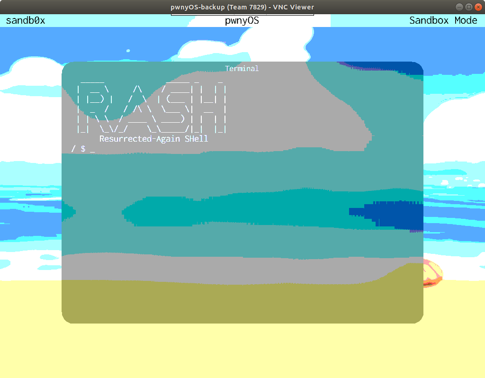
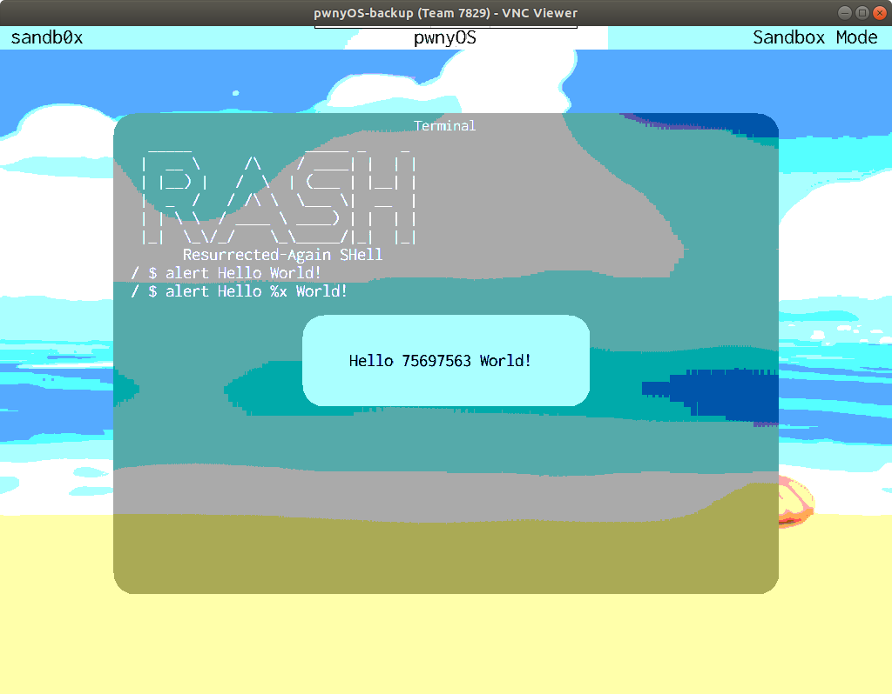
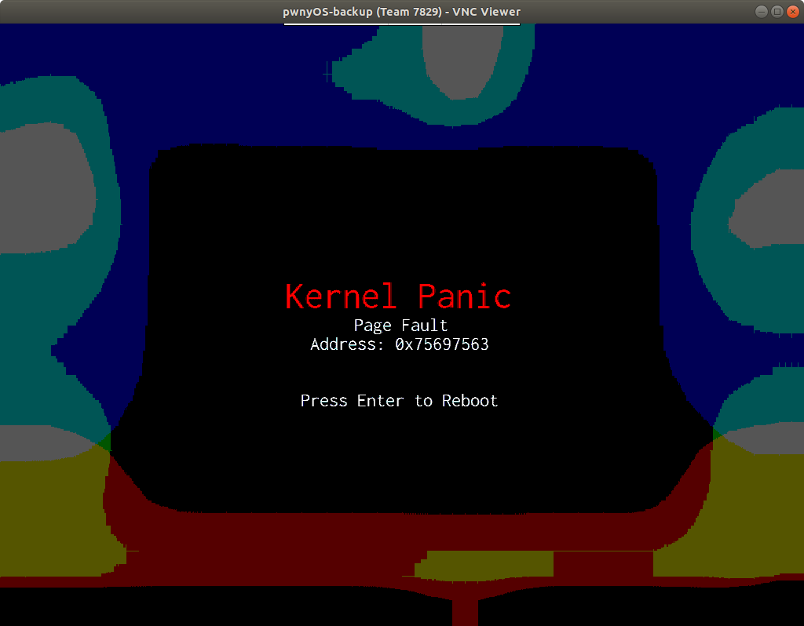
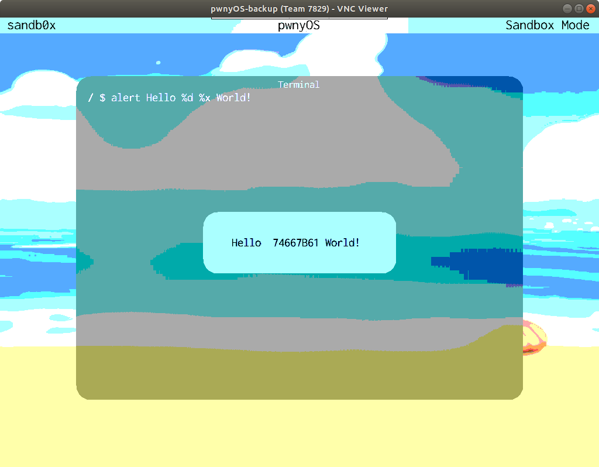
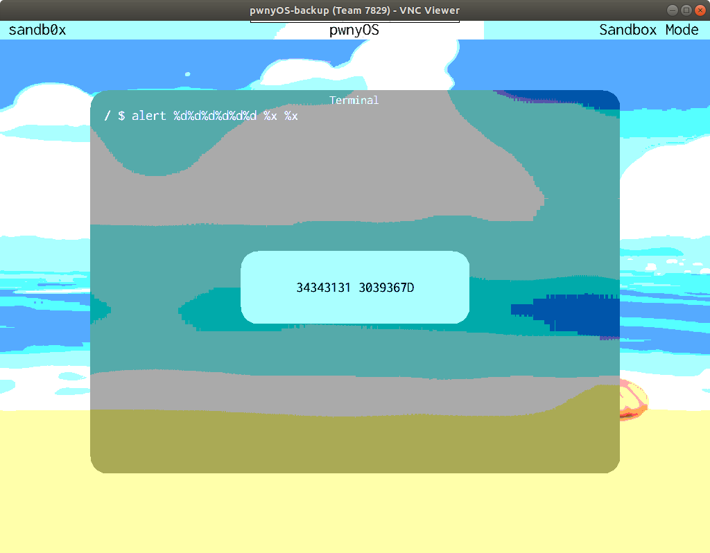

# Kernel Memory Leak

## Challenge Description

> The kernel is leaking memory to the user! That's probably not good, right?
>
> One of the syscalls can be convinced to leak the kernel stack. Find the leak and you'll receive a flag. Keep leaking kernel secrets until you see the }.
>
> (Hint: finding the leak is half the battle, getting it to leak the entire flag requires some outside the box thinking)
>
> Author: ravi

## Solution

So once we have solved the "Whats A Syscall?" challenge, we are greeted with `rash`'s splash screen. According to the documentation, `rash` is the shell for the pwnyOS.



Now we have to find a way to leak kernel memory. Reading (thoroughly) the documentation Syscalls.pdf, we notice the syscall 6, namely `ALERT(char *message)`. According to the documentation

> Displays a <b><u>nicely formatted</u></b> popup on the screen to the user. RASH, the shell provided with pwnyOS, uses this internally when you use the `alert` command.

See that "<i>nicely formatted</i>" there? This could be an indication that this is a string format vulnerability since we control the `char *` parameter. Furthermore, because this is a syscall, the code of `alert` is run in the kernel space. If `alert` is vulnerable to a string format exploit, then we have successfully found a way to leak kernel memory!

The documentation further points out that there is a built-in command in `rash`, with the (same) name `alert`, that acts as a wrapper around this syscall. Lets play around with this command in `rash`.

First we try some regular (expected according to the developer) input to see its behaviour, e.g. we type `alert Hello World!`


Now lets try to trigger a string format vulnerability with the input `alert Hello %x World!`



Nice! The `alert` syscall is vulnerable to a string format vulnerability since it leaked a 4-Byte word in hex format from the **<i>kernel</i>** stack. Lets leak some more data!

We try the input `alert %x %x %x %x`


Ugh, it seems we can only leak up to 3 words from the kernel stack at the same time due to the message being too long otherwise. But let's try to interpret what we see here. The value of each byte in the first word is within the printable ASCII range of the alphabet (`0x61 - 0x7a` lowercase). So let's interpret these 12 hex bytes as ASCII characters:

```bash
nikos@ubuntu:~/ctf/uiuctf/pwnyOS/kernel-memory-leak$ xxd -r -p <(echo 75 69 75 63 74 66 7b 61 65 64 30 35); echo ""
uiuctf{aed05
```

That is the first part of the flag! Now we have to find a work around in order to print more than 3 words. Lets try the dollar sign formatting that exists in `printf`, e.g. lets try<br/>
`alert Hello %2$x World!`


Hmm this didn't do the trick. How about printing a whole string with `%s`? This should give us the flag. Lets try `alert %s`



Um..., we should have expected this. The string is stored character-by-character on the stack. With the `%s` specifier, the <i>address</i> of the string is expected to be on the stack. So reading from the address `0x75696563` is indeed invalid. Moving on!

After fiddling around with other format specifiers, for this following input we notice something in our favor<br/>
`alert Hello %d %x World!`



The printed value `74667B61` is the ***2nd*** word on the stack, not the 1st! This means that alert probably tried to print the first word as a number, but for some reason it could not and instead it printed nothing. However, the `%x` worked just fine and printed the 2nd word from the stack. Lets abuse this to print the next part of the flag!<br/>
`alert %d%d%d %x %x %x`


And for the final part of the flag<br/>
`alert %d%d%d%d%d%d %x %x`



So lets decode all 3 parts to get  the flag
```
nikos@ubuntu:~/ctf/uiuctf/pwnyOS/kernel-memory-leak$ xxd -r -p <(echo 75 69 75 63 74 66 7b 61 65 64 30 35 62 61 32 34 34 31 37 24 23 34 63 36 34 34 31 31 30 39 36 7d); echo ""
uiuctf{aed05ba24417$#4c64411096}
```

So the flag for this level is

`uiuctf{aed05ba24417$#4c64411096}`
