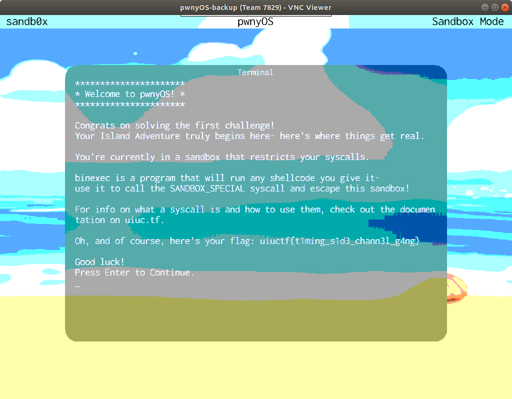
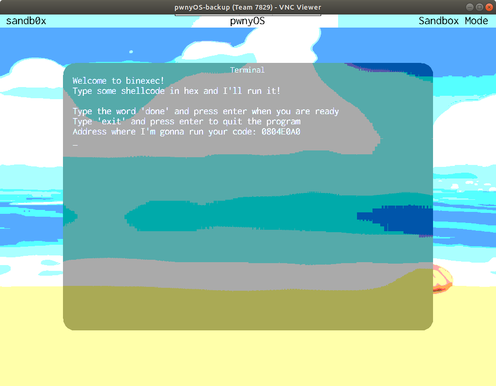
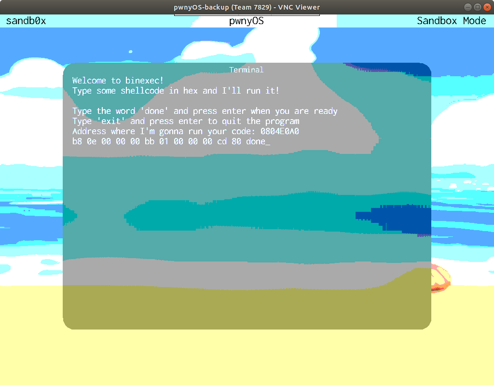
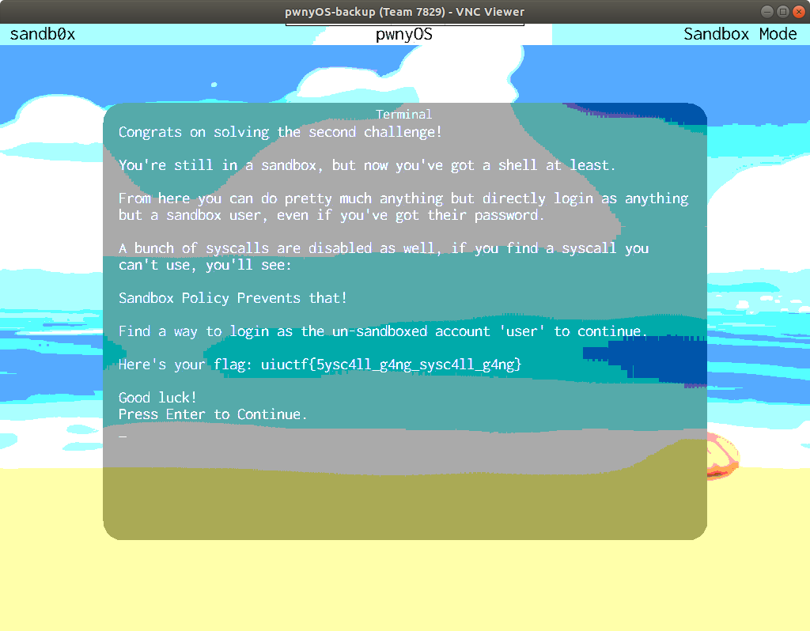

# Whats A Syscall?

## Challenge Description

> Syscall `14` is known as "SANDBOX_SPECIAL"... I wonder if that would be useful here.
>
> You'll be stuck in a never ending loop of `binexec` until you perform syscall `14`.
>
> To learn about syscalls and how they work in pwnyOS, check out the documentation!
>
> System Calls in pwnyOS: [https://github.com/sigpwny/pwnyOS-2020-docs/blob/master/Syscalls.pdf](https://github.com/sigpwny/pwnyOS-2020-docs/blob/master/Syscalls.pdf)
>
> Author: ravi

## Solution

So once we login and solve "Kernel::Time_To_Start" challenge (See solution [here](../kernel-time-to-start/README.md)), we are greeted with the following screen



And after hitting `Enter`



This challenge is straightforward, we have to invoke syscall `14` in order proceed. The documentation [Syscalls.pdf](https://github.com/sigpwny/pwnyOS-2020-docs/blob/master/Syscalls.pdf) describes all the available syscalls, including `14`, and even the describes how they work and how they should to be invoked. So we are currently running the `binexec` program which is waiting for shellcode input in HEX format in order to run it.

We will create locally a small binary that does just that, invokes syscall `14` and then we will hex-dump it. The pwnyOS is a 32-bit x86 system that supports ELF files, so using gcc to compile our shellcode will be fine.

The following assembly code invokes the syscall `14` and we save it as `shellcode.s`

```asm
.intel_syntax noprefix
.text

mov eax, 14 # SANDBOX_SPECIAL syscall
mov ebx, 1  # Argument: uint32_t kern_slide
int 0x80    # syscall interrupt
```

Then, using gcc we compile it and generate the object file `shellcode.o`

```bash
gcc -c -m32 shellcode.s -o shellcode.o
```

Now we use the `objdump` command in order to dump the code in HEX format and type it to the pwnyOS screen

```bash
nikos@ubuntu:~/ctf/uiuctf/pwnyOS/what-is-a-syscall$ objdump --disassembler-options=intel-mnemonic -d shellcode.o

shellcode.o:     file format elf32-i386


Disassembly of section .text:

00000000 <.text>:
   0:   b8 0e 00 00 00          mov    eax,0xe
   5:   bb 01 00 00 00          mov    ebx,0x1
   a:   cd 80                   int    0x80
```

Our input is `b8 0e 00 00 00 bb 01 00 00 00 cd 80 done` and so we type it.



Once we have typed it, we hit `Enter` and we are greeted with the success screen, which also gives us the flag.



So the flag for this level is

`uiuctf{5ysc4ll_g4ng_sysc4ll_g4ng}`
