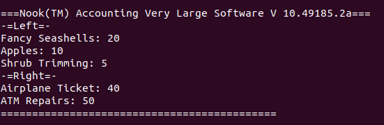
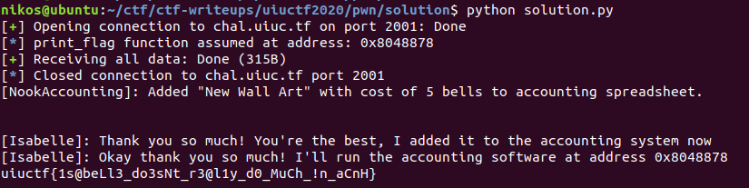

# Accounting Accidents

TL;DR:

* Reverse Engineering - Challenge is build around balanced binary trees (probably AVL)
* Function Pointer overwrite through `fgets()`
* Run `python solution.py` for an automated solution

## Challenge Description

> Isabelle is working on billing sheets for the end of the month, and she needs to move things into her Accounting Very Large accounting system. Can you help her finish her billing?!
>
> `nc chal.uiuc.tf 2001`

We are also given a binary file `accounting`

## Analysis

### What does the program do?

So, once we run the program it greets us with a few messages and boldly tells us that the flag is located at address `0x8048878`. But what does the program do?

There seem to be products (strings) associated with a value. It asks us for to give it 1 product name with value 25, and then 4 values for other products. At the end, it seems to print a few of them with a `left`, `right` message.



```bash
nikos@ubuntu:~/ctf/uiuctf/accounting-accident$ file accounting
accounting: ELF 32-bit LSB executable, Intel 80386, version 1 (SYSV), dynamically linked, interpreter /lib/ld-linux.so.2, for GNU/Linux 3.2.0, BuildID[sha1]=72ded94a52807f73d24ae7c72db8e29099a7bfc3, not stripped
```

```json
{
    // Command: checksec --file=accounting --format=json --output=json
    "/home/nikos/ctf/uiuctf/accounting-accident/accounting": {
        "relro": "partial",
        "canary": "yes",
        "nx": "yes",
        "pie": "no",
        "rpath": "no",
        "runpath": "no",
        "symbols": "yes",
        "fortify_source": "no",
        "fortified": "0",
        "fortify-able": "6"
    }
}
```

### Reverse Engineering

Using ghidra and GDB we discover the following:

1. Function `fancy_print()` is the culprit for the fancy-delaying printing
2. Function `insert()` indicates a data structure
3. Function `newNode()` creates a node for the data structure
4. Function `print_flag()` (Address `0x8048878`) that reveals the flag

After reversing a little bit and following function name hints like `height()`, `getBalance()`, `leftRotate()`, `rightRotate()` I concluded that the data structure used was a [balanced binary tree](https://en.wikipedia.org/wiki/Self-balancing_binary_search_tree), and due to the rotations, probable an [AVL Tree](https://en.wikipedia.org/wiki/AVL_tree)

Thus the return value of `newNode()` is the following data structure

```C
struct node {
    int bells_cost;
    struct node * left;
    struct node * right;
    int height;
    char item_name[16]; /* Given 0x15. NULL written at 0x0f */
    void * print_edges_f; /* == 0x80487a6 == &print_edges */
};
```

The function `newNode()` seems to be exploitable when it invokes `fgets(node->item_name,0x15,stdin)` at address `0x08048ad3`, because it allows us to write `0x15 == 21` Bytes, thus overwriting the `node->print_edges_f` function pointer.

This function pointer is used at the end of `main()`, when all input has finished. More particularly, `root->print_edges_f()` is invoked, with whatever root is currently after all the input has finished and the tree has balanced itself.

## Solution

So can we insert such elements that

1. For the element whose name we insert and value is fixed (25), lets call it "missing name" element, we overwrite the `print_edges_f` to point to the flag function `printf_flag()`
2. For the other 4 elements for which we control their value, we carefully choose their value and order of insertion so that the "missing name" element is at the top of the AVL tree at the end of the process

If we do so, then `printf_flag()` will be invoked through the `print_edges_f` pointer and we will get the flag

Indeed. If we insert the following values `23`, `28`, `29`, `5` in this particular order we have code execution and the flag is

`uiuctf{1s@beLl3_do3sNt_r3@l1y_d0_MuCh_!n_aCnH}`


